# InternForge — Product Specification

| | |
|---|---|
| **Document** | InternForge Product Specification v1.0 |
| **Status** | Released — production-ready v1 |
| **Author** | Documentation Writer (Product/Arch/Schema) |
| **Date** | 2025 — current release cycle |
| **Codebase** | Next.js 16 + TypeScript + Tailwind v4 + shadcn/ui + Prisma (SQLite dev) + z-ai-web-dev-sdk |
| **Companion docs** | `02-architecture.md`, `03-database-schema.md` |

---

## 1. Executive Summary

InternForge is a **single-route, role-driven internship management platform** that turns internships from passive observation + a certificate into **measurable, verified, mentor-validated skill acquisition**. One visible route (`/`) drives four full-function portals — **Student**, **Mentor**, **Company**, and **Admin** (plus a Recruiter variant) — through a role switcher. Behind the switcher sit 27 Prisma models, ~39 REST API routes, a socket.io real-time layer, and four AI-powered flows (mentor feedback generation, internship recommendation, skill analysis, AI mentor chat).

**One-line value:** *Every InternForge internship must produce measurable skills, verified work, mentor feedback, and career-ready evidence — not just attendance.*

The platform ships demo-seeded with 4 companies, 11 demo users, 6 internships, 8 applications, 2 fully-built projects (with milestones, tasks, submissions, evaluations), 12 tracked skills with baseline→current growth, assessments + results, certificates, daily logs, attendance, feedback, chat, badges, audit logs, and platform settings — i.e. it is a working, walk-through-able product, not a slide deck.

---

## 2. Problem Statement

Internships in their current form are a **skills-verification gap**. They are widely treated as time spent + a PDF certificate, with no enforceable chain of evidence between *"the intern says they can build X"* and *"the intern can build X — and here is the proof, scored by a domain expert."*

Concretely, the platform exists because the industry observes five pain points:

1. **Interns cannot prove what they learned.** A typical internship ends with a single PDF and a LinkedIn line. There is no project history, no skill baseline→growth, no mentor evaluation, no portfolio to hand a recruiter. The intern is reduced to claiming competence; the recruiter has no signal to trust.
2. **Mentors cannot review systematically.** Mentor feedback is informal — a Slack message, a hallway chat — and is rarely captured, scored, or made re-findable. Submissions pile up in email. There is no rubric, no 4-dimension score, no AI-assisted first draft to reduce review fatigue.
3. **Companies cannot manage the pipeline.** Applicant tracking, interview scheduling, stage movement, intern performance, and cohort analytics live in three disconnected tools (ATS, Slack, spreadsheet). Conversion rates (Submitted → Accepted) are unknown. Top performers are not surfaced.
4. **Recruiters cannot verify certificates.** A "Certificate of Completion" is opaque. There is no verification code, no skill list, no grade, no project link. A recruiter has to take the candidate's word for it.
5. **Platform admins cannot see risk.** Plagiarism, audit trails, role distribution, system health, and feature flags are scattered. There is no single dashboard for "is the platform healthy, is anyone cheating, who did what."

InternForge is purpose-built to close these five gaps.

---

## 3. Vision & Mission

**Vision.** A world where every internship — academic, industry, or open-source — ends with a **cryptographically-optional, mentor-verified, AI-augmented portfolio of real work** that a recruiter can verify in 30 seconds and trust.

**Mission.** Build the operating system for skills-first internships: one platform where a student discovers, applies, learns, works, submits, is reviewed, improves, is assessed, earns a verifiable certificate, and generates a portfolio — while mentors, companies, recruiters, and admins each get the surface area they need to do their job well.

---

## 4. Design Principles

The platform is governed by six non-negotiable design principles, each of which maps to a concrete feature in the codebase.

| # | Principle | How it shows up in the product |
|---|---|---|
| 1 | **Every internship must produce measurable skills.** | The `Skill` + `UserSkill` models track a `baseline` (0–100) and `current` (0–100) per student-skill pair. `analyticsApi.overview('STUDENT')` returns `avgSkill` and `skillGrowth` (`Σ(current−baseline)/n`). The Student Skills view renders `SkillBar` baseline→current. The Skills Gap endpoint compares a user's current skills against an internship's `skillsRequired`. |
| 2 | **Every internship must produce verified work.** | `Submission` + `Evaluation` models. Each submission has `version`, `content`, `fileUrl`, optional `plagiarismScore`. Each `Evaluation` carries 4 dimensions (`codeQuality`, `communication`, `delivery`, `learning`) + a weighted 0–100 `score` + `strengths[]`/`improvements[]` tag lists. `verified` flag on `UserSkill` is set when an evaluation evidences the skill. |
| 3 | **Every internship must produce mentor feedback.** | The `Feedback` model (1–5 rating, WEEKLY/MID/FINAL/SPONTANEOUS type) plus the 4-dimension `Evaluation`. The Mentor Portal's Reviews view exposes a slider form + an "Generate AI feedback" button that calls `/api/ai/feedback` for a first draft. |
| 4 | **Every internship must produce career-ready evidence.** | The `Certificate` model carries `certificateNumber`, `grade` (A+/A/B+/B/C), `skills[]`, `verificationCode`, `qrData`, and `template`. The Student Portfolio view composes profile + verified skills + projects + top submissions + certificates + badges + mentor testimonial. `certificatesApi.verify(code)` powers public verification. |
| 5 | **The journey is the product.** | The 15-stage `STUDENT_JOURNEY` (`Discover → Apply → Get Selected → Onboard → Learn → Work → Submit → Receive Feedback → Improve → Get Assessed → Complete Project → Get Evaluated → Earn Certificate → Generate Portfolio → Become Job Ready`) is rendered by the shared `JourneyTracker` component on the Student Dashboard. |
| 6 | **Graceful degradation is the default.** | The AI layer (`src/lib/zai.ts`) wraps `z-ai-web-dev-sdk` with `chat`/`chatJson`; if the LLM call fails, every consumer (`/api/ai/feedback`, `/api/ai/recommend`, `/api/ai/skill-analysis`, `/api/ai/chat`) returns a deterministic fallback object so the UI never breaks. Real-time socket.io reconnects automatically (`reconnectionAttempts: 8`). Every portal uses `LoadingGrid` + `EmptyState`. |

---

## 5. Primary Student Journey

The journey is the spine of the product. Every student-facing feature exists to reinforce one or more of these 15 stages.

```mermaid
flowchart LR
    D[Discover] --> A[Apply]
    A --> GS[Get Selected]
    GS --> O[Onboard]
    O --> L[Learn]
    L --> W[Work]
    W --> S[Submit]
    S --> RF[Receive Feedback]
    RF --> IM[Improve]
    IM --> GA[Get Assessed]
    GA --> CP[Complete Project]
    CP --> GE[Get Evaluated]
    GE --> EC[Earn Verified Certificate]
    EC --> GP[Generate Portfolio]
    GP --> JR[Job Ready]
```

| # | Stage | Student intent | Reinforcing platform features (view / model / endpoint) |
|---|---|---|---|
| 1 | **Discover** | "What internships fit me?" | Student → Discover view (marketplace with domain/remote filters, debounced search, AI Recommendations banner from `/api/ai/recommend`); `Internship` model with `requirements`, `skillsRequired`, `responsibilities` JSON arrays; `internshipsApi.save` bookmark. |
| 2 | **Apply** | "I want to apply to this one." | `applicationsApi.apply` POSTs `{ internshipId, coverLetter }`; `Application.status = SUBMITTED`; cover-letter preview in Applications view. |
| 3 | **Get Selected** | "Did I make it?" | Applications view's pipeline tracker highlights current stage across SUBMITTED → SCREENING → INTERVIEW → OFFERED → ACCEPTED; `applicationsApi.updateStatus(id, status)` moves stage; `Interview` model (VIDEO/PHONE/ONSITE, SCHEDULED/COMPLETED/CANCELLED/NOSHOW). |
| 4 | **Onboard** | "What do I do on day one?" | `OnboardingTask` model (DOCUMENT/QUIZ/SIGNATURE/MEETING/RESOURCE, PENDING/IN_PROGRESS/DONE, `required`, `order`); `onboardingApi.list/update`. |
| 5 | **Learn** | "What skills do I need?" | `Skill` + `UserSkill` models track `baseline`/`current`/`verified`/`evidence[]`; `skillsApi.gap(userId, internshipId)` returns the gap between current skills and the internship's required skills; Student Skills view shows the BarChart vs the 75% reference line. |
| 6 | **Work** | "What do I build, and with whom?" | `Project` model (assigned `studentId`, optional `mentorId`, status PLANNED/IN_PROGRESS/REVIEW/COMPLETED/ARCHIVED, `progress`, `repoUrl`); `Milestone` timeline; Project Workspace view. |
| 7 | **Submit** | "Here is my work." | `submissionsApi.create` POSTs `{ projectId, title, content, taskId? }`; `Submission.version` increments; Kanban view drops the task to REVIEW; `Submission.status = SUBMITTED`. |
| 8 | **Receive Feedback** | "What did my mentor think?" | Mentor Portal Reviews view: 4-slider evaluation form (codeQuality/communication/delivery/learning), composite `ScoreBadge`, strengths/improvements tag inputs, "Generate AI feedback" via `/api/ai/feedback`; persists as `Evaluation` with `feedback` + `aiFeedback`. |
| 9 | **Improve** | "What do I fix for v2?" | `Submission.version` increments on resubmit; `Evaluation.improvements[]` tag list drives the next iteration; `Evaluation.status = REVISION_REQUESTED`. |
| 10 | **Get Assessed** | "Do I actually know this?" | `Assessment` model (CODING/QUIZ/TECHNICAL/PROJECT, `questions` JSON, `maxScore`, `durationMins`); `assessmentsApi.submit(id, { answers })` → `AssessmentResult` with `score`, `answers[]`, `feedback`; `AssessmentResult.@@unique([assessmentId, userId])` enforces one attempt per user. |
| 11 | **Complete Project** | "Is my project done?" | Project Workspace: milestones DONE, tasks DONE, `Project.progress = 100`, `Project.status = COMPLETED`. |
| 12 | **Get Evaluated** | "What is my final score?" | Final `Evaluation` aggregates dimension averages; `analyticsApi.overview('MENTOR')` returns `avgScore`; Mentor Evaluation view's RadarChart shows dimension averages; LineChart shows score trajectory. |
| 13 | **Earn Verified Certificate** | "Give me proof." | `certificatesApi.generate({ userId, projectId, internshipId? })` mints a `Certificate` with `certificateNumber`, `grade`, `skills[]`, `verificationCode`, `qrData`, `template='emerald'`; Student Certificates view shows premium gradient card + `Verify` button → `certificatesApi.verify(code)`. |
| 14 | **Generate Portfolio** | "Show the world." | Student Portfolio view: gradient hero (avatar, title, github/linkedin), verified skills with `SkillBar`, projects with `ProgressRing`, top submissions, certificates, `badgesApi.forUser`, latest mentor feedback; "Share" button copies a portfolio URL. |
| 15 | **Become Job Ready** | "I am ready to be hired." | Outcome stage — signaled by: certificates count > 0, `verified` skills ≥ 3, badges count ≥ 1, `Evaluation.score` ≥ 80, `Project.status = COMPLETED`. The Recruiter variant of the Company Portal surfaces a Talent Pool with the same evidence for hiring decisions. |

---

## 6. Target Users & Personas

### 6.1 Sara Kapoor — Student (primary)

- **Background.** Pre-final-year CS student at BITS Pilani. React + TypeScript + design systems. Active demo student; accepted at FinEdge's Frontend internship; project = "ForgeUI"; mentor = Arjun Nair. Holds 3 badges (First Commit, A11y Champion, Streak Keeper).
- **Goals.** Discover internships that match her skills; ship real work; get mentor feedback; earn a verifiable certificate; build a portfolio she can send to recruiters.
- **Frustrations.** Past internships gave her a PDF and no evidence. Mentors feedback was verbal, never captured. Recruiters don't trust her CV.
- **Jobs-to-be-done.** Apply to internships → submit code → see mentor rubric → improve → get scored → mint certificate → share portfolio.
- **Success looks like.** A portfolio URL with verified skills (✓ ticks), 2+ projects with ProgressRing = 100, a certificate with verification code `IF-VERIFY-…`, and a SkillBar showing `baseline 35 → current 88 (+53)`.

### 6.2 Arjun Nair — Mentor

- **Background.** Principal Frontend Engineer at FinEdge. Design-systems nerd, champions accessibility and performance budgets. Mentors Sara's ForgeUI project + Ishaan's game project (2 assigned projects via `projectsApi.list({ mentorId })`).
- **Goals.** Review submissions systematically without burnout; give structured 4-dimension feedback; track his interns' skill growth over time; broadcast cohort announcements.
- **Frustrations.** Submissions arrive in email; he rewrites the same feedback from scratch; he can't see an intern's skill history; scheduling interviews is a Slack ping-pong.
- **Jobs-to-be-done.** See a queue of submissions to review → open a code preview → fill the rubric → let AI draft the first pass → submit evaluation → send weekly feedback → mark attendance → broadcast announcements.
- **Success looks like.** 8 sidebar views (dashboard, interns, reviews, evaluation, feedback, attendance, analytics, announcements) all wired to real data; weekly workload chart shows review volume; avg score trend trending up; pending-reviews queue clear by Friday.

### 6.3 Neha Iyer — Company Admin @ FinEdge

- **Background.** Head of Intern Programs at FinEdge (a FinTech neobank). Owns the FinEdge company record. Manages 1 active internship (Frontend), 7 applicants, 1 accepted intern (Sara), 1 active project.
- **Goals.** Post internships; run a transparent applicant pipeline; track cohort performance; broadcast announcements; shortlist and hire.
- **Frustrations.** Today her ATS, Slack, and spreadsheet don't talk. She can't compute conversion rate (Submitted → Accepted). She can't see who her top performers are.
- **Jobs-to-be-done.** Open the dashboard → see 6 StatCards + FunnelChart → open Applicants view → drag a candidate from SCREENING → INTERVIEW → schedule an interview → open Performance view → see per-intern skill gap → open Portfolios → shortlist / hire → broadcast announcement.
- **Success looks like.** 7 sidebar views (dashboard, internships, applicants, performance, portfolios, analytics, announcements) — all scoped to `user.company.id`; conversion rate computed; top performers surfaced; reach count on broadcast.

### 6.4 Raj Verma — Recruiter @ Nimbus Cloud

- **Background.** Talent partner at Nimbus Cloud (cloud infrastructure, 1001–5000). Hires for SRE, platform, and edge compute roles. Wants to source from InternForge's talent pool.
- **Goals.** Browse verified intern portfolios; filter by skill; verify certificates; shortlist; hand off to internal ATS.
- **Frustrations.** LinkedIn inflates skills. Certificates are unverifiable. He has no signal for "can this candidate actually ship."
- **Jobs-to-be-done.** Open the Talent Pool view → filter by verified skills → open a portfolio → see real submissions + evaluations + certificate + verification code → shortlist.
- **Success looks like.** The Recruiter variant of the Company Portal (5 sidebar views: dashboard, internships, applicants, **Talent Pool**, analytics) where every candidate has a verifiable certificate + verified-skill count + badges count + avg score.

### 6.5 Aria Mehta — Super Admin

- **Background.** Platform Administrator at InternForge. Owns `platform.name`, `platform.tagline`, and the feature flags (`features.ai_feedback`, `features.plagiarism`, `features.blockchain_certs`).
- **Goals.** Keep the platform healthy; spot plagiarism; audit every privileged action; manage users and programs; toggle features without a deploy.
- **Frustrations.** Audit logs are siloed. Plagiarism flags land in her DMs. Feature toggles require a release.
- **Jobs-to-be-done.** Open Dashboard → see KPIs + flagged submissions + recent audit events → open Users → suspend/activate → open Programs → archive → open Audit Logs → filter by severity → open Security → review plagiarism >0.25 → open System Health → run a check → open Settings → toggle a feature flag.
- **Success looks like.** 8 sidebar views (dashboard, users, programs, audit, analytics, security, health, settings) — all wired to real platform APIs; settings persist via `adminApi.updateSetting`; `adminApi.seedDemo` re-seeds the demo dataset; health endpoint reports DB + version + timestamp.

---

## 7. Core Value Propositions (per user type)

| User type | Core value proposition | Killer feature |
|---|---|---|
| **Student** | Turn your internship into a verifiable portfolio of real work, scored by a mentor, with a cryptographically-optional certificate. | The Portfolio view + Certificate verification + AI Mentor chat. |
| **Mentor** | Review submissions with a 4-dimension rubric and an AI first-draft button; never re-write feedback from scratch. | The Reviews view's AI feedback generator (`/api/ai/feedback`). |
| **Company** | Run a transparent applicant pipeline with cohort analytics — know your conversion rate, know your top performers. | The Applicants Kanban + FunnelChart + per-intern skill gap. |
| **Recruiter** | Source from a talent pool where every skill is verified, every certificate is verifiable, every project has a ProgressRing. | The Talent Pool view + `certificatesApi.verify(code)`. |
| **Admin** | One platform dashboard for health, plagiarism, audit, users, programs, and feature flags — no deploys to toggle. | The Admin Dashboard + Settings feature flags + `/api/admin/health`. |

---

## 8. Success Metrics

InternForge measures itself against six metrics — three leading, three lagging — all of which are computable from the codebase today via the `/api/analytics/overview` endpoint and the `UserSkill` baseline→current fields.

| Metric | Type | Definition | How it is measured in the codebase |
|---|---|---|---|
| **Skill acquisition rate** | Lagging | Average `current − baseline` across a student's `UserSkill` rows, in percentage points. | `analyticsApi.overview('STUDENT', userId)` → `student.skillGrowth = round(Σ(current − baseline) / n)`. The Student Dashboard renders this as a StatCard. The Student Skills view renders per-skill `SkillBar` with the delta. |
| **Placement rate** | Lagging | % of `ACCEPTED` applications that lead to a `Project.status = COMPLETED` and a `Certificate`. | `analyticsApi.overview('COMPANY')` → `company.accepted`, `company.conversionRate = round(accepted / totalApps × 100)`. The Company Dashboard renders the FunnelChart (Submitted → Screening → Interview → Offered → Accepted). |
| **Mentor satisfaction** | Lagging | Average `Evaluation.score` (0–100) across a mentor's evaluations + the count of `feedback` rows of type `WEEKLY/MID/FINAL` per intern. | `analyticsApi.overview('MENTOR', userId)` → `mentor.avgScore = round(_avg.score)`, `mentor.evaluations`. The Mentor Analytics view renders the LineChart of avg score over evaluations. |
| **Company ROI** | Lagging | Conversion rate (Submitted → Accepted) × cohort avg evaluation score, normalized to a 0–100 index. | Computed in the Company Dashboard from `analyticsApi.overview('COMPANY').funnel` + `analyticsApi.overview('MENTOR').avgScore`. |
| **Certificate verification rate** | Leading | % of issued `Certificate` rows that have been queried via `certificatesApi.verify(code)` at least once. | Tracked (planned) via an `AuditLog` row `action = 'VERIFY'` on the `/api/certificates/verify` endpoint. The Student Certificates view surfaces the Verify button; the Recruiter Talent Pool is the natural consumer. |
| **Time-to-first-submission** | Leading | Days between `Application.status = ACCEPTED` and the student's first `Submission.submittedAt` on the assigned `Project`. | Computed by joining `Application.appliedAt` → `Project.createdAt` → `Submission.submittedAt`. Surfaced (planned) on the Admin Dashboard as a "Cohort velocity" panel. |

Additional product-health metrics surfaced on the Admin Dashboard:

- **Flagged submissions** — `db.submission.count({ where: { plagiarismScore: { gt: 0.25 } } })`, surfaced on Admin Dashboard + Admin Security view.
- **Audit events** — `db.auditLog.count()`, broken down by `severity` (INFO/WARN/ERROR/CRITICAL) on the Admin Audit view.
- **Role distribution** — `db.user.groupBy({ by: ['role'] })`, rendered as a PieChart donut on the Admin Analytics view.
- **Signups trend** — 6-month mock series on the Admin Dashboard AreaChart (the schema supports real `User.createdAt`; the trend endpoint currently returns a mock series).

---

## 9. Non-Goals (v1)

The following are deliberately **out of scope for v1** and are documented as such so they are not mistaken for gaps:

1. **Production authentication.** v1 ships a demo role-switcher (`src/components/platform/role-switcher.tsx`) backed by `usePlatform` zustand store. The production auth path (NextAuth, `next-auth@4.24.11` is installed) is a documented next phase. See `02-architecture.md` §7.
2. **Persistent write-actions for company admin toasts.** New internship postings, schedule-interview, shortlist, hire, and broadcast-announcement surface as demo toasts because their POST endpoints are not yet implemented. This is intentional for the demo environment; the read paths return real data.
3. **Full message history.** `GET /api/messages?userId=…` returns the latest 1 message per conversation (`take: 1`). The chat panel seeds from that + new sends/incoming. A `GET /api/messages/:conversationId` route for full history is a documented follow-up.
4. **Blockchain-anchored certificates.** `Certificate.qrData` is nullable and `platform.feature.blockchain_certs = false` by default. The verification flow is code-based (`certificatesApi.verify(code)`), not on-chain.
5. **OAuth / SSO login flow, OpenAPI spec, full message history endpoint.** Documented in the worklog's "Unresolved / next phase recommendations."
6. **Production database.** Dev ships on SQLite (`prisma/schema.prisma` datasource `provider = "sqlite"`). The production path is PostgreSQL via a provider swap — same Prisma schema. See `03-database-schema.md` §1.

---

## 10. Glossary

| Term | Definition |
|---|---|
| **Portal** | A role-scoped UI surface. Four ship in v1: Student, Mentor, Company (with a Recruiter variant), Admin. |
| **Role switcher** | The dropdown in the platform header that switches the active role + demo user; backed by the `usePlatform` zustand store (`src/lib/role-store.ts`). |
| **Journey stage** | One of the 15 stages in `STUDENT_JOURNEY` (`src/lib/types.ts`). Rendered by the shared `JourneyTracker`. |
| **Verified skill** | A `UserSkill` row where `verified = true`, set when an `Evaluation` evidences the skill. Rendered with a ✓ tick on `SkillBar`. |
| **Evaluation** | A mentor's 4-dimension scored review of a `Submission` (codeQuality, communication, delivery, learning, weighted `score` 0–100, `feedback`, `aiFeedback`, `strengths[]`, `improvements[]`). |
| **Certificate** | A `Certificate` row with `certificateNumber`, `grade` (A+/A/B+/B/C), `skills[]`, `verificationCode`, `qrData`, `template='emerald'`. Verifiable via `/api/certificates/verify?code=…`. |
| **Badge** | A `Badge` row (`name`, `tier` = BRONZE/SILVER/GOLD/PLATINUM, `criteria[]`). Awarded via `UserBadge` (`@@unique([userId, badgeId])`). |
| **Funnel** | The applicant pipeline stages Submitted → Screening → Interview → Offered → Accepted (+ Rejected/Withdrawn branches). Computed in `/api/analytics/overview?role=COMPANY`. |
| **Onboarding task** | A `OnboardingTask` row (DOCUMENT/QUIZ/SIGNATURE/MEETING/RESOURCE, PENDING/IN_PROGRESS/DONE, `required`, `order`). |
| **Daily log** | A `DailyLog` row (`content`, `tasksCompleted[]`, `hoursSpent`, `mood` = GREAT/GOOD/OKAY/TIRED, `@@unique([userId, internshipId, date])`). |
| **AI Mentor** | A toggle in the Student Chat view that routes the user's messages to `/api/ai/chat` instead of a peer; replies render in a violet-tinted bubble with the `AIBadge`. |
| **XTransformPort** | The Caddy gateway pattern that routes socket.io traffic (path `/`) to the chat mini-service on port 3003 via the `?XTransformPort=3003` query string. See `02-architecture.md` §6. |
| **AuditLog** | An immutable record of a privileged action (`action`, `resource`, `resourceId`, `details` JSON, `ipAddress`, `severity` = INFO/WARN/ERROR/CRITICAL). |
| **PlatformSetting** | A key-value pair (`key @unique`, `value`) for runtime configuration (`platform.name`, `platform.tagline`, `features.ai_feedback`, etc.). Editable in Admin → Settings. |
