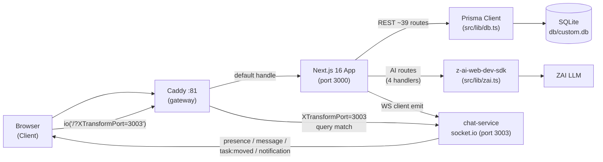

# InternForge — Architecture

| | |
|---|---|
| **Document** | InternForge Architecture v1.0 |
| **Status** | Released — production-ready v1 |
| **Author** | Documentation Writer (Product/Arch/Schema) |
| **Date** | 2025 — current release cycle |
| **Codebase** | Next.js 16.1 (App Router) + React 19 + TypeScript + Tailwind v4 + shadcn/ui + Prisma 6 + SQLite (dev) + socket.io + z-ai-web-dev-sdk |
| **Companion docs** | `01-product-specification.md`, `03-database-schema.md` |

---

## 1. Architecture Overview

InternForge is a **single-route Next.js 16 application** augmented by a small **socket.io mini-service** and a **Caddy gateway** that multiplexes both onto one external origin. There is one visible route (`/`); a client-side role store drives which of four portals renders. The data layer is Prisma over SQLite (dev) — production path is PostgreSQL via a provider swap on the same Prisma schema.



**Request flow (REST).** Browser fetches `/api/<resource>` → Caddy default handle → reverse-proxy to Next.js on :3000 → Next.js Route Handler (`src/app/api/<resource>/route.ts`) → Prisma Client singleton (`src/lib/db.ts`) → SQLite (`db/custom.db`). Response returns as JSON; the client (`src/lib/api.ts`) is typed against `src/lib/types.ts`.

**Request flow (WebSocket).** Browser obtains a socket via `getSocket()` in `src/lib/socket.ts`, which calls `io('/?XTransformPort=3003', …)`. Caddy matches the `XTransformPort=3003` query and reverse-proxies to the chat mini-service on :3003. The mini-service (`mini-services/chat-service/index.ts`) emits presence, conversation-relay, typing, notification fan-out, and project task-moved events.

**Request flow (AI).** Four AI route handlers (`/api/ai/{feedback,recommend,skill-analysis,chat}`) call into `src/lib/zai.ts`, which wraps `z-ai-web-dev-sdk`. Every call degrades gracefully — `chat()` returns `null` on failure, `chatJson()` returns the supplied fallback object — so the UI always renders.

---

## 2. Frontend Architecture

### 2.1 Framework & build

- **Next.js 16.1** with the App Router, output mode `standalone` (see `next.config.ts`). `reactStrictMode: false`; `typescript.ignoreBuildErrors: true` (intentional for the demo — production builds would re-enable strict TS).
- **React 19** with client components for portals (`'use client'` at top of every portal file).
- **Tailwind CSS v4** via `@tailwindcss/postcss`; design tokens defined as OKLCH custom properties in `src/app/globals.css`.
- **shadcn/ui** primitives in `src/components/ui/*` (button, card, dialog, dropdown-menu, table, tabs, select, etc. — ~45 primitives).
- **next-themes** + a `src/components/theme-provider.tsx` for light/dark theming; Sonner toaster wired in `src/app/layout.tsx`.

### 2.2 Role-driven shell + per-role portals

A single visible route (`src/app/page.tsx`) orchestrates the page:

1. Read `role` + `userId` from the persisted zustand store (`usePlatform` in `src/lib/role-store.ts`).
2. Fetch the demo user via `usersApi.me(role, userId)` — the `/api/users/me` route smart-picks the most demo-relevant user per role (MENTOR → mentor with most assigned projects = Arjun; STUDENT → student with most enrolled projects = Sara; COMPANY/RECRUITER → first user with a company membership; fallback to any active user of the role).
3. Render `<Shell>` (`src/components/platform/shell.tsx`) — sticky header (logo, role switcher, theme toggle, notification bell), left sidebar (`NAV[role]` from `src/components/platform/nav-config.tsx`), responsive mobile drawer, and a sticky footer.
4. Render the active portal component inside the shell, switching on `view` (the active sidebar id):

| Role | Portal file | LOC | Views |
|---|---|---|---|
| STUDENT | `src/components/portals/student/student-portal.tsx` | 2,240 | 12 (discover, applications, dashboard, project, kanban, skills, assessments, submissions, certificates, portfolio, logs, chat) |
| MENTOR | `src/components/portals/mentor/mentor-portal.tsx` | 1,935 | 8 (dashboard, interns, reviews, evaluation, feedback, attendance, analytics, announcements) |
| COMPANY | `src/components/portals/company/company-portal.tsx` | 1,927 | 7 (dashboard, internships, applicants, performance, portfolios, analytics, announcements) |
| ADMIN | `src/components/portals/admin/admin-portal.tsx` | 1,900 | 8 (dashboard, users, programs, audit, analytics, security, health, settings) |
| RECRUITER | (Company portal variant) | — | 5 (dashboard, internships, applicants, **Talent Pool**, analytics) |

Each portal file exports `<Role>Portal({ user, view, setView }: PortalProps)`; sections are wrapped in `<div className="animate-in-fade space-y-5">`.

### 2.3 Shared component library

`src/components/platform/shared.tsx` (single file, ~346 lines) exposes the platform's design-system primitives used across all four portals:

| Component | Purpose |
|---|---|
| `PageHeader` | Title + description + icon (gradient-emerald square) + eyebrow + actions. |
| `GlassCard` | Glassmorphism container (`glass` utility + `shadow-card`). Optional `hover` lift. |
| `StatCard` | KPI tile: label, value, icon, optional trend (`↑/↓ %`), `accent` ∈ emerald/amber/violet/sky/rose. |
| `SectionCard` | Titled card with header (icon + title + description + actions) and content slot. |
| `StatusPill` | Colored pill driven by `statusColor(status)` from `src/lib/format.ts`. |
| `ScoreBadge` | Tabular score pill (`score/100`) colored by `scoreColor(score)`. |
| `UserAvatar` | Avatar with `gradient-emerald` fallback initials. Sizes xs/sm/md/lg. |
| `SkillBar` | Baseline→current progress bar with verified-skill ✓ tick and category caption. |
| `EmptyState` | Icon + title + description + action for empty data states. |
| `LoadingGrid` | N shimmer skeleton cards for loading states. |
| `AIBadge` | Violet→emerald gradient pill with `Sparkles` icon — marks AI-generated content. |
| `JourneyTracker` | Renders the 15-stage `STUDENT_JOURNEY` as `stage → stage → …` chips; highlights `activeStage`. |
| `ProgressRing` | SVG circular progress with center label. |
| `MetaRow` | Label/value row for dense detail panels. |

### 2.4 State & data fetching

- **Role store** — `src/lib/role-store.ts` exports `usePlatform`, a zustand store with `persist` middleware. The store keeps `role`, `userId`, `user`, `view`; only `role` and `view` are persisted (`partialize`) so transient user state is fresh per session. `setRole()` clears stale `userId/user/view='dashboard'` to avoid a 404 on the new role's `/me` call.
- **Client API** — `src/lib/api.ts` is a hand-rolled typed client (~199 lines). Each resource group (`usersApi`, `internshipsApi`, `applicationsApi`, …, `aiApi`) is an object literal of functions returning `Promise<T>` where `T` is the domain type from `src/lib/types.ts`. The `request<T>()` helper wraps `fetch`, sets `cache: 'no-store'`, JSON-encodes the body, and throws on non-2xx.
- **Per-view data fetching** — Portals use a small `useAsync<T>(fn, deps)` hook returning `{ data, loading, error, reload }`. (TanStack Query and TanStack Table are installed as dependencies but the portals' own hooks are used for simplicity.)
- **Charts** — `recharts` for LineChart, BarChart, PieChart (donut), AreaChart, FunnelChart, RadarChart, ScatterChart. Chart palette: `--chart-1` emerald, `--chart-2` amber, `--chart-3` violet, `--chart-4` teal, `--chart-5` coral.
- **Drag-and-drop** — `@dnd-kit/{core,sortable,utilities}` for the Student Kanban (`DndContext`, `useSortable`, `useDroppable`, `DragOverlay`). On drop, `tasksApi.move(id, status)` is called and `socket.emit('task:moved', …)` broadcasts the move.
- **Animations** — `framer-motion` (installed); core CSS animations in `globals.css` (`animate-in-up`, `animate-in-fade`, `shimmer` keyframes). Portals wrap section roots in `animate-in-fade`.
- **Theming** — `next-themes` + a custom theme-provider; light (warm off-white canvas, emerald primary, soft-amber accent) and dark (deep forest-night) variants as OKLCH tokens in `globals.css`.
- **Toasts** — `sonner` (the shadcn `sonner.tsx` wrapper) for write-action confirmations.
- **Real-time client** — `src/lib/socket.ts` exports `getSocket()` which lazily creates a single `socket.io-client` connection to `/?XTransformPort=3003` (transports `['websocket','polling']`, `forceNew`, `reconnectionAttempts: 8`, `reconnectionDelay: 1200ms`, `timeout: 12000ms`). `disconnectSocket()` cleans up.

### 2.5 Key directories (one-line purposes)

| Path | Purpose |
|---|---|
| `src/app/` | Next.js App Router root — `layout.tsx`, `page.tsx`, `globals.css`, `api/`. |
| `src/app/api/` | ~39 REST route handlers under 22 resource groups. |
| `src/components/platform/` | Shell, role-switcher, theme-toggle, notification-bell, shared.tsx, nav-config.tsx. |
| `src/components/portals/{student,mentor,company,admin}/` | One self-contained portal file per role. |
| `src/components/ui/` | ~45 shadcn/ui primitives. |
| `src/components/theme-provider.tsx` | next-themes wrapper. |
| `src/lib/` | `db.ts`, `api.ts`, `types.ts`, `format.ts`, `role-store.ts`, `socket.ts`, `zai.ts`, `utils.ts`. |
| `prisma/` | `schema.prisma` (27 models) + `seed.ts` (943-line demo dataset). |
| `mini-services/chat-service/` | socket.io mini-service (`index.ts`, port 3003). |
| `public/` | Static assets (`logo.svg`, `robots.txt`). |
| `tests/` | Container build scripts (Python runtime, DB runtime). |
| `examples/websocket/` | Reference socket.io server + frontend examples. |

---

## 3. Backend Architecture

### 3.1 Route handlers

All API routes live under `src/app/api/` and follow Next.js 16 App Router conventions — each `route.ts` exports `GET`/`POST`/`PATCH`/`DELETE` async functions taking a standard `Request` and returning `NextResponse.json(...)`. Routes use the Prisma client singleton from `src/lib/db.ts`; there is no ORM-indirection layer. Errors are returned as `{ error: string, code?: string }` with the appropriate HTTP status. There are ~39 routes across 22 resource groups.

| Resource group | Route(s) | Methods | Notes |
|---|---|---|---|
| **users** | `/api/users`, `/api/users/me` | GET | `me?role=&userId=` smart-picks the most demo-relevant user for a role and includes `companyMemberships.company`. |
| **companies** | `/api/companies` | GET | List companies. |
| **internships** | `/api/internships`, `/api/internships/[id]`, `/api/internships/[id]/save` | GET, POST | List/get/bookmark; supports `?status=` filter. |
| **applications** | `/api/applications`, `/api/applications/[id]` | GET, POST, PATCH | `apply` creates a new application; `PATCH` updates `status` (stage move). |
| **projects** | `/api/projects`, `/api/projects/[id]` | GET | Filterable by `studentId`, `mentorId`, `internshipId`. |
| **tasks** | `/api/tasks`, `/api/tasks/[id]` | GET, POST, PATCH | `move` updates `status` (+optional `order`) for Kanban DnD. |
| **submissions** | `/api/submissions`, `/api/submissions/[id]/plagiarism` | GET, POST | `plagiarism` POST returns a similarity score. |
| **evaluations** | `/api/evaluations` | GET, POST | 4-dimension rubric create. |
| **skills** | `/api/skills`, `/api/skills/gap` | GET | `gap?userId=&internshipId=` returns per-skill `current`/`required`/`gap`. |
| **assessments** | `/api/assessments`, `/api/assessments/[id]/submit` | GET, POST | `submit` records an `AssessmentResult` (unique per `assessmentId+userId`). |
| **certificates** | `/api/certificates`, `/api/certificates/verify` | GET, POST | `generate` mints a new certificate; `verify?code=` returns validity + certificate. |
| **logs** | `/api/logs` | GET, POST (upsert) | Daily-log upsert keyed on `(userId, internshipId, date)`. |
| **attendance** | `/api/attendance` | GET | List attendance (write actions are demo-only toasts today). |
| **notifications** | `/api/notifications`, `/api/notifications/[id]` | GET, PATCH | `markRead` flips `read=true`. |
| **messages** | `/api/messages` | GET, POST | `conversations(userId)` returns the user's conversations with the latest 1 message each; `send` posts a message and (server-side) emits via socket.io. |
| **announcements** | `/api/announcements` | GET | Pinned-first list. |
| **onboarding** | `/api/onboarding`, `/api/onboarding/[id]` | GET, PATCH | `update` flips `OnboardingTask.status`. |
| **badges** | `/api/badges` | GET | `?userId=` returns the user's awarded badges. |
| **feedback** | `/api/feedback` | GET, POST | Mentor feedback (1–5 rating, type WEEKLY/MID/FINAL/SPONTANEOUS). |
| **analytics** | `/api/analytics/overview` | GET | Role-aware aggregates (totals, student/mentor/company/admin slices, skill trend, workload, funnel, signups). |
| **admin** | `/api/admin/audit`, `/api/admin/settings`, `/api/admin/seed`, `/api/admin/health` | GET, POST, PATCH | Audit logs (filter by severity/action/date), platform settings (key/value), seed-demo trigger, health probe. |
| **ai** | `/api/ai/feedback`, `/api/ai/recommend`, `/api/ai/skill-analysis`, `/api/ai/chat` | POST | Four AI flows — all return a deterministic fallback when the LLM call fails. |
| **root** | `/api/route.ts` | GET | Platform root — health/info probe. |

### 3.2 Prisma client singleton

`src/lib/db.ts` (12 lines) creates a single `PrismaClient` per Node process and stashes it on `globalThis.prisma` to avoid exhausting DB connections during Next.js hot-reload in dev. The dev instance logs every query (`log: ['query']`); production would lower that to `['warn','error']`.

```ts
import { PrismaClient } from '@prisma/client'
const globalForPrisma = globalThis as unknown as { prisma: PrismaClient | undefined }
export const db = globalForPrisma.prisma ?? new PrismaClient({ log: ['query'] })
if (process.env.NODE_ENV !== 'production') globalForPrisma.prisma = db
```

### 3.3 Error handling conventions

- All route handlers return `NextResponse.json({ error: string, code?: string }, { status: <code> })` on failure.
- The client (`src/lib/api.ts`) throws `Error('API <status>: <body>')`; the portal `useAsync` hook captures it into `error` for `ErrorState` rendering.
- AI routes never throw — they catch SDK errors and return a fallback JSON object so the UI always renders.
- The notification bell (`src/components/platform/notification-bell.tsx`) degrades silently when the socket is unreachable.

### 3.4 WebSocket mini-service

`mini-services/chat-service/index.ts` is a 90-line standalone Node process. It creates an `http.Server`, attaches `socket.io` with `path: '/'` (the path the Caddy gateway expects — do **not** change it), `cors: { origin: '*' }`, `pingTimeout: 60s`, `pingInterval: 25s`, listens on port `3003`, and handles `SIGTERM`/`SIGINT` for clean shutdown.

The service owns an in-memory `presence` map (socket.id → `{ id, name, role, avatarUrl }`); it does **not** persist messages (the Next.js API does that — `/api/messages` POST writes the row and then optionally emits). The mini-service is a pure relay-and-presence layer.

---

## 4. Data Layer

- **ORM** — Prisma 6.11 (`@prisma/client` + `prisma` CLI). Schema-first; the source of truth is `prisma/schema.prisma`.
- **Database (dev)** — SQLite (`datasource db { provider = "sqlite"; url = env("DATABASE_URL") }`). Dev DB at `db/custom.db`.
- **Production path** — PostgreSQL via a `provider` swap on the same Prisma schema. The schema uses only Prisma features that are portable across SQLite and PostgreSQL (no SQLite-specific raw extensions). JSON fields become `jsonb` on Postgres automatically.
- **Schema workflow** — `bun run db:push` (alias `prisma db push --accept-data-loss`) is used during development; the script set also includes `db:generate`, `db:migrate`, `db:reset` for production-style migrations.
- **JSON collections** — Many list-like fields are `Json @default("[]")` rather than normalized child tables: `Internship.requirements/skillsRequired/responsibilities`, `Application.stageNotes`, `Task.tags`, `Submission.answers` (n/a), `Assessment.questions`, `AssessmentResult.answers`, `Evaluation.strengths/improvements`, `UserSkill.evidence`, `Certificate.skills`, `DailyLog.tasksCompleted`, `Message.readBy`, `Badge.criteria`, `AuditLog.details`. This keeps the schema compact for v1; collections that need queryable joins (e.g. `UserSkill`, `TaskAuthor`, `ConversationMember`, `UserBadge`) are normalized.
- **Audit tables** — `AuditLog` (immutable privileged-action record with `severity` INFO/WARN/ERROR/CRITICAL) and `PlatformSetting` (key/value runtime config) are the two cross-cutting operational tables.
- **Seed** — `prisma/seed.ts` (943 lines) seeds the full demo dataset. Triggered on demand via `/api/admin/seed` or by running `bunx prisma db seed` (script wiring).

---

## 5. AI Layer

The AI layer is a thin, graceful-degradation wrapper around `z-ai-web-dev-sdk`.

### 5.1 The wrapper — `src/lib/zai.ts` (49 lines)

```ts
import ZAI from 'z-ai-web-dev-sdk'
let cached: Awaited<ReturnType<typeof ZAI.create>> | null = null

export async function getZai() {
  if (cached) return cached
  try { cached = await ZAI.create(); return cached }
  catch (e) { console.error('ZAI SDK init failed:', e); return null }
}

export async function chat(messages): Promise<string | null> {
  const zai = await getZai()
  if (!zai) return null
  try {
    const res = await zai.chat.completions.create({ messages })
    return res?.choices?.[0]?.message?.content?.trim() ?? null
  } catch (e) { console.error('ZAI chat failed:', e); return null }
}

export async function chatJson<T>(messages, fallback: T): Promise<T> {
  const text = await chat(messages)
  if (!text) return fallback
  const match = text.match(/\{[\s\S]*\}/)
  if (!match) return fallback
  try { return JSON.parse(match[0]) as T } catch { return fallback }
}
```

### 5.2 The four AI routes

| Route | Purpose | Fallback philosophy |
|---|---|---|
| `POST /api/ai/feedback` | Given a `submissionId`, generate mentor-feedback first draft — `{ feedback, strengths[], improvements[], score }`. | If LLM fails, returns a deterministic rule-based feedback object so the Mentor Reviews view's "Generate AI feedback" button always fills the form. |
| `POST /api/ai/recommend` | Given a `userId`, rank open internships by skill match — returns `recommendations[{ internshipId, score, reasons[] }]` (top 3). | Fallback: a deterministic scoring function over `UserSkill.current` vs `Internship.skillsRequired`. The Student Discover view renders the AI Recommendations banner regardless. |
| `POST /api/ai/skill-analysis` | Given a `userId`, produce a paragraph analysis + a per-skill `{ skill, level, evidence }[]` mapping from the user's submissions/evaluations. | Fallback: derive `level` from `UserSkill.current` thresholds and `evidence` from submission titles. The Student Skills view's "AI skill analysis" dialog always renders. |
| `POST /api/ai/chat` | Free-form conversational AI mentor — takes `{ message, context? }`, returns `{ reply }`. | Fallback: a templated reply that points the student at their next journey stage. The Student Chat view's "AI Mentor" toggle always responds. |

### 5.3 Why graceful fallback

The product principle (§4.6 in `01-product-specification.md`) is that the UI never breaks. The LLM may be rate-limited, the SDK may fail to initialize, the network may drop — none of those should ever produce a blank panel. Every AI route returns the **same response shape** whether the LLM succeeded or fell back; the consumer renders it identically (with the `AIBadge` indicating AI provenance on success).

---

## 6. Real-time Layer

### 6.1 Transport — the XTransformPort gateway pattern

The browser-side socket client connects to:

```ts
io('/?XTransformPort=3003', {
  transports: ['websocket', 'polling'],
  forceNew: true,
  reconnection: true,
  reconnectionAttempts: 8,
  reconnectionDelay: 1200,
  timeout: 12000,
})
```

Caddy (see `Caddyfile`) listens on `:81` and routes:

- If the request has `?XTransformPort=*`, it reverse-proxies to `localhost:{query.XTransformPort}` — so the WebSocket upgrade for `XTransformPort=3003` lands on the chat mini-service.
- Otherwise, it reverse-proxies to `localhost:3000` (the Next.js app).

This pattern lets one external origin serve both the Next.js HTTP API and the socket.io real-time service without CORS configuration or a second port exposure.

### 6.2 Events handled by the chat-service

| Event (client → server) | Direction | Effect |
|---|---|---|
| `identify` | client → server | Store presence; broadcast `presence` to all. |
| `join:conversation` / `leave:conversation` | client → server | Enter/leave a `conv:<id>` room. |
| `message` | client → server | Relay a chat message to everyone in `conv:<id>`. (Persistence happens via `POST /api/messages` separately.) |
| `typing` | client → server | Broadcast typing indicator to the rest of `conv:<id>`. |
| `join:user` | client → server | Enter a `user:<id>` room for notification fan-out. |
| `notify` | client → server | Fan-out a `notification` event to `user:<id>`. |
| `join:project` | client → server | Enter a `project:<id>` room for live Kanban updates. |
| `task:moved` | client → server | Broadcast a moved task to everyone else in `project:<id>`. |

| Event (server → client) | Direction | Effect |
|---|---|---|
| `presence` | server → all | Full presence list (array of `{ id, name, role, avatarUrl }`). |
| `message` | server → `conv:<id>` | Incoming chat message in a joined conversation. |
| `typing` | server → `conv:<id>` | Typing indicator. |
| `notification` | server → `user:<id>` | Live notification — consumed by `notification-bell.tsx`. |
| `task:moved` | server → `project:<id>` | Live task move on a joined Kanban — Student Portal auto-reloads the board. |

### 6.3 Consumers in the app

- **Notification bell** (`src/components/platform/notification-bell.tsx`) joins `user:<id>` on mount, listens for `notification`, and shows a live unread badge.
- **Student Kanban** (`student-portal.tsx` → KanbanView) joins `project:<projectId>` on mount and listens for `task:moved` to reload the board; on drop it emits `task:moved`.
- **Student Chat** (`student-portal.tsx` → ChatView) joins `conv:<conversationId>` on selection, listens for `message`, and emits `message` on send.
- **AI Mentor mode** in the Student Chat toggles between emitting a `message` to a peer vs. calling `/api/ai/chat` and rendering the reply with the `AIBadge` in a violet-tinted bubble.

---

## 7. Security & Access Control (summary)

(Full treatment lives in the planned `06-security.md`; this is a summary cross-reference.)

- **RBAC roles** — Five roles in `User.role`: `STUDENT | MENTOR | COMPANY | ADMIN | RECRUITER`. Company-side users get a `CompanyMembership` row (`role = ADMIN | RECRUITER`).
- **Demo role-switcher** — v1 ships a demo role switcher (no real auth). `usePlatform` stores `role` + `userId`; `/api/users/me?role=&userId=` smart-picks the most demo-relevant user for that role.
- **Production auth path** — `next-auth@4.24.11` is installed and configured as a dependency; the production deployment swaps the role switcher for NextAuth session-backed middleware. (Documented non-goal for v1.)
- **Audit logging** — The `AuditLog` table records every privileged action with `userId`, `action`, `resource`, `resourceId`, `details` (JSON), `ipAddress`, and `severity` (INFO/WARN/ERROR/CRITICAL). The Admin Audit view filters by severity/action/date and renders the `details` JSON in a viewer.
- **Plagiarism surveillance** — `Submission.plagiarismScore` is set by `POST /api/submissions/[id]/plagiarism`. The Admin Security view surfaces submissions with `plagiarismScore > 0.25` (high-risk > 0.5).
- **Feature flags** — `PlatformSetting` keyspace (`features.ai_feedback`, `features.plagiarism`, `features.blockchain_certs`, etc.) is editable at runtime in Admin → Settings; the API layer can read these flags to gate writes.

---

## 8. Environments & Configuration

| Item | Dev | Production path |
|---|---|---|
| **App port** | 3000 (`next dev -p 3000`) | standalone build (`next build`) → `bun .next/standalone/server.js` |
| **Mini-service port** | 3003 (`mini-services/chat-service/index.ts`) | same — behind Caddy gateway |
| **Gateway** | Caddy `:81` (`Caddyfile`) | same — terminate TLS, route by `?XTransformPort=` |
| **Database** | SQLite at `db/custom.db` (`DATABASE_URL=file:./db/custom.db`) | PostgreSQL (`DATABASE_URL=postgresql://…`) — same Prisma schema, `provider` swap |
| **Environment vars** | `DATABASE_URL` | `DATABASE_URL`, plus NextAuth secrets when auth is enabled |
| **Build** | `bun run dev` (HMR, `dev.log`) | `bun run build` → `bun run start` (`server.log`) |
| **DB workflow** | `db:push` (schema-first, accept-data-loss) | `db:migrate` (Prisma Migrate) + `db:reset` |
| **Lint** | `bun run lint` (ESLint flat config `eslint.config.mjs`) | CI gate |
| **Type-check** | `bunx tsc --noEmit` | CI gate |

---

## 9. Cross-cutting Concerns

- **Theming** — OKLCH design tokens in `globals.css`; `next-themes` toggles `.dark`; light = warm off-white + emerald primary + soft-amber accent; dark = deep forest-night + emerald-400 primary. Glassmorphism utilities (`.glass`, `.glass-strong`, `.gradient-emerald`, `.gradient-amber`, `.gradient-violet`, `.glow-emerald`, `.shadow-soft`, `.shadow-card`, `.grid-pattern`, `.shimmer`). Custom scrollbar (`.scroll-soft`). Font: Geist Sans/Mono via `--font-geist-sans`/`--font-geist-mono`; OpenType features `ss01`, `cv01`, `cv02` enabled.
- **Accessibility** — shadcn/ui primitives are built on Radix UI; tooltips, dialogs, dropdowns, and select come keyboard-traversable out of the box. `aria-*` props threaded through portals. Color contrast: emerald-600 on warm off-white passes WCAG AA.
- **Responsive design** — Shell collapses to a mobile drawer below the `sm` breakpoint; the role switcher shortens ("Super"); grids use `grid gap-4 sm:grid-cols-2 lg:grid-cols-3` throughout. Mobile verified at 375×812 in the agent-browser verification pass.
- **Observability** — Dev: Prisma logs every query (`log: ['query']`); the chat-service logs connect/disconnect; Next.js logs route compilation. Admin Portal ships a System Health view (`/api/admin/health`) that returns DB-connection status, version, timestamp, and a mock service-status grid (incl. a deliberately-degraded "Plagiarism Engine" entry to exercise the warning style).
- **Animations** — `framer-motion` available; core motion is CSS in `globals.css` (`animate-in-up`, `animate-in-fade`, `shimmer`). Portal section roots wrap in `animate-in-fade`.
- **Toasts** — Sonner (`src/components/ui/sonner.tsx`) for write-action feedback.

---

## 10. Trade-offs & Decisions

| Decision | Rationale |
|---|---|
| **SQLite for dev** | Zero-ops, file-based, instant seed/reset; perfect for a demo / single-tenant dev box. Production path is PostgreSQL via a provider swap on the same Prisma schema — no model changes. |
| **Monolith-with-mini-service (not microservices)** | One Next.js app owns the REST surface, the Prisma client, and the AI routes; one tiny Node process owns the socket.io relay. The monolith keeps the data layer single-sourced; the mini-service keeps long-lived socket connections off the Next.js request pool. The Caddy `XTransformPort` gateway avoids CORS / second-port exposure. |
| **Hand-rolled `useAsync` hook (not TanStack Query)** | TanStack Query is installed but the portals use a local `useAsync<T>(fn, deps)` for simplicity and to keep each portal self-contained in one file. Trade-off: simpler mental model and zero global provider wiring; cost: no built-in cache invalidation/refetch-on-focus (acceptable for the demo workload). |
| **JSON columns for collections, normalized for joins** | List-like fields (`requirements`, `tags`, `strengths`, `criteria`, `evidence`, `questions`, `answers`, `readBy`, `details`) are `Json @default("[]")` for compactness; queryable joins (`UserSkill`, `TaskAuthor`, `ConversationMember`, `UserBadge`, `CompanyMembership`) are normalized with `@@unique` constraints. |
| **String-typed enums (not Prisma `enum`)** | SQLite does not support Prisma enums; using `String` + a comment keeps the schema portable to PostgreSQL. The domain layer (`src/lib/types.ts`) re-declares these as TS string-literal types (e.g. `ApplicationStatus`, `TaskStatus`) for compile-time safety. |
| **In-process job queue (planned, not yet shipped)** | Background work (e.g. recurring cron-scheduled "webDevReview" job mentioned in the worklog) is planned to run in-process via a `setInterval` / cron-style loop in the Next.js server, not as an external queue. This trades operational simplicity for at-most-once semantics; acceptable for v1 demo workload. |
| **Demo-only write toasts** | Some write actions (new internship posting, schedule interview, broadcast announcement, suspend user) surface as demo toasts because their POST endpoints are not yet implemented. This is intentional for the demo — the read paths return real data, and the toast confirms intent. Documented in `01-product-specification.md` §9 Non-goals. |
| **`react-syntax-highlighter` installed but not used in Mentor Portal** | The Mentor Reviews view uses a styled `<pre>` for code blocks because Next 16 SSR with the syntax-highlighter is fiddly and the brief permitted the fallback. A future pass can swap in `PrismLight` with dynamic import. |
| **`GET /api/messages` returns latest 1 message per conversation** | The endpoint uses `take: 1` to keep the list view light; the chat panel seeds from that 1 message plus new sends/incoming. A follow-up `GET /api/messages/:conversationId` for full history is documented as a non-goal in v1. |
