# InternForge — Database Schema

| | |
|---|---|
| **Document** | InternForge Database Schema v1.0 |
| **Status** | Released — production-ready v1 |
| **Author** | Documentation Writer (Product/Arch/Schema) |
| **Date** | 2025 — current release cycle |
| **Source of truth** | `prisma/schema.prisma` (27 models + 2 join models) |
| **Seed** | `prisma/seed.ts` (943 lines) |
| **Companion docs** | `01-product-specification.md`, `02-architecture.md` |

---

## 1. Overview

InternForge uses **Prisma 6** as its ORM with a **schema-first** workflow. The dev datasource is **SQLite** (`provider = "sqlite"`, `url = env("DATABASE_URL")`, dev file at `db/custom.db`). The **production target is PostgreSQL** — switching the provider to `"postgresql"` on this same schema requires no model changes; JSON columns become `jsonb` automatically.

Key conventions in the schema:

- **IDs** are `String @id @default(cuid())`.
- **Timestamps** are `DateTime @default(now())` for `createdAt` and `DateTime @updatedAt` for `updatedAt`.
- **Enum-like fields** are `String` (because SQLite does not support Prisma `enum`s). Allowed values are documented inline as comments and enumerated in `src/lib/types.ts` as TS string-literal unions (e.g. `ApplicationStatus`, `TaskStatus`).
- **Collection fields** are `Json @default("[]")` — used for list-like payloads (`requirements`, `tags`, `strengths`, `questions`, `answers`, `evidence`, `readBy`, `criteria`, `details`).
- **Cascade rules** are explicit: most FKs use `onDelete: Cascade`; ownership-optional FKs (e.g. `Project.mentorId`, `Submission.taskId`, `Certificate.internshipId/projectId`, `Announcement.internshipId`, `OnboardingTask.internshipId/userId`) use `onDelete: SetNull` so removing the parent doesn't destroy the child.
- **Unique constraints** are declared with `@@unique([...])` for join tables and one-per-row relations (`UserSkill`, `AssessmentResult`, `CompanyMembership`, `ConversationMember`, `UserBadge`, `TaskAuthor`, `DailyLog`, `Attendance`, `PlatformSetting.key`).

Schema workflow:

| Script | Effect |
|---|---|
| `bun run db:push` | `prisma db push --accept-data-loss` — schema-first dev sync. |
| `bun run db:generate` | `prisma generate` — regenerate the typed Prisma Client. |
| `bun run db:migrate` | `prisma migrate dev` — production-style migration workflow. |
| `bun run db:reset` | `prisma migrate reset` — wipe + re-seed. |

---

## 2. ER Diagram

The diagram below groups entities by domain (Access · Marketplace · Project/Work · Skills/Assessment · Certification · Operations · Communication · Gamification/Audit) for readability. All relationships are visible; cardinality labels follow the standard `||--o{` (one-to-many), `||--||` (one-to-one), `}o--o{` (many-to-many) conventions.

```mermaid
erDiagram
    User ||--o{ CompanyMembership : has
    User ||--o{ Application : "applies via"
    User ||--o{ Project : "mentors (MentorProjects)"
    User ||--o{ Project : "enrolled (StudentProjects)"
    User ||--o{ Task : "assignedTasks"
    User ||--o{ Submission : "submits"
    User ||--o{ Evaluation : "gives"
    User ||--o{ UserSkill : tracks
    User ||--o{ AssessmentResult : takes
    User ||--o{ Certificate : earns
    User ||--o{ DailyLog : writes
    User ||--o{ Attendance : logs
    User ||--o{ Notification : receives
    User ||--o{ Message : "sends (SentMessages)"
    User ||--o{ ConversationMember : joins
    User ||--o{ Feedback : "gives (FeedbackFrom)"
    User ||--o{ Feedback : "gets (FeedbackTo)"
    User ||--o{ UserBadge : earns
    User ||--o{ AuditLog : performs
    User ||--o{ OnboardingTask : owns
    User ||--o{ Announcement : authors
    User ||--o{ TaskAuthor : co-authors

    Company ||--o{ CompanyMembership : has
    Company ||--o{ Internship : owns

    Internship ||--o{ Application : receives
    Internship ||--o{ Assessment : sets
    Internship ||--o{ Announcement : scoped
    Internship ||--o{ OnboardingTask : prescribes
    Internship ||--o{ Certificate : issues
    Internship ||--o{ Project : drives

    Application ||--o{ Interview : schedules

    Project ||--o{ Milestone : has
    Project ||--o{ Task : has
    Project ||--o{ Submission : receives
    Project ||--o{ Evaluation : scored
    Project ||--o{ Certificate : certifies

    Task ||--o{ Submission : yields
    Task ||--o{ TaskAuthor : "co-authored by"

    Submission ||--o{ Evaluation : reviewed

    Skill ||--o{ UserSkill : "tracked per user"

    Assessment ||--o{ AssessmentResult : "yields results"

    Conversation ||--o{ ConversationMember : has
    Conversation ||--o{ Message : carries

    Badge ||--o{ UserBadge : awards

    User ||--o{ AuditLog : "may trigger (nullable)"
    Announcement }o--|| User : "authorId"
    Announcement }o--o| Internship : "internshipId"
    OnboardingTask }o--o| User : "userId"
    OnboardingTask }o--o| Internship : "internshipId"
    Certificate }o--o| Internship : "internshipId"
    Certificate }o--o| Project : "projectId"
    Project }o--o| Internship : "internshipId"
    Project }o--o| User : "mentorId"
    Submission }o--o| Task : "taskId"
    DailyLog }o--o| Internship : "internshipId"
    Attendance }o--o| Internship : "internshipId"
    Feedback }o--o| Internship : "internshipId"
    Assessment }o--o| Internship : "internshipId"
```

---

## 3. Tables Reference

Each subsection below documents one model with: purpose, key fields, relations, and notable JSON fields. Field types use Prisma notation. All 29 models in `prisma/schema.prisma` are covered.

### 3.1 `User`

The central actor. Every role (STUDENT, MENTOR, COMPANY, ADMIN, RECRUITER) is a row here.

| Field | Type | Constraints / default | Notes |
|---|---|---|---|
| `id` | `String` | `@id @default(cuid())` | PK. |
| `email` | `String` | `@unique` | Login identity (production). |
| `name` | `String` | — | Display name. |
| `role` | `String` | `@default("STUDENT")` | Enum-like: `STUDENT | MENTOR | COMPANY | ADMIN | RECRUITER`. |
| `avatarUrl`, `bio`, `title`, `location`, `phone` | `String?` | — | Profile fields. |
| `githubUrl`, `linkedinUrl` | `String?` | — | Social/external profile. |
| `university`, `major`, `gradYear` | `String?` | — | Student-only academic fields. |
| `status` | `String` | `@default("ACTIVE")` | Enum-like: `ACTIVE | SUSPENDED | INACTIVE`. |
| `createdAt` | `DateTime` | `@default(now())` | — |
| `updatedAt` | `DateTime` | `@updatedAt` | — |

**Relations (one-to-many):** `companyMemberships`, `applications`, `mentoredProjects` (`Project` via "MentorProjects"), `enrolledProjects` (`Project` via "StudentProjects"), `assignedTasks`, `submissions`, `evaluationsGiven`, `userSkills`, `assessmentResults`, `certificates`, `dailyLogs`, `attendances`, `notifications`, `sentMessages` (`Message` via "SentMessages"), `conversationMembers`, `feedbackGiven` (`Feedback` via "FeedbackFrom"), `feedbackReceived` (`Feedback` via "FeedbackTo"), `userBadges`, `auditLogs`, `onboardingTasks`, `announcements`, `authoredTasks` (`TaskAuthor`).

### 3.2 `Company`

A company on the platform (e.g. Quantum Labs, Nimbus Cloud, FinEdge, PixelForge Studios).

| Field | Type | Constraints / default | Notes |
|---|---|---|---|
| `id` | `String` | `@id @default(cuid())` | PK. |
| `name` | `String` | — | Display name. |
| `logoUrl`, `website`, `description`, `location`, `size` | `String?` | — | Profile fields. |
| `industry` | `String` | required | e.g. `AI Research`, `FinTech`. |
| `verified` | `Boolean` | `@default(false)` | Verification badge. |
| `createdAt`, `updatedAt` | `DateTime` | defaults | — |

**Relations:** `memberships` (CompanyMembership[]), `internships` (Internship[]).

### 3.3 `CompanyMembership`

A many-to-many join between `User` and `Company` with a role. `@@unique([userId, companyId])` enforces one-membership-per-user-per-company.

| Field | Type | Constraints / default | Notes |
|---|---|---|---|
| `id` | `String` | `@id @default(cuid())` | PK. |
| `userId` | `String` | FK → `User.id`, `onDelete: Cascade` | — |
| `companyId` | `String` | FK → `Company.id`, `onDelete: Cascade` | — |
| `role` | `String` | `@default("ADMIN")` | Enum-like: `ADMIN | RECRUITER`. |

**Unique:** `@@unique([userId, companyId])`.

### 3.4 `Internship`

A posted internship program (marketplace listing).

| Field | Type | Constraints / default | Notes |
|---|---|---|---|
| `id` | `String` | `@id @default(cuid())` | PK. |
| `companyId` | `String` | FK → `Company.id`, `onDelete: Cascade` | Owning company. |
| `title`, `description` | `String` | required | Posting copy. |
| `domain` | `String` | required | e.g. `Frontend`, `ML`, `DevOps`. |
| `durationWeeks` | `Int` | required | Length. |
| `stipend`, `location` | `String?` | — | Optional. |
| `remote` | `Boolean` | `@default(true)` | Remote-eligible flag. |
| `status` | `String` | `@default("OPEN")` | Enum-like: `OPEN | CLOSED | DRAFT | ARCHIVED`. |
| `slots` | `Int` | `@default(1)` | Headcount. |
| `requirements` | `Json` | `@default("[]")` | String-array of bullet requirements. |
| `skillsRequired` | `Json` | `@default("[]")` | String-array of skill names — matched against `UserSkill.current` by `/api/skills/gap`. |
| `responsibilities` | `Json` | `@default("[]")` | String-array. |
| `startDate`, `endDate`, `applicationDeadline` | `DateTime?` | — | Posting timeline. |
| `createdAt`, `updatedAt` | `DateTime` | defaults | — |

**Relations:** `company`, `applications`, `assessments`, `announcements`, `onboardingTasks`, `certificates`, `projects`.

### 3.5 `Application`

A student's application to an internship.

| Field | Type | Constraints / default | Notes |
|---|---|---|---|
| `id` | `String` | `@id @default(cuid())` | PK. |
| `internshipId` | `String` | FK → `Internship.id`, `onDelete: Cascade` | — |
| `studentId` | `String` | FK → `User.id`, `onDelete: Cascade` | — |
| `status` | `String` | `@default("SUBMITTED")` | Enum-like: `DRAFT | SUBMITTED | SCREENING | INTERVIEW | OFFERED | ACCEPTED | REJECTED | WITHDRAWN`. |
| `coverLetter` | `String?` | — | Free text. |
| `resumeUrl` | `String?` | — | Uploaded resume link. |
| `matchScore` | `Int?` | — | Computed match score (0–100). |
| `stageNotes` | `Json?` | — | Per-stage notes (history of changes). |
| `appliedAt` | `DateTime` | `@default(now())` | — |
| `updatedAt` | `DateTime` | `@updatedAt` | — |

**Relations:** `internship`, `student`, `interviews`.

### 3.6 `Interview`

A scheduled interview attached to an application.

| Field | Type | Constraints / default | Notes |
|---|---|---|---|
| `id` | `String` | `@id @default(cuid())` | PK. |
| `applicationId` | `String` | FK → `Application.id`, `onDelete: Cascade` | — |
| `scheduledAt` | `DateTime` | required | When. |
| `location` | `String?` | — | Where (room/URL). |
| `type` | `String` | `@default("VIDEO")` | Enum-like: `VIDEO | PHONE | ONSITE`. |
| `notes` | `String?` | — | Free text. |
| `status` | `String` | `@default("SCHEDULED")` | Enum-like: `SCHEDULED | COMPLETED | CANCELLED | NOSHOW`. |
| `createdAt` | `DateTime` | `@default(now())` | — |

**Relations:** `application`.

### 3.7 `Project`

The student's project for an accepted internship. May optionally link to an `Internship` (`SetNull` if internship is deleted).

| Field | Type | Constraints / default | Notes |
|---|---|---|---|
| `id` | `String` | `@id @default(cuid())` | PK. |
| `internshipId` | `String?` | FK → `Internship.id`, `onDelete: SetNull` | Optional. |
| `title`, `description` | `String` | required | Project copy. |
| `studentId` | `String` | FK → `User.id` via "StudentProjects", `onDelete: Cascade` | Owner. |
| `mentorId` | `String?` | FK → `User.id` via "MentorProjects", `onDelete: SetNull` | Optional. |
| `status` | `String` | `@default("PLANNED")` | Enum-like: `PLANNED | IN_PROGRESS | REVIEW | COMPLETED | ARCHIVED`. |
| `progress` | `Int` | `@default(0)` | 0–100. |
| `repoUrl` | `String?` | — | Git repo link. |
| `startDate`, `endDate` | `DateTime?` | — | — |
| `createdAt`, `updatedAt` | `DateTime` | defaults | — |

**Relations:** `internship`, `student`, `mentor`, `milestones`, `tasks`, `submissions`, `evaluations`, `certificates`.

### 3.8 `Milestone`

A milestone within a project (timeline marker).

| Field | Type | Constraints / default | Notes |
|---|---|---|---|
| `id` | `String` | `@id @default(cuid())` | PK. |
| `projectId` | `String` | FK → `Project.id`, `onDelete: Cascade` | — |
| `title` | `String` | required | — |
| `description` | `String?` | — | — |
| `dueDate` | `DateTime?` | — | — |
| `status` | `String` | `@default("PENDING")` | Enum-like: `PENDING | IN_PROGRESS | DONE | OVERDUE`. |
| `order` | `Int` | `@default(0)` | Display order. |
| `createdAt` | `DateTime` | `@default(now())` | — |

**Relations:** `project`.

### 3.9 `Task`

A Kanban task inside a project.

| Field | Type | Constraints / default | Notes |
|---|---|---|---|
| `id` | `String` | `@id @default(cuid())` | PK. |
| `projectId` | `String` | FK → `Project.id`, `onDelete: Cascade` | — |
| `title` | `String` | required | — |
| `description` | `String?` | — | — |
| `status` | `String` | `@default("TODO")` | Enum-like: `TODO | IN_PROGRESS | REVIEW | DONE | BLOCKED`. |
| `priority` | `String` | `@default("MEDIUM")` | Enum-like: `LOW | MEDIUM | HIGH | URGENT`. |
| `assigneeId` | `String?` | FK → `User.id`, `onDelete: SetNull` | Optional. |
| `dueDate` | `DateTime?` | — | — |
| `estimateHours` | `Int?` | — | — |
| `order` | `Int` | `@default(0)` | Column-order in Kanban. |
| `tags` | `Json` | `@default("[]")` | String-array. |
| `createdAt`, `updatedAt` | `DateTime` | defaults | — |

**Relations:** `project`, `assignee`, `submissions`, `authors` (TaskAuthor).

### 3.10 `TaskAuthor`

A join table for multiple authors on a single task. `@@unique([taskId, userId])`.

| Field | Type | Constraints / default | Notes |
|---|---|---|---|
| `id` | `String` | `@id @default(cuid())` | PK. |
| `taskId` | `String` | FK → `Task.id`, `onDelete: Cascade` | — |
| `userId` | `String` | FK → `User.id`, `onDelete: Cascade` | — |

**Unique:** `@@unique([taskId, userId])`.

### 3.11 `Submission`

A student's submission of work — tied to a `Project` and optionally a `Task`.

| Field | Type | Constraints / default | Notes |
|---|---|---|---|
| `id` | `String` | `@id @default(cuid())` | PK. |
| `projectId` | `String` | FK → `Project.id`, `onDelete: Cascade` | — |
| `taskId` | `String?` | FK → `Task.id`, `onDelete: SetNull` | Optional. |
| `studentId` | `String` | FK → `User.id`, `onDelete: Cascade` | — |
| `title`, `content` | `String` | required | Title + body (code/markdown). |
| `fileUrl` | `String?` | — | Optional attachment. |
| `version` | `Int` | `@default(1)` | Increments on resubmit. |
| `status` | `String` | `@default("SUBMITTED")` | Enum-like: `SUBMITTED | REVIEWED | APPROVED | REVISION_REQUESTED`. |
| `plagiarismScore` | `Float?` | — | 0–1 similarity; > 0.25 = flagged. |
| `submittedAt` | `DateTime` | `@default(now())` | — |
| `updatedAt` | `DateTime` | `@updatedAt` | — |

**Relations:** `project`, `task`, `student`, `evaluations`.

### 3.12 `Evaluation`

A mentor's structured evaluation of a submission. Four 0–100 dimensions + a weighted composite `score` + AI-assisted `aiFeedback`.

| Field | Type | Constraints / default | Notes |
|---|---|---|---|
| `id` | `String` | `@id @default(cuid())` | PK. |
| `submissionId` | `String` | FK → `Submission.id`, `onDelete: Cascade` | — |
| `projectId` | `String` | FK → `Project.id`, `onDelete: Cascade` | — |
| `mentorId` | `String` | FK → `User.id`, `onDelete: Cascade` | — |
| `codeQuality`, `communication`, `delivery`, `learning` | `Int` | `@default(0)` | 0–100 dimension scores. |
| `score` | `Int` | `@default(0)` | Weighted 0–100 composite. |
| `feedback` | `String?` | — | Mentor's prose. |
| `aiFeedback` | `String?` | — | AI first-draft (from `/api/ai/feedback`). |
| `strengths` | `Json` | `@default("[]")` | String-array tags. |
| `improvements` | `Json` | `@default("[]")` | String-array tags. |
| `createdAt`, `updatedAt` | `DateTime` | defaults | — |

**Relations:** `submission`, `project`, `mentor`.

### 3.13 `Skill`

A canonical skill (e.g. React, TypeScript, AWS).

| Field | Type | Constraints / default | Notes |
|---|---|---|---|
| `id` | `String` | `@id @default(cuid())` | PK. |
| `name` | `String` | `@unique` | Display name. |
| `category` | `String` | required | e.g. `Frontend`, `Languages`, `Cloud/DevOps`. |
| `description` | `String?` | — | — |
| `createdAt` | `DateTime` | `@default(now())` | — |

**Relations:** `userSkills`.

### 3.14 `UserSkill`

Per-user skill tracking — the **measurable-skills** spine of the product. `@@unique([userId, skillId])`.

| Field | Type | Constraints / default | Notes |
|---|---|---|---|
| `id` | `String` | `@id @default(cuid())` | PK. |
| `userId` | `String` | FK → `User.id`, `onDelete: Cascade` | — |
| `skillId` | `String` | FK → `Skill.id`, `onDelete: Cascade` | — |
| `baseline` | `Int` | `@default(0)` | 0–100 starting proficiency. |
| `current` | `Int` | `@default(0)` | 0–100 current proficiency. |
| `evidence` | `Json` | `@default("[]")` | Array of evidence pointers (submission IDs, eval IDs, descriptions). |
| `verified` | `Boolean` | `@default(false)` | Set when an `Evaluation` evidences the skill. |
| `updatedAt` | `DateTime` | `@updatedAt` | — |

**Unique:** `@@unique([userId, skillId])`.

### 3.15 `Assessment`

A graded assessment tied (optionally) to an internship.

| Field | Type | Constraints / default | Notes |
|---|---|---|---|
| `id` | `String` | `@id @default(cuid())` | PK. |
| `internshipId` | `String?` | FK → `Internship.id`, `onDelete: SetNull` | Optional. |
| `title` | `String` | required | — |
| `type` | `String` | `@default("QUIZ")` | Enum-like: `CODING | QUIZ | TECHNICAL | PROJECT`. |
| `description` | `String?` | — | — |
| `questions` | `Json` | `@default("[]")` | Array of question objects. |
| `maxScore` | `Int` | `@default(100)` | — |
| `dueDate` | `DateTime?` | — | — |
| `durationMins` | `Int?` | — | Time-boxed. |
| `createdAt` | `DateTime` | `@default(now())` | — |

**Relations:** `internship`, `results`.

### 3.16 `AssessmentResult`

A user's attempt at an assessment. `@@unique([assessmentId, userId])` enforces one attempt per user.

| Field | Type | Constraints / default | Notes |
|---|---|---|---|
| `id` | `String` | `@id @default(cuid())` | PK. |
| `assessmentId` | `String` | FK → `Assessment.id`, `onDelete: Cascade` | — |
| `userId` | `String` | FK → `User.id`, `onDelete: Cascade` | — |
| `score` | `Int` | `@default(0)` | 0–`maxScore`. |
| `answers` | `Json` | `@default("[]")` | Array of answer objects. |
| `feedback` | `String?` | — | — |
| `submittedAt` | `DateTime` | `@default(now())` | — |

**Unique:** `@@unique([assessmentId, userId])`.

### 3.17 `Certificate`

A verifiable certificate issued to a user. The career-ready-evidence artifact.

| Field | Type | Constraints / default | Notes |
|---|---|---|---|
| `id` | `String` | `@id @default(cuid())` | PK. |
| `certificateNumber` | `String` | `@unique` | Human-readable ID (e.g. `IF-CERT-2025-0007`). |
| `userId` | `String` | FK → `User.id`, `onDelete: Cascade` | Owner. |
| `internshipId` | `String?` | FK → `Internship.id`, `onDelete: SetNull` | Optional. |
| `projectId` | `String?` | FK → `Project.id`, `onDelete: SetNull` | Optional. |
| `grade` | `String` | required | Enum-like: `A+ | A | B+ | B | C`. |
| `skills` | `Json` | `@default("[]")` | String-array of skill names. |
| `verificationCode` | `String` | required | Queried via `/api/certificates/verify?code=…`. |
| `qrData` | `String?` | — | Optional QR payload. |
| `template` | `String` | `@default("emerald")` | Visual template. |
| `issuedAt` | `DateTime` | `@default(now())` | — |

**Relations:** `user`, `internship`, `project`.

### 3.18 `DailyLog`

A student's daily log entry. `@@unique([userId, internshipId, date])` enforces one log per user per internship per day.

| Field | Type | Constraints / default | Notes |
|---|---|---|---|
| `id` | `String` | `@id @default(cuid())` | PK. |
| `userId` | `String` | FK → `User.id`, `onDelete: Cascade` | — |
| `internshipId` | `String?` | — | Optional scope (no FK declared — interns may log without an active internship). |
| `date` | `DateTime` | `@default(now())` | Day of the log. |
| `content` | `String` | required | Free text. |
| `tasksCompleted` | `Json` | `@default("[]")` | String-array. |
| `hoursSpent` | `Float` | `@default(0)` | — |
| `mood` | `String` | `@default("GOOD")` | Enum-like: `GREAT | GOOD | OKAY | TIRED`. |
| `createdAt`, `updatedAt` | `DateTime` | defaults | — |

**Unique:** `@@unique([userId, internshipId, date])`.

### 3.19 `Attendance`

A student's daily attendance entry. `@@unique([userId, internshipId, date])`.

| Field | Type | Constraints / default | Notes |
|---|---|---|---|
| `id` | `String` | `@id @default(cuid())` | PK. |
| `userId` | `String` | FK → `User.id`, `onDelete: Cascade` | — |
| `internshipId` | `String?` | — | Optional scope. |
| `date` | `DateTime` | `@default(now())` | Day. |
| `status` | `String` | `@default("PRESENT")` | Enum-like: `PRESENT | ABSENT | LATE | LEAVE | REMOTE`. |
| `checkIn`, `checkOut` | `DateTime?` | — | Timestamps. |
| `notes` | `String?` | — | — |

**Unique:** `@@unique([userId, internshipId, date])`.

### 3.20 `Feedback`

A mentor-to-intern (or peer) feedback record.

| Field | Type | Constraints / default | Notes |
|---|---|---|---|
| `id` | `String` | `@id @default(cuid())` | PK. |
| `fromUserId` | `String` | FK → `User.id` via "FeedbackFrom", `onDelete: Cascade` | — |
| `toUserId` | `String` | FK → `User.id` via "FeedbackTo", `onDelete: Cascade` | — |
| `internshipId` | `String?` | — | Optional scope. |
| `rating` | `Int` | `@default(5)` | 1–5. |
| `content` | `String` | required | Free text. |
| `type` | `String` | `@default("WEEKLY")` | Enum-like: `WEEKLY | MID | FINAL | SPONTANEOUS`. |
| `createdAt` | `DateTime` | `@default(now())` | — |

**Relations:** `fromUser`, `toUser`.

### 3.21 `Conversation`

A conversation (direct chat, group chat, or channel).

| Field | Type | Constraints / default | Notes |
|---|---|---|---|
| `id` | `String` | `@id @default(cuid())` | PK. |
| `type` | `String` | `@default("DIRECT")` | Enum-like: `DIRECT | GROUP | CHANNEL`. |
| `name` | `String?` | — | Optional (required for GROUP/CHANNEL). |
| `createdAt` | `DateTime` | `@default(now())` | — |

**Relations:** `members`, `messages`.

### 3.22 `ConversationMember`

A user's membership in a conversation. `@@unique([conversationId, userId])`.

| Field | Type | Constraints / default | Notes |
|---|---|---|---|
| `id` | `String` | `@id @default(cuid())` | PK. |
| `conversationId` | `String` | FK → `Conversation.id`, `onDelete: Cascade` | — |
| `userId` | `String` | FK → `User.id`, `onDelete: Cascade` | — |
| `joinedAt` | `DateTime` | `@default(now())` | — |

**Unique:** `@@unique([conversationId, userId])`.

### 3.23 `Message`

A single message in a conversation.

| Field | Type | Constraints / default | Notes |
|---|---|---|---|
| `id` | `String` | `@id @default(cuid())` | PK. |
| `conversationId` | `String` | FK → `Conversation.id`, `onDelete: Cascade` | — |
| `senderId` | `String` | FK → `User.id` via "SentMessages", `onDelete: Cascade` | — |
| `content` | `String` | required | Body. |
| `type` | `String` | `@default("TEXT")` | Enum-like: `TEXT | SYSTEM | AI | FILE`. |
| `readBy` | `Json` | `@default("[]")` | Array of user IDs who have read the message. |
| `createdAt` | `DateTime` | `@default(now())` | — |

**Relations:** `conversation`, `sender`.

### 3.24 `Notification`

A user-targeted notification.

| Field | Type | Constraints / default | Notes |
|---|---|---|---|
| `id` | `String` | `@id @default(cuid())` | PK. |
| `userId` | `String` | FK → `User.id`, `onDelete: Cascade` | Recipient. |
| `type` | `String` | `@default("INFO")` | Enum-like: `INFO | SUCCESS | WARNING | ERROR | MENTION`. |
| `title`, `message` | `String` | required | — |
| `read` | `Boolean` | `@default(false)` | — |
| `link` | `String?` | — | Optional deep-link (e.g. `/?view=submissions`). |
| `createdAt` | `DateTime` | `@default(now())` | — |

**Relations:** `user`.

### 3.25 `Announcement`

A scoped announcement (per-internship or per-company).

| Field | Type | Constraints / default | Notes |
|---|---|---|---|
| `id` | `String` | `@id @default(cuid())` | PK. |
| `internshipId` | `String?` | FK → `Internship.id`, `onDelete: SetNull` | Optional. |
| `companyId` | `String?` | — | Optional (no FK declared). |
| `title`, `content` | `String` | required | — |
| `authorId` | `String` | FK → `User.id`, `onDelete: Cascade` | Author. |
| `pinned` | `Boolean` | `@default(false)` | Sorts first. |
| `createdAt` | `DateTime` | `@default(now())` | — |

**Relations:** `internship`, `author`.

### 3.26 `OnboardingTask`

An onboarding checklist item for an internship (and/or a specific user).

| Field | Type | Constraints / default | Notes |
|---|---|---|---|
| `id` | `String` | `@id @default(cuid())` | PK. |
| `internshipId` | `String?` | FK → `Internship.id`, `onDelete: SetNull` | Optional. |
| `userId` | `String?` | FK → `User.id`, `onDelete: SetNull` | Optional (assigned-to). |
| `title` | `String` | required | — |
| `description` | `String?` | — | — |
| `type` | `String` | `@default("DOCUMENT")` | Enum-like: `DOCUMENT | QUIZ | SIGNATURE | MEETING | RESOURCE`. |
| `required` | `Boolean` | `@default(true)` | — |
| `status` | `String` | `@default("PENDING")` | Enum-like: `PENDING | IN_PROGRESS | DONE`. |
| `order` | `Int` | `@default(0)` | Display order. |
| `createdAt` | `DateTime` | `@default(now())` | — |

**Relations:** `internship`, `user`.

### 3.27 `Badge`

A canonical badge definition (gamification).

| Field | Type | Constraints / default | Notes |
|---|---|---|---|
| `id` | `String` | `@id @default(cuid())` | PK. |
| `name` | `String` | `@unique` | Display name. |
| `description` | `String?` | — | — |
| `icon` | `String?` | — | Lucide icon name (e.g. `GitCommit`, `Trophy`). |
| `criteria` | `Json` | `@default("[]")` | String-array of award criteria. |
| `tier` | `String` | `@default("BRONZE")` | Enum-like: `BRONZE | SILVER | GOLD | PLATINUM`. |
| `createdAt` | `DateTime` | `@default(now())` | — |

**Relations:** `userBadges`.

### 3.28 `UserBadge`

A user's awarded badge. `@@unique([userId, badgeId])`.

| Field | Type | Constraints / default | Notes |
|---|---|---|---|
| `id` | `String` | `@id @default(cuid())` | PK. |
| `userId` | `String` | FK → `User.id`, `onDelete: Cascade` | — |
| `badgeId` | `String` | FK → `Badge.id`, `onDelete: Cascade` | — |
| `awardedAt` | `DateTime` | `@default(now())` | — |

**Unique:** `@@unique([userId, badgeId])`.

### 3.29 `AuditLog`

An immutable audit record of a privileged action. `userId` is nullable (system actions).

| Field | Type | Constraints / default | Notes |
|---|---|---|---|
| `id` | `String` | `@id @default(cuid())` | PK. |
| `userId` | `String?` | FK → `User.id`, `onDelete: SetNull` | Nullable. |
| `action` | `String` | required | e.g. `CREATE`, `UPDATE`, `DELETE`, `EVALUATE`, `LOGIN_ATTEMPT`. |
| `resource` | `String` | required | e.g. `Internship`, `Submission`, `Application`, `User`, `Auth`. |
| `resourceId` | `String?` | — | Optional target ID. |
| `details` | `Json?` | — | Free-form details (e.g. `{ from: 'SUBMITTED', to: 'INTERVIEW' }`). |
| `ipAddress` | `String?` | — | Source IP. |
| `severity` | `String` | `@default("INFO")` | Enum-like: `INFO | WARN | ERROR | CRITICAL`. |
| `createdAt` | `DateTime` | `@default(now())` | — |

**Relations:** `user` (optional).

### 3.30 `PlatformSetting`

A key/value runtime configuration row. `key @unique`.

| Field | Type | Constraints / default | Notes |
|---|---|---|---|
| `id` | `String` | `@id @default(cuid())` | PK. |
| `key` | `String` | `@unique` | e.g. `platform.name`, `features.ai_feedback`. |
| `value` | `String` | required | Booleans encoded as `"true"`/`"false"`. |
| `updatedAt` | `DateTime` | `@updatedAt` | — |

**Unique:** `key @unique`.

---

## 4. Indexes & Constraints

### 4.1 Unique constraints

| Model | Constraint | Semantics |
|---|---|---|
| `User` | `email @unique` | One account per email. |
| `CompanyMembership` | `@@unique([userId, companyId])` | One membership per user per company. |
| `UserSkill` | `@@unique([userId, skillId])` | One skill-tracking row per user per skill. |
| `AssessmentResult` | `@@unique([assessmentId, userId])` | One attempt per user per assessment. |
| `TaskAuthor` | `@@unique([taskId, userId])` | One co-author row per task per user. |
| `ConversationMember` | `@@unique([conversationId, userId])` | One membership per conversation per user. |
| `UserBadge` | `@@unique([userId, badgeId])` | One award per user per badge. |
| `DailyLog` | `@@unique([userId, internshipId, date])` | One log per user per internship per day. |
| `Attendance` | `@@unique([userId, internshipId, date])` | One attendance per user per internship per day. |
| `Skill` | `name @unique` | Canonical skill names. |
| `Badge` | `name @unique` | Canonical badge names. |
| `Certificate` | `certificateNumber @unique` | Globally-unique human-readable ID. |
| `PlatformSetting` | `key @unique` | One value per key. |

### 4.2 Cascade rules summary

| FK | On delete | Rationale |
|---|---|---|
| `CompanyMembership.userId`, `CompanyMembership.companyId` | Cascade | Membership is meaningless without either side. |
| `Internship.companyId` | Cascade | Company delete cascades postings. |
| `Application.internshipId`, `Application.studentId` | Cascade | Application is owned by both. |
| `Interview.applicationId` | Cascade | Interview dies with its application. |
| `Project.internshipId` | SetNull | Project survives internship deletion. |
| `Project.studentId` | Cascade | Project owned by student. |
| `Project.mentorId` | SetNull | Mentor leaving doesn't kill projects. |
| `Milestone.projectId` | Cascade | — |
| `Task.projectId` | Cascade | — |
| `Task.assigneeId` | SetNull | Unassigned task survives. |
| `TaskAuthor.taskId`, `TaskAuthor.userId` | Cascade | — |
| `Submission.projectId`, `Submission.studentId` | Cascade | — |
| `Submission.taskId` | SetNull | Submission survives task deletion. |
| `Evaluation.submissionId`, `Evaluation.projectId`, `Evaluation.mentorId` | Cascade | — |
| `UserSkill.userId`, `UserSkill.skillId` | Cascade | — |
| `Assessment.internshipId` | SetNull | — |
| `AssessmentResult.assessmentId`, `AssessmentResult.userId` | Cascade | — |
| `Certificate.userId` | Cascade; `Certificate.internshipId`, `Certificate.projectId` | SetNull | User delete wipes certs; internship/project delete leaves the cert. |
| `DailyLog.userId`, `Attendance.userId` | Cascade | — |
| `Feedback.fromUserId`, `Feedback.toUserId` | Cascade | — |
| `ConversationMember.conversationId`, `ConversationMember.userId` | Cascade | — |
| `Message.conversationId`, `Message.senderId` | Cascade | — |
| `Notification.userId` | Cascade | — |
| `Announcement.authorId` | Cascade; `Announcement.internshipId` | SetNull | — |
| `OnboardingTask.internshipId`, `OnboardingTask.userId` | SetNull | Task survives parent deletion. |
| `UserBadge.userId`, `UserBadge.badgeId` | Cascade | — |
| `AuditLog.userId` | SetNull | Audit log survives user delete — keeps the trail. |

### 4.3 Indexes

Prisma auto-creates indexes for `@id`, `@unique`, and every FK column. The schema does not declare additional `@@index` blocks in v1 — query patterns are currently served by the FK indexes. Production hardening may add composite indexes (e.g. `@@index([userId, status])` on `Application`) once query-volume profiles are known.

---

## 5. Enum-like Fields

Prisma `enum`s are not used because SQLite does not support them and the schema must remain portable to PostgreSQL. Enum-like fields are `String` columns with an inline-comment-documented set of allowed values. The TypeScript domain layer (`src/lib/types.ts`) re-declares these as string-literal unions for compile-time safety.

| Model | Field | Allowed values |
|---|---|---|
| `User` | `role` | `STUDENT` · `MENTOR` · `COMPANY` · `ADMIN` · `RECRUITER` |
| `User` | `status` | `ACTIVE` · `SUSPENDED` · `INACTIVE` |
| `CompanyMembership` | `role` | `ADMIN` · `RECRUITER` |
| `Internship` | `status` | `OPEN` · `CLOSED` · `DRAFT` · `ARCHIVED` |
| `Application` | `status` | `DRAFT` · `SUBMITTED` · `SCREENING` · `INTERVIEW` · `OFFERED` · `ACCEPTED` · `REJECTED` · `WITHDRAWN` |
| `Interview` | `type` | `VIDEO` · `PHONE` · `ONSITE` |
| `Interview` | `status` | `SCHEDULED` · `COMPLETED` · `CANCELLED` · `NOSHOW` |
| `Project` | `status` | `PLANNED` · `IN_PROGRESS` · `REVIEW` · `COMPLETED` · `ARCHIVED` |
| `Milestone` | `status` | `PENDING` · `IN_PROGRESS` · `DONE` · `OVERDUE` |
| `Task` | `status` | `TODO` · `IN_PROGRESS` · `REVIEW` · `DONE` · `BLOCKED` |
| `Task` | `priority` | `LOW` · `MEDIUM` · `HIGH` · `URGENT` |
| `Submission` | `status` | `SUBMITTED` · `REVIEWED` · `APPROVED` · `REVISION_REQUESTED` |
| `Assessment` | `type` | `CODING` · `QUIZ` · `TECHNICAL` · `PROJECT` |
| `Certificate` | `grade` | `A+` · `A` · `B+` · `B` · `C` |
| `Certificate` | `template` | `emerald` (default; additional templates can be added) |
| `DailyLog` | `mood` | `GREAT` · `GOOD` · `OKAY` · `TIRED` |
| `Attendance` | `status` | `PRESENT` · `ABSENT` · `LATE` · `LEAVE` · `REMOTE` |
| `Feedback` | `type` | `WEEKLY` · `MID` · `FINAL` · `SPONTANEOUS` |
| `Conversation` | `type` | `DIRECT` · `GROUP` · `CHANNEL` |
| `Message` | `type` | `TEXT` · `SYSTEM` · `AI` · `FILE` |
| `Notification` | `type` | `INFO` · `SUCCESS` · `WARNING` · `ERROR` · `MENTION` |
| `OnboardingTask` | `type` | `DOCUMENT` · `QUIZ` · `SIGNATURE` · `MEETING` · `RESOURCE` |
| `OnboardingTask` | `status` | `PENDING` · `IN_PROGRESS` · `DONE` |
| `Badge` | `tier` | `BRONZE` · `SILVER` · `GOLD` · `PLATINUM` |
| `AuditLog` | `severity` | `INFO` · `WARN` · `ERROR` · `CRITICAL` |
| `AuditLog` | `action` | free string — conventional values `CREATE`, `UPDATE`, `DELETE`, `EVALUATE`, `LOGIN_ATTEMPT`, `VERIFY` |

---

## 6. Seed Data

The seed (`prisma/seed.ts`, 943 lines) creates a complete, walk-through-able demo dataset. It is re-runnable via `bunx prisma db seed` or on demand via `POST /api/admin/seed`. The seed is **not** idempotent by default (it inserts fresh rows); a re-seed assumes the database was reset (`bun run db:reset`) or that you accept duplicates.

### 6.1 Seeded entities

| Entity | Count | Notes |
|---|---|---|
| `Company` | 4 | Quantum Labs (AI Research, verified), Nimbus Cloud (Cloud Infrastructure, verified), FinEdge (FinTech, verified), PixelForge Studios (Game Development, not verified). |
| `User` | 11 | 1 super admin (Aria Mehta — `ADMIN`), 3 company-side users (Priya Sharma — `COMPANY` @ Quantum Labs; one `RECRUITER` @ Nimbus Cloud; Neha Iyer — `COMPANY` @ FinEdge), 3 mentors (Kabir Rao, Ananya Bose, Arjun Nair), 4 students (Sara Kapoor, Dev Patel, Maya Reddy, Ishaan Gupta). |
| `CompanyMembership` | 3 | One per company-side user, with the appropriate `role`. |
| `Skill` | 12 | React, TypeScript, Node.js, Python, Machine Learning, SQL, AWS, Docker, System Design, UI/UX Design, Go, Communication — across categories Frontend, Languages, Backend, Data/ML, Data, Cloud/DevOps, Engineering, Design, Soft Skills. |
| `UserSkill` | ~6 | Sara's skills tracked with `baseline` + `current` growth deltas (e.g. React 35→88). |
| `Internship` | 6 | Across the 4 companies — Frontend (FinEdge), ML Research (Quantum), SRE/Cloud (Nimbus), Game Dev (PixelForge), etc. Mix of `OPEN`, `CLOSED`, `DRAFT`. |
| `Application` | 8 | Mix across `SUBMITTED`, `SCREENING`, `INTERVIEW`, `OFFERED`, `ACCEPTED`, `REJECTED`, `WITHDRAWN` — exercises the full funnel. |
| `Interview` | 2 | Attached to interview-stage applications; `VIDEO`/`PHONE`/`ONSITE` types. |
| `Project` | 2 | Sara's "ForgeUI" (Frontend, mentor Arjun) + Ishaan's game project (mentor Arjun). |
| `Milestone` | ~6 | Two `createMany` calls per project — `DONE`/`IN_PROGRESS`/`PENDING` mix. |
| `Task` | ~4 | One `create` call per Kanban task across the 5 statuses (`TODO`/`IN_PROGRESS`/`REVIEW`/`DONE`/`BLOCKED`). |
| `Submission` | 2 | One approved (`sub1`) + one revision-requested (`sub2`) on Sara's ForgeUI project. |
| `Evaluation` | 1 | On `sub1` by Arjun — 4 dimensions + `score=84` + `feedback` + `aiFeedback` + `strengths[]`/`improvements[]` tags. |
| `Assessment` | 2 | A QUIZ + a CODING assessment, both scoped to FinEdge internship. |
| `AssessmentResult` | 1 | Sara's attempt on the QUIZ assessment (`score`, `answers[]`). |
| `Certificate` | 1 | Maya Reddy's SRE certificate (`IF-CERT-2025-0007`, grade A) — exercises the verification flow. |
| `DailyLog` | multiple | Sara's logs across recent days with mood + hours. |
| `Attendance` | multiple | Sara's attendance pattern (`PRESENT`/`REMOTE`/`LATE`). |
| `Feedback` | 1 | Mentor→Sara weekly feedback (`rating=5`, `WEEKLY`). |
| `OnboardingTask` | multiple | Checklist for the FinEdge internship (`DOCUMENT`/`SIGNATURE`/`MEETING`). |
| `Conversation` + `Message` | 1 + multiple | Mentor↔Student direct conversation between Arjun and Sara with seeded messages. |
| `Notification` | 7 | Across students + mentor + admin — `INFO`/`SUCCESS`/`WARNING` mix. |
| `Announcement` | 2 | FinEdge welcome (pinned) + Quantum reading list. |
| `Badge` | 5 | First Commit (BRONZE), A11y Champion (GOLD), Streak Keeper (SILVER), Top Performer (PLATINUM), Bug Hunter (SILVER). |
| `UserBadge` | 4 | Sara: First Commit + A11y Champion + Streak Keeper; Maya: Top Performer. |
| `AuditLog` | 5 | Mix of `INFO`/`WARN`/`CRITICAL` severities covering CREATE/EVALUATE/UPDATE/LOGIN_ATTEMPT/DELETE actions. |
| `PlatformSetting` | 5 | `platform.name=InternForge`, `platform.tagline=Verified internships. Measurable skills.`, `features.ai_feedback=true`, `features.plagiarism=true`, `features.blockchain_certs=false`. |

### 6.2 Demo-user-to-role mapping (active after `/api/users/me` smart-pick)

| Role | Demo user | Why |
|---|---|---|
| `STUDENT` | Sara Kapoor | Most enrolled projects (the ForgeUI project). |
| `MENTOR` | Arjun Nair | Most assigned projects (ForgeUI + game project). |
| `COMPANY` | First company-side user with a membership | Has a `company` field attached. |
| `ADMIN` | Aria Mehta | The platform `ADMIN` row. |
| `RECRUITER` | The Nimbus recruiter | Company membership with `role=RECRUITER`. |

---

## 7. Data Retention & Archival (Production Guidance)

The v1 schema does not ship a soft-delete column on transactional tables (the convention is hard delete + cascade, except where `SetNull` is intentional). For production, the following retention policy is recommended:

| Data class | Retention | Mechanism |
|---|---|---|
| `AuditLog` | Indefinite (or 7 years per regulatory requirement). | Append-only; never delete. Partition by `createdAt` on PostgreSQL. |
| `PlatformSetting` | Indefinite. | Append/update-only. |
| `Certificate` + `AssessmentResult` + `Evaluation` + `UserSkill` | Lifetime of the user account + 5 years. | Soft-delete the owning `User` (`status=INACTIVE`); keep the evidence rows. |
| `Submission` + `Message` + `DailyLog` + `Attendance` + `Feedback` | 2 years after the internship ends, then archive. | Move to a cold `*_archive` table (same schema) or to S3 + index. |
| `Notification` + `Announcement` | 90 days. | Periodic cleanup cron. |
| `Conversation` + `ConversationMember` + `Message.readBy` | 1 year of inactivity, then archive. | Periodic cron with `lastActivityAt` (would need a column). |
| `OnboardingTask` | Lifetime of the internship + 1 year. | Cascade with `Internship` if archived. |
| `Application` + `Interview` | 2 years after `appliedAt`, then archive (unless `status=ACCEPTED` then keep with the project). | Periodic cron. |
| `Badge` + `UserBadge` | Indefinite. | Soft-delete the user, keep the badge awards. |

**Soft-delete convention (production addition).** Add a `deletedAt DateTime?` column to transactional tables (`User`, `Internship`, `Project`, `Submission`, `Message`) and filter `WHERE deletedAt IS NULL` at the Prisma middleware layer. The v1 schema does not include this column; the production migration would add it.

**PII handling.** `User.email`, `User.phone`, `User.githubUrl`, `User.linkedinUrl`, `User.university`, `User.major`, `User.gradYear`, `AuditLog.ipAddress` are PII. A GDPR-style deletion request should `Anonymous`-ize these columns (set to `'[redacted]'`) rather than hard-delete the row, so the audit trail survives.

**Backup strategy.** SQLite dev: file copy on a cron. PostgreSQL prod: `pg_dump` nightly + WAL archiving + PITR. The seed (`prisma/seed.ts`) is the canonical restore-from-scratch for the demo dataset.
