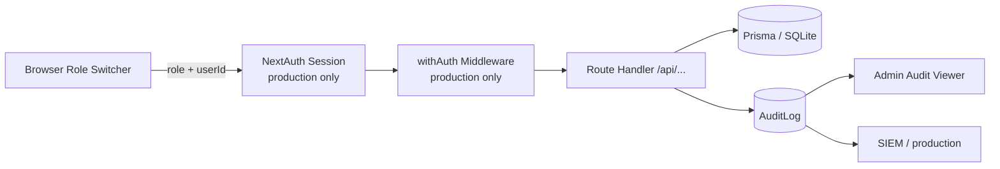
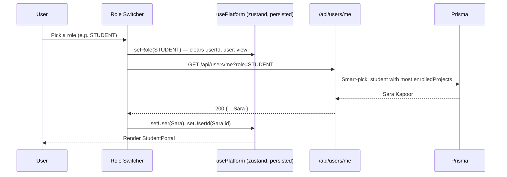
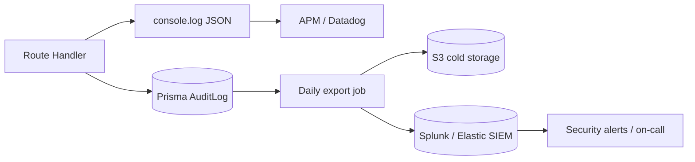

# InternForge — Security & RBAC

> Reference for the InternForge security model: how the demo enforces role boundaries today,
> what the production upgrade path looks like, and the gap between the two.
>
> The platform ships in **sandbox demo mode** with no real authentication. Authorization is
> enforced **client-side** via the role switcher (`src/components/platform/role-switcher.tsx`)
> and the persisted `usePlatform` store (`src/lib/role-store.ts`). Every API route is
> open-by-default in the demo; production wiring is documented below as the upgrade target.

---

## 1. Security model overview

InternForge is a multi-tenant internship platform with **five roles** sharing one codebase.
The security model has three layers:

1. **Identity (authentication)** — who is the caller? In the demo, identity is *simulated* by
   the role switcher selecting a seeded demo user. In production, identity is established by
   NextAuth.js v4 sessions (email/password + OAuth).
2. **Authorization (RBAC)** — what can the caller do? The platform defines 5 roles
   (`STUDENT`, `MENTOR`, `COMPANY`, `ADMIN`, `RECRUITER`) with resource-scoped permissions.
3. **Audit (accountability)** — what did the caller do? Every mutating endpoint writes an
   `AuditLog` row (`action`, `resource`, `resourceId`, `severity`, `userId`, `ipAddress`).



In **demo mode**, the dashed path (`NextAuth`, `withAuth middleware`) is absent — the role +
userId are passed as query parameters and trusted as-is. The route handlers are open. This is
acceptable for the sandbox but **must not** ship to production unmodified.

---

## 2. Authentication

### 2.1 Demo mode (current build)

The demo intentionally ships **without authentication** so the role switcher can drive the
experience instantly. Identity flows like this:



Key properties of the demo:
- **No credentials** are exchanged. The role and userId are passed as plain query parameters
  to role-aware endpoints (notably `GET /api/users/me` and `GET /api/analytics/overview`).
- The persisted store (`localStorage` key `internforge-platform`) only keeps the long-lived
  `role` + `view` preferences; `userId` and `user` are **transient** and re-fetched on every
  page load. This prevents stale user references after a role switch.
- A "user picker" dropdown in the role switcher lists candidate demo users for the active role
  (loaded via `GET /api/users?role=…&status=ACTIVE`).

### 2.2 Production mode — NextAuth.js v4

The intended upgrade path is to wrap the App Router in NextAuth.js v4 with the credentials +
OAuth providers below. None of this is wired in the sandbox; this is the launch checklist.

#### 2.2.1 Providers

| Provider        | Use case                                                       | Library                              |
|-----------------|----------------------------------------------------------------|---------------------------------------|
| Credentials     | Email + password (Argon2id-hashed) — primary path              | `next-auth@4` Credentials provider    |
| Google OAuth    | Student sign-up (consumer identity)                            | `next-auth/providers/google`          |
| GitHub OAuth    | Developer-leaning students & mentors                           | `next-auth/providers/github`          |
| LinkedIn OAuth  | Recruiter & company admins (professional identity verification) | `next-auth/providers/linkedin`     |

#### 2.2.2 Session strategy
- **JWT** strategy (stateless, HS256, 30-day expiry).
- The JWT encodes `{ id, role, companyId?, email, name, avatarUrl? }`.
- The session callback injects `role` and `companyId` from the User row so route handlers
  can read `session.user.role` directly.

#### 2.2.3 `withAuth` middleware
A single Next.js middleware (`src/middleware.ts`) wraps every `/api/*` route except
`/api/users/me` (the login bootstrap), `/api/certificates/verify` (public verification),
and `/api/admin/health` (unauthenticated probe). It:
1. Reads the JWT from the `Authorization: Bearer <token>` header (or the `next-auth.session`
   cookie for first-party browser calls).
2. Rejects invalid / expired sessions with `401 Unauthorized`.
3. Attaches `req.user = { id, role, companyId }` to the request for downstream handlers.
4. Writes a `AuditLog` row (`action=AUTH`, `resource=Session`, `severity=INFO`) on every
   successful validation, throttled to once per (user, hour).

#### 2.2.4 Password storage
- Hash with **Argon2id** (`argon2` npm package), `m=65536, t=3, p=4`.
- Never log passwords; never include them in the JWT or session.
- On password reset, invalidate all active sessions for the user (JWT `jti` blocklist in Redis).

#### 2.2.5 OAuth hardening
- For Google / GitHub / LinkedIn, after the first OAuth sign-in, the user is **prompted** to
  set a password before they can access the platform (so they can fall back to credentials).
- LinkedIn OAuth is required for `COMPANY` and `RECRUITER` roles (professional identity
  verification is enforced before granting pipeline access).

---

## 3. Role-based access control (RBAC)

### 3.1 The five roles

| Role        | Persona                                              | Demo user               |
|-------------|------------------------------------------------------|-------------------------|
| `STUDENT`   | Discovers internships, applies, builds, earns certs  | Sara Kapoor             |
| `MENTOR`    | Guides assigned interns, reviews submissions        | Arjun Nair              |
| `COMPANY`   | Posts internships, tracks pipeline, hires            | Neha Iyer (FinEdge)     |
| `RECRUITER` | Sources talent, screens, shortlists                  | (mapped to Company portal in demo) |
| `ADMIN`     | Governs the platform, audits, secures                | Aria Mehta (super admin)|

### 3.2 Permission matrix

| Resource / Action           | STUDENT | MENTOR | COMPANY | RECRUITER | ADMIN |
|-----------------------------|:-------:|:------:|:-------:|:---------:|:-----:|
| **Users**                   |         |        |         |           |       |
| List users                  | view self only | view assigned students | view own company members | view own company members | view all |
| View own profile            | ✅ edit | ✅ edit | ✅ edit | ✅ edit | ✅ edit |
| Suspend / activate users    | ❌ | ❌ | ❌ (own members only in prod) | ❌ | ✅ |
| **Internships**             |         |        |         |           |       |
| Browse open internships     | ✅ | ✅ | ✅ (all) | ✅ (all) | ✅ |
| View single internship      | ✅ | ✅ | ✅ | ✅ | ✅ |
| Create / edit internship    | ❌ | ❌ | ✅ (own company) | ❌ | ✅ |
| Save (bookmark)             | ✅ | — | — | ✅ | — |
| **Applications**            |         |        |         |           |       |
| View own applications       | ✅ | — | — | — | ✅ |
| View applications for own company | — | — | ✅ | ✅ | ✅ |
| Apply                       | ✅ | ❌ | ❌ | ❌ | — |
| Move stage (advance/reject) | ❌ | ❌ | ✅ (own company) | ✅ (own company) | ✅ |
| Withdraw                    | ✅ (own) | — | — | — | — |
| **Projects**                |         |        |         |           |       |
| View own projects           | ✅ | ✅ (mentored) | ✅ (own company) | ✅ (own company) | ✅ |
| Create / edit milestones    | ❌ | ✅ (assigned) | ❌ | ❌ | ✅ |
| Assign mentor               | ❌ | ❌ | ✅ (own company) | ❌ | ✅ |
| **Tasks (Kanban)**          |         |        |         |           |       |
| View tasks in project       | ✅ (own) | ✅ (assigned) | ✅ (own company) | ✅ (own company) | ✅ |
| Create / move task          | ✅ (own project) | ✅ (assigned project) | ❌ | ❌ | ✅ |
| **Submissions**             |         |        |         |           |       |
| View own submissions        | ✅ | — | — | — | ✅ |
| View submissions for project | — | ✅ (assigned) | ✅ (own company) | ✅ (own company) | ✅ |
| Create submission           | ✅ (own project) | ❌ | ❌ | ❌ | — |
| Run plagiarism check        | ✅ (own) | ✅ (assigned) | ❌ | ❌ | ✅ |
| **Evaluations**             |         |        |         |           |       |
| View evaluations of own work | ✅ | — | — | — | ✅ |
| View evaluations for assigned project | — | ✅ | ✅ (own company) | ✅ (own company) | ✅ |
| Create evaluation           | ❌ | ✅ (assigned) | ❌ | ❌ | ✅ |
| **Skills**                  |         |        |         |           |       |
| View own skills + gaps     | ✅ | ✅ (own) | — | — | ✅ |
| Edit own skill evidence     | ✅ (own) | ✅ (own) | ❌ | ❌ | ✅ |
| **Assessments**             |         |        |         |           |       |
| Take assessment             | ✅ (enrolled) | — | — | — | — |
| View results                | ✅ (own) | ✅ (assigned students) | ✅ (own company) | ✅ (own company) | ✅ |
| Create / edit assessment    | ❌ | ❌ | ✅ (own company) | ❌ | ✅ |
| **Certificates**            |         |        |         |           |       |
| View own certificates       | ✅ | — | ✅ (own company) | ✅ (own company) | ✅ |
| Generate certificate        | ✅ (own project) | ❌ | ✅ (own company) | ❌ | ✅ |
| Verify (public)             | ✅ | ✅ | ✅ | ✅ | ✅ |
| **Logs / Attendance**       |         |        |         |           |       |
| View own daily logs         | ✅ | ✅ (own) | — | — | ✅ |
| Upsert own daily log        | ✅ | ✅ (own) | — | — | ✅ |
| View attendance             | ✅ (own) | ✅ (assigned students) | ✅ (own company) | ✅ (own company) | ✅ |
| Mark attendance             | ❌ | ✅ (assigned) | ❌ | ❌ | ✅ |
| **Messages / Notifications**|         |        |         |           |       |
| View own conversations      | ✅ | ✅ | ✅ | ✅ | ✅ |
| Send message                | ✅ (member of conv) | ✅ (member) | ✅ (member) | ✅ (member) | ✅ (member) |
| View own notifications      | ✅ | ✅ | ✅ | ✅ | ✅ |
| Mark own notif read         | ✅ | ✅ | ✅ | ✅ | ✅ |
| **Announcements / Onboarding / Badges / Feedback** | | | | | |
| View announcements          | ✅ | ✅ | ✅ (own) | ✅ (own) | ✅ |
| Broadcast announcement     | ❌ | ❌ | ✅ (own company) | ❌ | ✅ |
| View own onboarding         | ✅ | ✅ (assigned) | — | — | ✅ |
| Update onboarding status    | ✅ (own) | ✅ (assigned) | — | — | ✅ |
| View own badges             | ✅ | ✅ | — | — | ✅ |
| Give feedback               | ✅ (own) | ✅ (to assigned) | ✅ | ✅ | ✅ |
| Receive feedback            | ✅ | ✅ | ✅ | ✅ | ✅ |
| **Analytics**               |         |        |         |           |       |
| Overview (self-scoped)      | ✅ (self) | ✅ (self) | ✅ (company) | ✅ (company) | ✅ (all) |
| **Admin**                   |         |        |         |           |       |
| View audit logs             | ❌ | ❌ | ❌ | ❌ | ✅ |
| Manage settings             | ❌ | ❌ | ❌ | ❌ | ✅ |
| Run health check            | ❌ | ❌ | ❌ | ❌ | ✅ |
| Re-seed demo data           | ❌ | ❌ | ❌ | ❌ | ✅ |

### 3.3 How the demo enforces this (the role-scoped `/me` + portal routing)

In the sandbox, the role boundary is enforced at **two seams**:

1. **`GET /api/users/me?role=…&userId=…`** is the single entry point for the active identity.
   The route smart-picks the "most interesting" demo user per role:
   - `MENTOR` → the mentor with the most `mentoredProjects`.
   - `STUDENT` → the student with the most `enrolledProjects`.
   - `COMPANY` / `RECRUITER` → a user with at least one `companyMemberships` row.
   - `ADMIN` → any active `ADMIN` user.
   The role of the returned user is guaranteed to match the query `role`, so portal routing
   is safe.

2. **`src/app/page.tsx`** renders exactly one portal based on `role`:
   ```tsx
   {role === 'STUDENT' && <StudentPortal ... />}
   {role === 'MENTOR'  && <MentorPortal ... />}
   {(role === 'COMPANY' || role === 'RECRUITER') && <CompanyPortal ... />}
   {role === 'ADMIN'   && <AdminPortal ... />}
   ```
   A user with role `STUDENT` cannot render the Admin Portal — the switch in `page.tsx` makes
   it impossible. The role switcher itself is the only entry point to change `role`, and in
   production it would be replaced by the actual session role (read-only).

In production, both seams become **defense in depth** — the canonical enforcement moves to
server-side middleware (`withAuth`) + per-route `requireRole()` helpers. The client-side
portal switch remains as a UX convenience but is no longer a security boundary.

---

## 4. Authorization (granular rules)

Beyond "which role can hit which route", InternForge enforces **object-level** authorization —
i.e. who can see/edit *which instance* of a resource. The demo's list endpoints accept the
filtering parameters that make these rules enforceable; production wraps each route in a
`requireOwner` / `requireScoped` helper.

### 4.1 Student scope
A student may only see and mutate **their own** resources:

| Rule                                                      | Enforced via                                         |
|-----------------------------------------------------------|------------------------------------------------------|
| `GET /api/applications?studentId=<self>`                  | Caller's `userId` must equal `studentId`             |
| `GET /api/submissions?studentId=<self>`                  | Same as above                                         |
| `GET /api/projects?studentId=<self>`                     | Same as above                                         |
| `GET /api/skills?userId=<self>`                          | Same                                                  |
| `GET /api/logs?userId=<self>`                            | Same                                                  |
| `GET /api/notifications?userId=<self>`                  | Same                                                  |
| `GET /api/certificates?userId=<self>`                   | Same                                                  |
| `GET /api/analytics/overview?role=STUDENT&userId=<self>` | `userId` must equal session user                      |
| `POST /api/submissions` (own `studentId`)                | Body `studentId` must equal session user             |
| `POST /api/evaluations`                                  | ❌ Students may not create evaluations (mentor-only) |

### 4.2 Mentor scope
A mentor sees only the **projects assigned to them** and the submissions/evaluations beneath
those projects:

| Rule                                                       | Enforced via                                       |
|------------------------------------------------------------|-----------------------------------------------------|
| `GET /api/projects?mentorId=<self>`                       | Caller's `userId` must equal `mentorId`             |
| `GET /api/submissions?projectId=<assigned>`              | The project's `mentorId` must equal session user    |
| `GET /api/evaluations?mentorId=<self>`                    | Caller's `userId` must equal `mentorId`             |
| `POST /api/evaluations` (`mentorId=<self>`)               | Body `mentorId` must equal session user             |
| `GET /api/analytics/overview?role=MENTOR&userId=<self>`   | `userId` must equal session user                    |

### 4.3 Company / Recruiter scope
A company admin or recruiter sees only the **internships + applications for their own company**:

| Rule                                                                  | Enforced via                                              |
|-----------------------------------------------------------------------|------------------------------------------------------------|
| `GET /api/applications?companyId=<selfCompanyId>`                    | Caller's `companyId` must match                            |
| `GET /api/internships?companyId=<selfCompanyId>`                      | Caller's `companyId` must match                            |
| `PATCH /api/applications/[id]`                                        | The application's `internship.companyId` must match caller  |
| `POST /api/evaluations`                                               | ❌ Company role may not author evaluations                  |

### 4.4 Admin scope
Admin sees everything; writes are audit-logged at `severity=INFO` (or `WARN` for sensitive
actions like user suspension):

| Rule                            | Enforced via                              |
|---------------------------------|--------------------------------------------|
| `GET /api/admin/audit`           | Role must be `ADMIN`                       |
| `GET /api/admin/settings`        | Role must be `ADMIN`                       |
| `PATCH /api/admin/settings`      | Role must be `ADMIN`; writes audited `WARN` |
| `GET /api/admin/health`          | Public (probe route)                       |
| `POST /api/admin/seed`           | Role must be `ADMIN`; writes audited `WARN` |

### 4.5 The demo's actual enforcement today
The current route handlers **do not** perform these checks — they trust the query parameters
passed by the client. This is the documented gap. Production requires a per-route wrapper, e.g.:

```ts
// src/lib/requireScope.ts (proposed, not yet in repo)
export async function requireRole(req: Request, roles: Role[]) {
  const session = await getSession(req)
  if (!session || !roles.includes(session.user.role))
    throw new HttpError(403, 'FORBIDDEN', `Requires role: ${roles.join(' | ')}`)
  return session
}
export async function requireOwner(req: Request, ownerOf: 'studentId' | 'mentorId' | 'companyId') {
  const session = await getSession(req)
  // … check that the resource's `ownerOf` matches session.user[ownerOf]
}
```

Every `/api/**/route.ts` would call `requireRole` (and `requireOwner` where applicable) at the
top, before the Prisma query.

---

## 5. Audit logs

### 5.1 The `AuditLog` model

```prisma
model AuditLog {
  id         String   @id @default(cuid())
  userId     String?
  user       User?    @relation(...)
  action     String          // CREATE | UPDATE | DELETE | AUTH | AI_CALL | EXPORT | ...
  resource   String          // User | Application | Evaluation | Session | AI | ...
  resourceId String?
  details    Json?
  ipAddress  String?
  severity   String   @default("INFO")   // INFO | WARN | ERROR | CRITICAL
  createdAt  DateTime @default(now())
}
```

### 5.2 What's logged today

The demo writes audit rows from a small set of mutating endpoints:

| Endpoint                             | Action  | Resource     | Severity |
|--------------------------------------|---------|--------------|----------|
| `PATCH /api/applications/[id]`       | UPDATE  | Application  | INFO     |

(Other mutating endpoints — `POST /api/applications`, `POST /api/submissions`,
`POST /api/evaluations`, `POST /api/feedback`, `POST /api/messages`, `POST /api/tasks`,
`PATCH /api/tasks/[id]`, `PATCH /api/notifications/[id]`, `PATCH /api/onboarding/[id]`,
`POST /api/certificates`, `POST /api/logs`, `PATCH /api/admin/settings`, `POST /api/admin/seed` —
do **not** yet emit audit rows in the demo. They are listed here as the production coverage
target. The seed script (`prisma/seed.ts`) does pre-populate the audit log with synthetic
entries so the Admin Audit viewer has data to render.)

### 5.3 Severity levels

| Severity   | Color   | Use                                                         |
|------------|---------|-------------------------------------------------------------|
| `INFO`     | sky     | Normal create/update operations                              |
| `WARN`     | amber   | Sensitive admin actions (settings changes, user suspension, re-seed) |
| `ERROR`    | rose    | Failed operations that should be investigated (e.g. failed payment, failed assessment submission) |
| `CRITICAL` | rose-bg | Security-critical events (auth bypass attempt, mass deletion, suspicious AI usage) |

### 5.4 The Admin Audit viewer
`GET /api/admin/audit?severity=…` returns the most recent 50 audit log entries with the
related `user` joined. The Admin Portal renders this as a filterable table:
- Severity Select filter.
- Action search filter (substring match on the `action` field).
- Date range filter (client-side).
- `CRITICAL` + `ERROR` rows highlighted.
- Row click → Dialog with full `details` JSON in a `JsonBlock` viewer.
- Severity distribution BarChart.
- "Export CSV" button (currently a demo toast; production should stream a CSV).

### 5.5 Production SIEM path
For a real launch, the `AuditLog` table is the **platform-of-record** but not the only sink:



Recommended production additions:
- Stream audit events to a SIEM via a fire-and-forget queue (SQS / Kafka) so audit latency
  doesn't block the user-facing write.
- Add a daily export to S3 cold storage (90-day retention for free tier; longer for paid
  plans).
- Add anomaly detection on `action=AUTH, severity=WARN` bursts (brute-force signal).
- Add an alert on any `severity=CRITICAL` event to the on-call rotation.

---

## 6. Data privacy & GDPR

### 6.1 Data retention

| Data class                | Retention (recommended)        | Demo policy      |
|---------------------------|--------------------------------|-------------------|
| Active user records        | Until right-to-erasure request | Persisted forever |
| Soft-deleted user records  | 90 days (then hard delete)      | Not implemented   |
| Audit logs                 | 7 years (compliance)            | Persisted forever |
| Submissions + evaluations  | Tied to user account            | Persisted forever |
| Daily logs                 | 365 days (rolling)              | Persisted forever |
| Messages                   | 365 days (rolling)              | Persisted forever |
| AI prompts + responses     | 30 days (for abuse review)      | Not stored        |
| Certificate records        | Permanent (proof of completion) | Persisted forever |

### 6.2 Consent
The production sign-up flow must capture explicit consent for:
- Marketing communications (opt-in, default off).
- Analytics tracking (opt-in, default off).
- AI-assisted features (opt-in, default on — but documented in the privacy policy).

The `PlatformSetting` table (`key` / `value`) is the right place to store per-user consent
flags, e.g. `consent:marketing:<userId>` = `"false"`.

### 6.3 Right to erasure (soft delete via `User.status`)
The `User` model carries a `status` field with values `ACTIVE | SUSPENDED | INACTIVE`. The
intended erasure flow:

1. User submits an erasure request (web form or email).
2. Admin sets `User.status = 'INACTIVE'` (soft delete — the user can no longer log in, their
   name is masked in UIs, but the row + relations remain for audit/compliance).
3. After 90 days, a cron job hard-deletes the user row (cascading deletes clean up
   `applications`, `submissions`, `evaluations`, etc. — see the Prisma schema `onDelete:
   Cascade` rules).
4. Audit log rows referencing the user are retained (`User?` relation + `onDelete: SetNull`),
   so the audit trail survives the erasure.

The demo's `GET /api/users` route already filters `status: 'ACTIVE'`, so soft-deleted users
are invisible in lists immediately.

### 6.4 Data export (right to portability)
GDPR Article 20 requires the ability to export personal data in a machine-readable format.
Production should add:
- `GET /api/users/me/export` → returns a ZIP with `profile.json`, `applications.json`,
  `submissions.json`, `evaluations.json`, `certificates.json`, `logs.json`, `messages.json`.
- The Admin Portal "Users" view should expose a "Export user data" action that calls the
  same route with an `userId` parameter.

### 6.5 Data minimization in AI
As documented in `docs/05-ai-features.md` §8.5:
- AI prompts never carry PII (email, phone, location, university).
- Submission content is truncated to 3000 chars before LLM transmission.
- AI responses are not stored except where the mentor explicitly persists them via
  `POST /api/evaluations` (in `aiFeedback`).

---

## 7. Encryption

### 7.1 At rest
- **Database:** SQLite file at `db/custom.db` (or `DATABASE_URL` in production). SQLite does
  not natively encrypt the file. Production deployments should either:
  - Migrate to PostgreSQL with `pgcrypto` for column-level encryption of PII fields
    (`User.phone`, `User.email` if sensitivity warrants), or
  - Use SQLCipher (encrypted SQLite) for small / single-tenant deployments, or
  - Use full-disk encryption (LUKS on Linux, FileVault on macOS, AWS EBS encryption) which
    is sufficient for most platforms.
- **Backups:** Must be encrypted at rest (AWS S3 server-side encryption with KMS, or
  `gpg --symmetric` for self-hosted).
- **Secrets:** Never in the DB. AI SDK credentials, NextAuth secret, OAuth client secrets,
  DB URL — all read from environment variables / a secrets manager (AWS Secrets Manager,
  Doppler, Vault).

### 7.2 In transit
- **Browser ↔ App:** TLS terminated by the **Caddy gateway** (`Caddyfile` terminates TLS on
  port 443 with automatic Let's Encrypt). Internal traffic from Caddy to Next.js (port 3000)
  and to the socket.io service (port 3003) is plain HTTP on `localhost` — acceptable because
  it never leaves the host.
- **App ↔ LLM SDK:** HTTPS to the `z-ai-web-dev-sdk` upstream. No custom TLS configuration
  needed.
- **WebSocket:** WSS through Caddy; the socket.io handshake upgrades to WSS after the
  initial HTTPS polling.

### 7.3 Secrets management
| Secret                       | Source (demo) | Source (production)              |
|------------------------------|---------------|-----------------------------------|
| `DATABASE_URL`               | `.env`        | Secrets manager / env var         |
| `NEXTAUTH_SECRET`            | n/a (not wired) | 32-byte random in secrets manager |
| `ZAI_API_KEY` (SDK internal) | SDK default   | Secrets manager / env var         |
| OAuth client secrets          | n/a           | Secrets manager per provider      |

`.env` files are git-ignored (verify with `.gitignore`); never commit real secrets.

---

## 8. Input validation & output safety

### 8.1 Request body parsing
- All write routes call `await req.json()` and destructure expected fields. There is **no
  schema validation library** (e.g. Zod) in the demo — types come from the call-site and
  `src/lib/types.ts`. Production should add Zod schemas per route, e.g.:
  ```ts
  const Body = z.object({ internshipId: z.string().cuid(), coverLetter: z.string().max(5000).optional() })
  const { internshipId, coverLetter } = Body.parse(await req.json())
  ```

### 8.2 JSON fields
The Prisma schema stores several JSON columns (`requirements`, `skillsRequired`,
`responsibilities`, `tasksCompleted`, `evidence`, `strengths`, `improvements`, `questions`,
`answers`, `readBy`, `details`, `criteria`, `stageNotes`). These are validated at the
application boundary in production; the demo trusts the client.

### 8.3 React escaping
- All user-generated content is rendered through React's default JSX escaping. There are
  **no `dangerouslySetInnerHTML`** calls in any portal component.
- The `AIBadge` and `StatusPill` components render text, not raw HTML.
- The Mentor Portal renders submission `content` inside a styled `<pre>` (not
  `react-syntax-highlighter`'s HTML injector) so even malicious HTML in a submission body
  is escaped.

### 8.4 Cache policy
- The typed client sets `cache: 'no-store'` on every `fetch` — responses are never cached
  by intermediate CDNs. This prevents stale authorization decisions (the production concern)
  and stale data leaks (the GDPR concern) at the same time.
- The `no-store` policy applies even to public endpoints like
  `GET /api/certificates/verify?code=…` — verification results are always live.

### 8.5 CSRF
- The demo has no cookies (stateless), so CSRF is not exploitable in the current sandbox.
- Production with NextAuth cookie sessions **must** add CSRF protection. NextAuth v4 ships
  with built-in CSRF tokens (double-submit cookie pattern) — ensure `csrfToken` is enabled
  (default) and all mutations check it.

### 8.6 SQL injection
- All DB access goes through Prisma's parameterized queries. The route handlers do not
  compose raw SQL strings. The `q` substring filter (`/api/internships?q=…`) uses Prisma's
  `contains` operator, which is parameterized under the hood. No SQL injection vector.

---

## 9. Security headers & protections

### 9.1 Production security headers checklist
Configure these in `next.config.ts` or via the Caddy gateway:

| Header                          | Value                                              | Why                                                  |
|---------------------------------|----------------------------------------------------|------------------------------------------------------|
| `Strict-Transport-Security`     | `max-age=63072000; includeSubDomains; preload`     | Force HTTPS for 2 years, opt into HSTS preload       |
| `Content-Security-Policy`      | `default-src 'self'; img-src 'self' data: https:; script-src 'self' 'unsafe-inline'; connect-src 'self' wss: https:;` | Block XSS, allow inline scripts (Next.js needs this), allow WSS to socket.io |
| `X-Frame-Options`               | `DENY`                                              | Clickjacking prevention                              |
| `X-Content-Type-Options`        | `nosniff`                                          | MIME-sniffing prevention                             |
| `Referrer-Policy`               | `strict-origin-when-cross-origin`                  | Limit referrer leakage to same-origin                |
| `Permissions-Policy`           | `geolocation=(), microphone=(), camera=()`         | Disable unused device APIs                           |
| `Cross-Origin-Opener-Policy`    | `same-origin`                                      | Process isolation                                     |
| `Cross-Origin-Embedder-Policy`  | `require-corp`                                     | Safe cross-origin embedding                          |
| `Cross-Origin-Resource-Policy`  | `same-origin`                                      | Restrict cross-origin resource loads                 |

### 9.2 XSS
- Defense in depth: React escaping (default) + strict CSP (above) + no `dangerouslySetInnerHTML`.
- The `AIBadge` component explicitly marks AI-generated content as a separate visual class so
  a malicious AI reply is sandboxed from the rest of the UI styling.

### 9.3 Rate limiting
See `docs/04-api-reference.md` §5. Production tiers:
- Edge: 600 req/min/IP on `/api/*`.
- Admin: 60 req/min/IP on `/api/admin/*`.
- AI: 20 req/hour/user on `/api/ai/*` (highest leverage — see `05-ai-features.md` §10).

### 9.4 WebSocket hardening
- Replace `cors: { origin: '*' }` on the socket.io service with the production origin allowlist.
- Authenticate the socket handshake via the NextAuth JWT in `io({ auth: { token } })`.
- Add per-room rate limiting on `message` and `task:moved` events to prevent flood attacks.
- Add a `heartbeat` event so silent disconnects are detected faster than `pingTimeout`.

### 9.5 Dependency scanning
- Run `bun audit` weekly; pin transitive deps via `bun.lock`.
- Use Dependabot or Snyk to monitor `next`, `next-auth`, `prisma`, `z-ai-web-dev-sdk` for CVEs.

### 9.6 Session management
- JWT `jti` blocklist in Redis for forced logouts.
- Password reset invalidates all sessions for the user.
- Suspicious-login detection: email + new-IP combo triggers a verification email.

---

## 10. Demo vs production gap

| # | Concern                                  | Demo (current build)                                              | Production (target)                                                        |
|---|------------------------------------------|-------------------------------------------------------------------|----------------------------------------------------------------------------|
| 1 | Authentication                           | None. Role switcher picks a seeded user.                          | NextAuth.js v4 with credentials + Google + GitHub + LinkedIn OAuth.        |
| 2 | Authorization                            | Client-side role switch + per-view switch in `page.tsx`.           | `withAuth` middleware + per-route `requireRole` / `requireOwner` helpers. |
| 3 | Object-level authorization               | Trusts query params (`studentId`, `mentorId`, `companyId`).       | Server-side scoping against `session.user.id` / `companyId`.              |
| 4 | Input validation                         | `await req.json()` + destructure, no schema.                       | Zod schemas per route; reject malformed bodies with 400.                   |
| 5 | Audit logging                            | Only `PATCH /api/applications/[id]`; seed provides sample data.     | Every mutating endpoint writes AuditLog; streamed to SIEM.                |
| 6 | Rate limiting                            | None.                                                              | Edge + per-route token buckets; aggressive on `/api/ai/*`.                |
| 7 | Database encryption                      | Plain SQLite file.                                                 | PostgreSQL + `pgcrypto` for PII; full-disk encryption at minimum.         |
| 8 | TLS                                      | Caddy terminates TLS on :443 (configured in Caddyfile).            | Same + HSTS preload + OCSP stapling.                                       |
| 9 | Secrets                                  | `.env` file (gitignored).                                          | Secrets manager (Doppler / Vault / AWS Secrets Manager).                   |
| 10 | CSRF                                    | N/a (no cookies).                                                  | NextAuth CSRF tokens enforced on every mutation.                          |
| 11 | Security headers                        | Defaults only.                                                     | Full `next.config.ts` header block (§9.1).                                |
| 12 | Right to erasure                         | `User.status = 'INACTIVE'` field exists; not wired to an admin UI. | Admin "Suspend / Erase" action + 90-day cron hard-delete.                  |
| 13 | Data export                              | None.                                                              | `GET /api/users/me/export` ZIP route.                                       |
| 14 | Plagiarism detection                     | Heuristic word-repetition ratio.                                   | Embedding-similarity index + external AI-text detector.                    |
| 15 | AI prompt logging                        | Not stored.                                                        | 30-day retention for abuse review (per-call `AuditLog` with redacted prompt hash). |
| 16 | WebSocket auth                           | `cors: { origin: '*' }`, no auth.                                  | JWT handshake, per-room RBAC, origin allowlist.                            |
| 17 | Multi-tenancy                            | Single shared SQLite DB.                                           | Per-tenant schema or row-level security policies in PostgreSQL.            |
| 18 | Backup & disaster recovery               | None.                                                              | Daily encrypted backups + tested restore drill quarterly.                 |
| 19 | Dependency CVEs                          | `bun audit` available but not scheduled.                          | Weekly `bun audit` + Dependabot alerts.                                    |
| 20 | Incident response                        | None.                                                              | Runbook + on-call rotation + automated alerts on CRITICAL audit events.   |

The demo is built to make the production upgrade mechanical: every route handler already
accepts `userId` as a query parameter — in production, that parameter simply comes from
`session.user.id` instead of the URL, and the route returns 403 if the caller tries to
impersonate another user.
