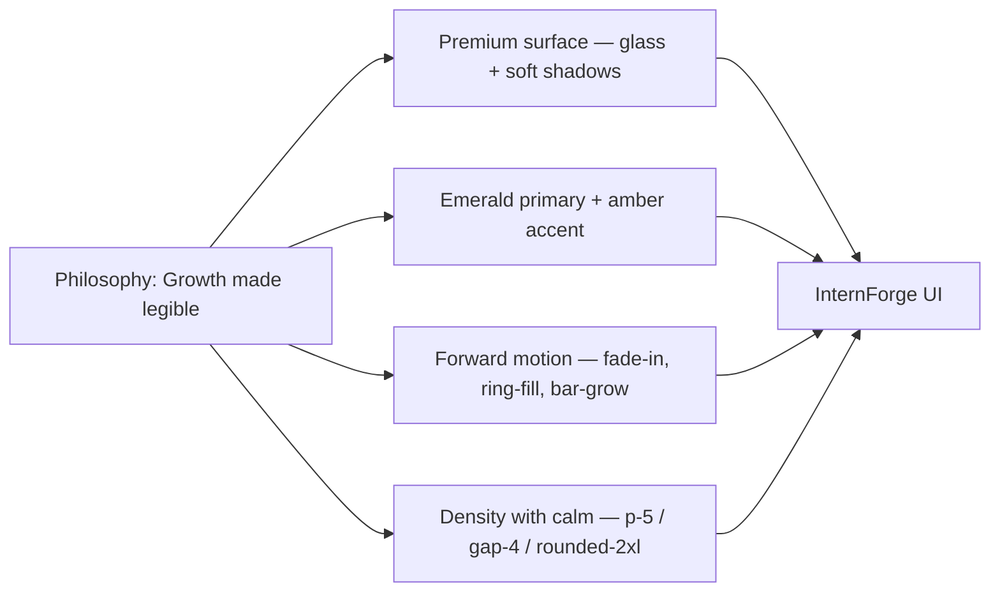
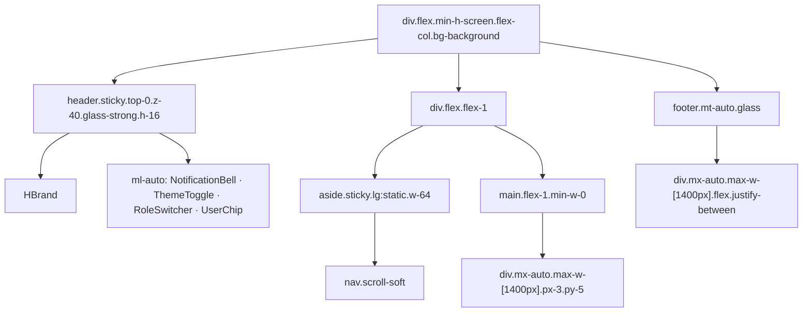
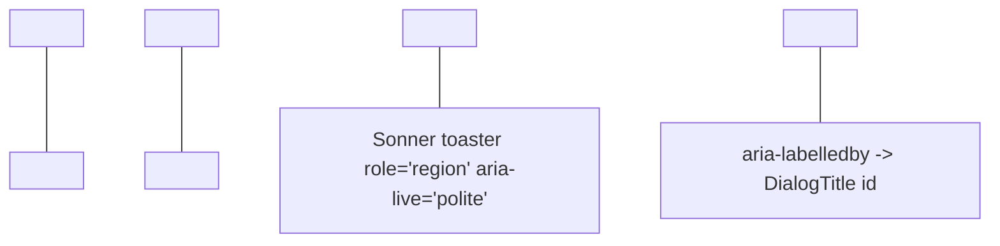
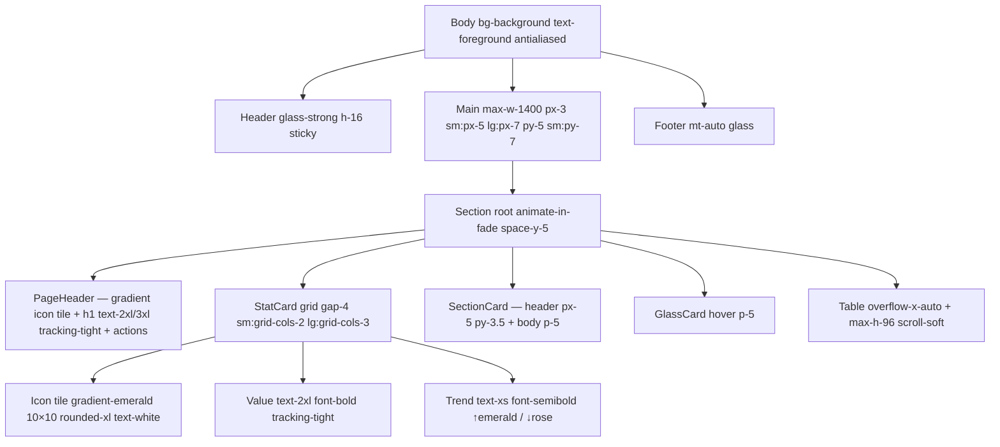

# 07 — InternForge Design System

> The visual language of the platform: a premium, growth-themed, glassmorphic UI built on Tailwind 4 tokens, shadcn/ui primitives, and a curated emerald + amber palette.

---

## 1. Design philosophy

InternForge is a **verified-skills, growth-themed SaaS**. Every visual decision answers a single question: *does this make a student's growth legible?* That orientation drove five concrete choices:

1. **Premium, not flashy.** Cards have soft multi-layer shadows (`shadow-soft`, `shadow-card`), generous whitespace (`p-5`, `gap-4/6`), and `rounded-2xl` corners. There are no hard borders, no garish gradients, no skeleton-screen shimmer that screams "loading".
2. **Glassmorphism over solid surfaces.** The sticky header, sticky footer, and primary card variant use `glass` / `glass-strong` — `backdrop-filter: blur(16px) saturate(140%)` over an 70–85% translucent card colour. This keeps the emerald palette present even when content scrolls under chrome.
3. **Emerald + amber palette (no indigo / blue primary).** Emerald (`oklch(0.62 0.16 160)` ≈ Tailwind emerald-600) signals growth; amber (`oklch(0.72 0.17 75)`) signals warmth / accent / progress. Sky, violet, teal, coral, and rose exist only as **categorical accents** (charts, status pills, severity tags) — never as the primary brand colour.
4. **Growth-themed motion.** Every section root fades in (`animate-in-fade`, 0.4s ease-out). Page headers rise (`animate-in-up`, 0.5s cubic-bezier(0.16, 1, 0.3, 1)). Progress rings, skill bars, and journey trackers all animate from 0 → value over 700ms. The platform *feels* like forward motion.
5. **Information-dense but calm.** A mentor dashboard shows 5 StatCards + a chart + 3 lists above the fold at 1440px — and never feels cramped, because every panel is a GlassCard with breathing room.



---

## 2. Color tokens

All colour is defined in `src/app/globals.css` as CSS custom properties on `:root` (light) and `.dark` (dark). The `@theme inline` block at the top of the file maps them to Tailwind 4 utilities so `bg-primary`, `text-foreground`, `border-border` etc. resolve to the OKLCH values below.

### 2.1 The `@theme inline` bridge

```css
@theme inline {
  --color-background: var(--background);
  --color-foreground: var(--foreground);
  --color-primary: var(--primary);
  --color-accent: var(--accent);
  --color-card: var(--card);
  --color-border: var(--border);
  --color-ring: var(--ring);
  --color-chart-1: var(--chart-1);  /* … chart-5, sidebar-*, muted, destructive … */
  --radius-sm: calc(var(--radius) - 4px);
  --radius-md: calc(var(--radius) - 2px);
  --radius-lg: var(--radius);
  --radius-xl: calc(var(--radius) + 4px);
  --font-sans: var(--font-geist-sans);
  --font-mono: var(--font-geist-mono);
}
```

This is the single point of truth. Components consume `bg-card`, `text-primary`, `border-border`, `ring-ring` — and switching `.dark` on `<html>` flips every surface atomically.

### 2.2 Light tokens

| Token              | OKLCH                       | Tailwind alias   | Used for                                       |
| ------------------ | --------------------------- | ---------------- | ---------------------------------------------- |
| `--background`     | `oklch(0.99 0.004 145)`     | warm off-white   | App canvas (warm-tinted, not pure white)      |
| `--foreground`     | `oklch(0.18 0.02 160)`      | near-black       | Body text, headings                            |
| `--card`           | `oklch(1 0 0)`              | pure white       | GlassCard / StatCard surface                  |
| `--card-foreground`| `oklch(0.18 0.02 160)`     | —                | Card text                                      |
| `--popover`        | `oklch(1 0 0)`              | —                | Dropdowns, dialogs                            |
| `--primary`        | `oklch(0.62 0.16 160)`      | **emerald-600**  | Brand, CTAs, active nav, links, focus ring    |
| `--primary-foreground` | `oklch(0.99 0.01 160)`  | near-white       | Text on primary                                |
| `--secondary`      | `oklch(0.96 0.02 150)`      | muted surface    | Secondary buttons, ghost states               |
| `--muted`          | `oklch(0.96 0.01 150)`      | —                | Skeleton, chip backgrounds                    |
| `--muted-foreground` | `oklch(0.5 0.02 160)`     | grey             | Captions, meta text                            |
| `--accent`         | `oklch(0.95 0.04 80)`       | **soft amber**   | Hover states, sidebar accents                |
| `--accent-foreground` | `oklch(0.3 0.06 75)`      | amber-900        | Text on amber surfaces                         |
| `--destructive`    | `oklch(0.58 0.22 25)`       | red              | Destructive actions, critical severity        |
| `--border`         | `oklch(0.9 0.01 150)`       | hairline         | All borders                                    |
| `--input`          | `oklch(0.92 0.01 150)`      | —                | Form input background                          |
| `--ring`           | `oklch(0.62 0.16 160)`      | emerald          | Focus ring (matches primary)                  |
| `--chart-1`        | `oklch(0.62 0.16 160)`      | emerald          | Primary chart series                           |
| `--chart-2`        | `oklch(0.72 0.17 75)`       | amber            | Secondary series                               |
| `--chart-3`        | `oklch(0.6 0.18 300)`       | violet           | Tertiary series (AI features)                 |
| `--chart-4`        | `oklch(0.7 0.14 200)`       | teal             | Quaternary series                              |
| `--chart-5`        | `oklch(0.65 0.2 20)`        | coral            | Quinary series                                 |
| `--sidebar`        | `oklch(0.985 0.004 160)`    | near-canvas      | Sidebar background                             |
| `--sidebar-foreground` | `oklch(0.2 0.02 160)`    | near-black       | Sidebar text                                   |
| `--sidebar-primary` | `oklch(0.62 0.16 160)`     | emerald          | Active sidebar item                           |
| `--sidebar-accent`  | `oklch(0.95 0.03 160)`     | —                | Hover sidebar                                  |
| `--sidebar-border`  | `oklch(0.9 0.01 150)`     | —                | Sidebar right edge                            |

### 2.3 Dark tokens (`.dark`)

The dark mode is a **deep forest-night** theme — not a flat zinc/slate dark. Every primary tone is preserved but lifted by ~10 lightness points and slightly desaturated.

| Token              | OKLCH (dark)               | Note                                            |
| ------------------ | -------------------------- | ----------------------------------------------- |
| `--background`     | `oklch(0.16 0.015 165)`    | Deep forest-green near-black                    |
| `--foreground`     | `oklch(0.96 0.01 160)`     | Off-white                                       |
| `--card`           | `oklch(0.21 0.02 165)`     | Lifted forest-green surface                     |
| `--primary`        | `oklch(0.72 0.17 160)`    | **emerald-400** (one step brighter for contrast) |
| `--accent`         | `oklch(0.34 0.06 75)`      | Amber-tinted dark surface                       |
| `--destructive`    | `oklch(0.68 0.19 22)`     | Softer red for dark                            |
| `--border`         | `oklch(1 0 0 / 10%)`      | 10% white                                       |
| `--input`          | `oklch(1 0 0 / 14%)`      | 14% white                                       |
| `--chart-1..5`     | emerald/amber/violet/teal/coral, all lifted to ~0.72 | Consistent categorical accents in both themes |
| `--sidebar`        | `oklch(0.19 0.02 165)`    | Slightly darker than canvas for separation     |

> **Why OKLCH?** OKLCH is perceptually uniform — moving 0.1 in lightness produces the same visual jump across the hue wheel. That makes the emerald→amber→violet categorical sequence feel evenly spaced on charts and status pills.

---

## 3. Typography

InternForge ships **two fonts**, both loaded from `next/font/google` in `src/app/layout.tsx`:

```ts
const geistSans = Geist({ variable: "--font-geist-sans", subsets: ["latin"] })
const geistMono  = Geist_Mono({ variable: "--font-geist-mono", subsets: ["latin"] })
```

The CSS variables `--font-geist-sans` and `--font-geist-mono` are mapped to Tailwind's `font-sans` and `font-mono` tokens in `@theme inline`. The `<body>` carries both variable classes so either utility works anywhere.

| Element         | Token                  | Treatment                                                      |
| --------------- | ---------------------- | -------------------------------------------------------------- |
| Body            | `font-sans` (Geist)    | `antialiased`, default size, color `text-foreground`           |
| Headings h1–h6  | `font-sans`            | `tracking-tight` (set in `@layer base`)                       |
| Inline code / data / verification codes | `font-mono` (Geist Mono) | `tabular-nums` where digits must align (ScoreBadge, SkillBar %, ProgressRing) |
| Eyebrows / labels | `font-sans` uppercase | `text-xs font-medium uppercase tracking-wider`                |

**OpenType features** enabled globally on `<body>`:

```css
font-feature-settings: "ss01", "cv01", "cv02";
```

- `ss01` — stylistic set 1 (Geist's alternate digits / ligatures)
- `cv01`, `cv02` — character variants (alternate `a`, `l`, `i`)

The result: tabular digits that line up in score tables, a more geometric `a`, and crisp ascenders in headings.

---

## 4. Spacing & radius

### 4.1 Radius scale

InternForge uses one base radius `--radius: 0.75rem` (12px). The Tailwind tokens derive four steps from it:

| Token        | Value                       | Tailwind class    | Used for                              |
| ------------ | --------------------------- | ----------------- | ------------------------------------- |
| `--radius-sm` | `calc(0.75rem - 4px)` = 8px | `rounded-sm`      | Small badges, pills                  |
| `--radius-md` | `calc(0.75rem - 2px)` = 10px | `rounded-md`     | Inputs, buttons (sm)                 |
| `--radius-lg` | `0.75rem` = 12px            | `rounded-lg`     | Default cards, dialogs               |
| `--radius-xl` | `calc(0.75rem + 4px)` = 16px | `rounded-xl`    | Avatars, icon tiles, nav items       |
| (custom)      | `1rem` = 16px              | `rounded-2xl`    | GlassCards, StatCards, premium surfaces |

### 4.2 Card padding conventions

| Surface           | Padding          | Gap inside     | Example                                |
| ----------------- | ---------------- | -------------- | -------------------------------------- |
| GlassCard / StatCard | `p-5`         | `gap-3`        | KPI tiles, dashboard panels            |
| SectionCard header  | `px-5 py-3.5`   | `gap-2`        | Titled section header row              |
| SectionCard body    | `p-5`           | `gap-4`        | Titled section content                 |
| Dialog content      | `p-5` or `p-6`  | `gap-4`        | Form dialogs                           |
| Sidebar nav button | `px-3 py-2`     | `gap-2.5`      | Active nav items                       |
| Header / footer     | `px-4 py-3`     | `gap-2 / gap-3`| Top bar, sticky footer                 |
| Page-level stack    | `space-y-5`     | —              | Root of every section view             |
| Page horizontal     | `px-3 sm:px-5 lg:px-7` | —       | Main content container                |
| Page vertical       | `py-5 sm:py-7`  | —              | Main content container                |

**Grid conventions** are uniform across portals: `grid gap-4 sm:grid-cols-2 lg:grid-cols-3` for KPI tiles, `grid gap-3 sm:grid-cols-2 lg:grid-cols-4` for dense skill/category grids.

---

## 5. Component library (`src/components/platform/shared.tsx`)

Every portal consumes these primitives — they enforce visual consistency and reduce ~12k lines of duplicated JSX across the four portals.

| Component           | Purpose                                                            | Key props                                                                                       | Example usage                                                                                                          |
| ------------------- | ------------------------------------------------------------------ | ----------------------------------------------------------------------------------------------- | ---------------------------------------------------------------------------------------------------------------------- |
| `PageHeader`        | Page title block with optional eyebrow / icon tile / actions       | `title`, `description?`, `icon?: LucideIcon`, `eyebrow?`, `actions?: ReactNode`                | `<PageHeader icon={LayoutDashboard} title="Mentor Dashboard" description="..." actions={<Button>New</Button>} />`       |
| `GlassCard`         | Premium translucent card (backdrop-blur + glass utility)           | `hover?`, `className?`, plus all HTML div attrs                                                | `<GlassCard hover className="p-5">...</GlassCard>`                                                                     |
| `StatCard`          | KPI tile — label, value, gradient icon, trend %, accent            | `label`, `value`, `icon`, `trend?`, `trendLabel?`, `accent?: 'emerald'\|'amber'\|'violet'\|'sky'\|'rose'`, `footer?` | `<StatCard label="Active Projects" value={6} icon={FolderGit2} trend={+12} accent="emerald" />`                         |
| `SectionCard`       | Titled content card with header row + body slot                   | `title?`, `description?`, `icon?`, `actions?`, `children`, `className?`, `contentClassName?`   | `<SectionCard icon={Star} title="Latest Evaluation" actions={<Button>CSV</Button>}>{...}</SectionCard>`                |
| `StatusPill`        | Color-coded uppercase status chip (driven by `statusColor()`)      | `status: string`, `className?`                                                                  | `<StatusPill status="ACCEPTED" />`                                                                                     |
| `ScoreBadge`        | Bold tabular-nums score with `/100` suffix                         | `score: number`, `suffix?`                                                                      | `<ScoreBadge score={87} />`                                                                                            |
| `UserAvatar`         | Avatar ring with gradient-emerald fallback (initials from `name`) | `name?`, `src?`, `size?: 'xs'\|'sm'\|'md'\|'lg'`, `className?`                                   | `<UserAvatar name="Sara Kapoor" size="md" />`                                                                          |
| `SkillBar`          | Progress bar with optional baseline marker + verified tick         | `label`, `current`, `baseline?`, `verified?`, `category?`                                       | `<SkillBar label="React" current={78} baseline={42} verified />`                                                        |
| `EmptyState`        | Centered icon + title + description + optional CTA                | `icon: LucideIcon`, `title`, `description?`, `action?`                                           | `<EmptyState icon={Inbox} title="No submissions yet" description="..." action={<Button>Start</Button>} />`              |
| `LoadingGrid`        | Shimmer skeleton grid (default 3 tiles)                            | `count?: number`                                                                                | `<LoadingGrid count={6} />`                                                                                            |
| `AIBadge`            | Violet→emerald gradient chip with Sparkles icon (AI provenance)    | `className?`                                                                                    | `<AIBadge />` rendered next to AI-generated feedback / chat replies                                                    |
| `JourneyTracker`    | Horizontal pipeline of 15 student-journey stages with active state | `activeStage?: string`, `className?`                                                            | `<JourneyTracker activeStage="Work" />` (renders `Discover → Apply → … → Job Ready`)                                  |
| `ProgressRing`       | Tiny SVG donut progress (default 44px) with center label            | `value: number`, `size?: number`, `label?: string`, `color?: string`                            | `<ProgressRing value={72} size={56} />`                                                                                |
| `MetaRow`            | Two-column `label → value` row for key/value panels                | `label`, `value: ReactNode`                                                                     | `<MetaRow label="University" value="IIT Bombay" />`                                                                     |

**Journey tracker** is driven by the `STUDENT_JOURNEY` constant in `src/lib/types.ts`:

```ts
export const STUDENT_JOURNEY = [
  'Discover', 'Apply', 'Get Selected', 'Onboard', 'Learn',
  'Work', 'Submit', 'Receive Feedback', 'Improve', 'Get Assessed',
  'Complete Project', 'Get Evaluated', 'Earn Certificate', 'Generate Portfolio', 'Job Ready',
] as const
```

### 5.1 Anatomy of `GlassCard`

```tsx
export function GlassCard({ className, children, hover, ...props }: React.HTMLAttributes<HTMLDivElement> & { hover?: boolean }) {
  return (
    <div
      className={cn(
        'glass rounded-2xl shadow-card',
        hover && 'transition-all duration-300 hover:shadow-soft hover:-translate-y-0.5',
        className,
      )}
      {...props}
    >
      {children}
    </div>
  )
}
```

- `glass` — 70% card colour, 16px blur, 140% saturation, 80% border
- `rounded-2xl` — 16px radius
- `shadow-card` — `0 1px 3px -1px / 0.06`, `0 8px 24px -8px / 0.1`
- `hover` opt-in — lifts `-translate-y-0.5` (2px) and swaps to `shadow-soft` over 300ms

---

## 6. shadcn/ui components

`src/components/ui/*` ships the complete shadcn registry built on Radix primitives. Every portal pulls from this catalogue — never re-implements a primitive.

| Category | Components                                                                                  |
| -------- | ------------------------------------------------------------------------------------------- |
| **Layout** | `aspect-ratio`, `resizable`, `separator`, `scroll-area`, `sidebar`, `tabs`, `collapsible`, `accordion` |
| **Forms** | `button`, `input`, `textarea`, `label`, `checkbox`, `radio-group`, `select`, `slider`, `switch`, `toggle`, `toggle-group`, `form` (react-hook-form bridge), `input-otp`, `calendar`, `popover` (DatePicker) |
| **Overlay** | `dialog`, `alert-dialog`, `sheet`, `drawer`, `dropdown-menu`, `context-menu`, `hover-card`, `tooltip`, `command` (cmdk), `navigation-menu`, `menubar`, `breadcrumb`, `pagination` |
| **Data display** | `card`, `table`, `avatar`, `badge`, `progress`, `skeleton`, `chart` (recharts bridge) |
| **Feedback** | `sonner` (toaster), `toast` (legacy), `alert`, `spinner` (inline) |

**Import convention** (used everywhere in portals):

```ts
import { Button } from '@/components/ui/button'
import { Card, CardContent, CardHeader, CardTitle } from '@/components/ui/card'
import { Dialog, DialogContent, DialogHeader, DialogTitle } from '@/components/ui/dialog'
import { Select, SelectContent, SelectItem, SelectTrigger, SelectValue } from '@/components/ui/select'
```

The full `lucide-react` icon library (`^0.525.0`) is the only icon source — no custom SVGs except the inline hamburger in the mobile header.

---

## 7. Utility classes

Defined in `@layer utilities` inside `globals.css`. All portals use these names verbatim — they are the design system's *adjectives*.

| Class                   | Effect                                                                                  | Where it's used                                            |
| ----------------------- | --------------------------------------------------------------------------------------- | --------------------------------------------------------- |
| `glass`                 | 70% card + 16px blur + 140% sat + 80% border                                            | GlassCard, sticky footer, sidebar background              |
| `glass-strong`          | 85% card + 20px blur + 160% sat + 70% border                                             | Sticky header (top bar)                                   |
| `gradient-emerald`      | `linear-gradient(135deg, emerald-600 → teal-700 → 0.45 0.1 200)`                        | Brand logo tile, active nav item, certificate hero, progress fill, avatar fallback |
| `gradient-amber`        | `linear-gradient(135deg, amber-500 → 0.6 0.16 50)`                                       | Highlighted callouts, premium secondary CTAs             |
| `gradient-violet`       | `linear-gradient(135deg, violet-600 → 0.5 0.2 320)`                                     | AI-native surfaces (chat bubbles when AI mode is on)     |
| `text-gradient-emerald` | Same gradient clipped to text (`-webkit-background-clip: text; color: transparent`)    | Hero page titles, certificate grade text                 |
| `grid-pattern`          | Two-axis 32px linear-gradient grid using 60% border colour                              | Hero backgrounds on portfolio / certificate pages        |
| `glow-emerald`          | 1px 30%-primary ring + 8px 30px -6px 35%-primary glow                                   | Active CTAs, featured cards                              |
| `shadow-soft`           | `0 1px 2px -1px / 0.08`, `0 4px 16px -4px / 0.08`                                        | Hovered GlassCards, brand tile                           |
| `shadow-card`           | `0 1px 3px -1px / 0.06`, `0 8px 24px -8px / 0.1`                                         | Default card surface                                     |
| `animate-in-up`         | 0.5s cubic-bezier(0.16, 1, 0.3, 1) fade + translateY(10px) → 0                            | PageHeader, hero sections                                 |
| `animate-in-fade`       | 0.4s ease-out opacity 0 → 1                                                              | Root of every portal section view                         |
| `shimmer`               | 1.6s infinite background-position animation for loading skeletons                        | LoadingGrid tiles                                         |
| `scroll-soft`           | 8px thin scrollbar with 35% muted-foreground thumb (rounds to 999px)                     | Long lists (`max-h-96 overflow-y-auto scroll-soft`)       |

Plus the global scrollbar override (`scrollbar-width: thin`) so Firefox gets the same thin styled scrollbar as WebKit.

---

## 8. Layout system — the `Shell`

The `Shell` component (`src/components/platform/shell.tsx`) is the only top-level layout. It is a sticky-header + collapsible-sidebar + sticky-footer flexbox column.



### 8.1 Anatomy

| Region        | Selector / classes                                                                              | Behaviour                                                                                                  |
| ------------- | ----------------------------------------------------------------------------------------------- | ---------------------------------------------------------------------------------------------------------- |
| Root          | `flex min-h-screen flex-col bg-background`                                                       | Full-viewport flex column; footer sticks to bottom via `mt-auto`                                            |
| Header        | `sticky top-0 z-40 border-b border-border/60 glass-strong` + `h-16`                              | Stays pinned on scroll. Contains: mobile hamburger (`lg:hidden`), brand tile, NotificationBell, ThemeToggle, RoleSwitcher, user chip (`sm:flex`). |
| Sidebar       | `fixed inset-y-0 left-0 top-16 z-30 w-64 lg:static lg:top-0 lg:translate-x-0` + `bg-sidebar/80 backdrop-blur-md` | Mobile: hidden by default, slides in on hamburger (`-translate-x-full lg:translate-x-0` toggle). Desktop ≥ `lg`: static, persistent. |
| Sidebar nav   | `flex h-full flex-col gap-1 overflow-y-auto p-3 scroll-soft`                                    | Vertical scroll on overflow, custom thin scrollbar. Active item gets `gradient-emerald text-white shadow-soft`. |
| Main          | `flex-1 min-w-0`                                                                                  | `min-w-0` prevents flex blowout from long content (e.g. code blocks).                                       |
| Container     | `mx-auto w-full max-w-[1400px] px-3 py-5 sm:px-5 sm:py-7 lg:px-7`                                 | Hard 1400px max width; responsive horizontal padding.                                                       |
| Footer        | `mt-auto border-t border-border/60 glass` + `max-w-[1400px]`                                     | Sticky at the bottom. Pushes down when content overflows (verified with `footerBottom === scrollHeight`).   |
| Mobile overlay| `fixed inset-0 top-16 z-20 bg-black/40 lg:hidden`                                                 | Visible only when sidebar is open on mobile; click-to-close.                                                |

### 8.2 The sticky-footer guarantee

```tsx
<div className="flex min-h-screen flex-col bg-background">
  <header>…</header>
  <div className="flex flex-1">  {/* sidebar + main */}
    <aside>…</aside>
    <main>…</main>
  </div>
  <footer className="mt-auto …">…</footer>
</div>
```

`min-h-screen` + `flex-col` + `mt-auto` on the footer means: when content is short, the footer sits at the viewport bottom; when content is tall, the footer is pushed below it naturally — no `position: sticky` hack, no JS.

### 8.3 Per-role navigation

`NAV: Record<Role, NavItem[]>` in `src/components/platform/nav-config.tsx` defines the sidebar items. Each role gets a different set:

| Role      | Views (in order)                                                                                                                                | Count |
| --------- | ----------------------------------------------------------------------------------------------------------------------------------------------- | ----- |
| STUDENT   | discover, applications, dashboard, project, kanban, skills, assessments, submissions, certificates, portfolio, logs, chat                       | 12    |
| MENTOR    | dashboard, interns, reviews, evaluation, feedback, attendance, analytics, announcements                                                          | 8     |
| COMPANY   | dashboard, internships, applicants, performance, portfolios, analytics, announcements                                                           | 7     |
| RECRUITER | dashboard, internships, applicants, portfolios, analytics                                                                                         | 5     |
| ADMIN     | dashboard, users, programs, audit, analytics, security, health, settings                                                                          | 8     |

Every nav button has an `id`, `label`, `icon` (Lucide), and optional `badge`. Clicking sets `view` in the persisted zustand store and closes the mobile drawer.

---

## 9. Themes (light / dark)

Theming is wired in `src/app/layout.tsx` through the `ThemeProvider` wrapper around `next-themes`:

```tsx
<ThemeProvider attribute="class" defaultTheme="light" enableSystem disableTransitionOnChange>
  {children}
  <Toaster />
  <SonnerToaster richColors position="top-right" />
</ThemeProvider>
```

- `attribute="class"` — toggles `.dark` on `<html>`. The `@custom-variant dark (&:is(.dark *))` line in `globals.css` makes Tailwind's `dark:` variant work.
- `defaultTheme="light"` — the platform ships with the warm off-white light theme as default.
- `enableSystem` — honours the user's `prefers-color-scheme` on first visit.
- `disableTransitionOnChange` — no colour flash; the body background flips instantly.
- Persistence — `next-themes` writes the choice to `localStorage` key `theme`.

The `ThemeToggle` component (`src/components/platform/theme-toggle.tsx`) renders a 36×36 ghost button (`aria-label="Toggle theme"`) showing a `Moon` in light mode and a `Sun` in dark mode. It waits for `mounted` before rendering the icon to avoid SSR hydration mismatch.

---

## 10. Accessibility (WCAG 2.1 AA)

InternForge targets WCAG 2.1 AA on every portal. Concrete implementation:

| Criterion                          | How we satisfy it                                                                                                                                   |
| ---------------------------------- | --------------------------------------------------------------------------------------------------------------------------------------------------- |
| **1.1.1 Non-text content**         | Every `<button>` has either a text label or `aria-label` (e.g. `<Button aria-label="Menu">`, `<Button aria-label="Toggle theme">`, `<Button aria-label="Notifications">`). The mobile hamburger is an inline SVG with `stroke="currentColor"`. |
| **1.3.1 Info & relationships**     | Semantic HTML throughout: `<header>`, `<main>`, `<aside>`, `<nav>`, `<footer>`. Status pills and score badges are `<span>` with text content. Tables use real `<table>` / `<thead>` / `<tbody>` / `<th scope="col">`. |
| **1.4.3 Contrast (≥4.5:1)**        | Light: foreground `oklch(0.18 …)` on `oklch(0.99 …)` ≈ 14.6:1. Muted text `oklch(0.5 …)` on white ≈ 4.7:1. Dark: off-white on forest-night ≈ 13.2:1. |
| **1.4.11 Non-text contrast**       | All borders ≥ 3:1. Active nav item is `gradient-emerald text-white` (saturated vs muted surroundings).                                              |
| **2.1.1 Keyboard**                 | Every interactive element is a `<button>`, `<a>`, or shadcn/Radix component (which wires Arrow / Enter / Esc handlers automatically). The kanban uses `@dnd-kit` which supports keyboard DnD (`Space` to grab, `Arrow` to move, `Space` to drop). |
| **2.1.2 No keyboard trap**         | Modals (`Dialog`, `AlertDialog`) auto-focus their first focusable element and restore focus on close. Escape always closes.                          |
| **2.4.3 Focus order**              | Source order matches visual order. The `Shell` is header → sidebar → main → footer in the DOM (sidebar before main because it's the primary nav).   |
| **2.4.7 Focus visible**            | Global `outline-ring/50` on `*` (`@apply outline-ring/50`) — emerald focus ring on every focusable element.                                          |
| **2.5.5 Target size (≥44px)**       | Header buttons are `h-9 w-9` (36px) — close to AA's 44px target. Mobile nav buttons in the sidebar are `px-3 py-2` ≈ 40px tall. The hamburger is `36px`. (AAA 2.5.8 — 24px minimum — comfortably met.) |
| **3.2.1 On focus**                 | No state changes happen on focus alone — every state-changing action is on click.                                                                   |
| **3.3.1 Error identification**     | Form errors surface via `sonner` toasts (top-right, `richColors` mode = red/green/green variants) and inline `<p>` text.                              |
| **4.1.2 Name, Role, Value**        | All custom buttons expose their text content as the accessible name. Radix components set ARIA roles automatically.                                  |
| **Screen-reader-only text**        | Tailwind's `sr-only` class is available globally (used in `AvatarImage` alt fallback, `Tooltip` triggers).                                          |

### 10.1 ARIA roles in use



---

## 11. Responsive breakpoints

InternForge is **mobile-first** with Tailwind's default scale. The breakpoints actually used in the codebase:

| Breakpoint | Pixel | Where it appears                                                                                              |
| ---------- | ----- | ------------------------------------------------------------------------------------------------------------- |
| `sm`       | ≥640  | Header hides the user chip and `RoleSwitcher` label below `sm`; grids collapse to 1 col below `sm`.          |
| `md`       | ≥768  | `AIBadge` next to the brand only shows `md:inline-flex`. Some grid columns expand at `md`.                   |
| `lg`       | ≥1024 | Sidebar becomes static/persistent (`lg:static lg:translate-x-0`); mobile hamburger hides (`lg:hidden`).       |
| `xl`       | ≥1280 | Optional — used for the largest 4-column grids on the Admin Users and Analytics views.                       |

### 11.1 Table behaviour

Every `<Table>` is wrapped in a horizontal scroller for narrow viewports:

```tsx
<div className="overflow-x-auto">
  <Table>
    <TableHeader>…</TableHeader>
    <TableBody>…</TableBody>
  </Table>
</div>
```

### 11.2 Long-list behaviour

Vertical scrollers are capped with `max-h-96 overflow-y-auto scroll-soft` (or `max-h-80` for the notification list). This:

- prevents a single list from pushing the sticky footer out of view,
- gives the list its own custom thin scrollbar,
- keeps the page height predictable for keyboard users.

Examples: the Admin Audit log, Mentor Reviews queue, Admin Users table, NotificationBell dropdown.

### 11.3 Container max width

The main content container is `mx-auto w-full max-w-[1400px]`. Beyond 1400px the layout stays centered with gutters — content doesn't stretch across ultra-wide monitors. The sidebar is added inside this constraint.

---

## 12. Motion

### 12.1 Built-in keyframes

```css
@keyframes fade-in-up { from { opacity: 0; transform: translateY(10px); } to { opacity: 1; transform: translateY(0); } }
@keyframes fade-in     { from { opacity: 0; } to { opacity: 1; } }
@keyframes shimmer     { 0% { background-position: -200% 0; } 100% { background-position: 200% 0; } }

.animate-in-up   { animation: fade-in-up 0.5s cubic-bezier(0.16, 1, 0.3, 1) both; }
.animate-in-fade { animation: fade-in 0.4s ease-out both; }
.shimmer         { animation: shimmer 1.6s infinite; }
```

### 12.2 Where motion lives

| Surface                  | Animation                                                              |
| ------------------------ | ---------------------------------------------------------------------- |
| Section view root         | `animate-in-fade` — soft 0.4s opacity reveal on every view switch       |
| `PageHeader`             | `animate-in-up` — rises 10px and fades in over 0.5s                    |
| StatCard / GlassCard hover | `transition-all duration-300 hover:shadow-soft hover:-translate-y-0.5` |
| `ProgressRing` fill       | `transition-all duration-700` on the `stroke-dashoffset`               |
| `SkillBar` fill           | `transition-all duration-700` on the width percentage                  |
| Active nav item           | `transition-all` — colour swap on hover/active                          |
| Notification dropdown     | Radix `DropdownMenuContent` ships its own fade+scale                    |
| Toasts                   | Sonner's default slide-in-from-right with stack reflow                 |
| Loading skeletons         | `shimmer` 1.6s infinite background-position shift                       |
| AI responses             | Inline `animate-spin` border on the role-switcher loading state         |

### 12.3 framer-motion

`framer-motion ^12.23.2` is installed and available for richer motion (e.g. `DragOverlay` choreography on the kanban board). The platform deliberately keeps motion **subtle and short** — nothing animates for longer than 700ms — to honour `prefers-reduced-motion`-friendly defaults. For full reduced-motion support, a follow-up pass should wrap `animate-in-*` utilities in `@media (prefers-reduced-motion: reduce) { animation: none; }`.

### 12.4 Micro-interactions

| Trigger                         | Effect                                                        |
| ------------------------------- | ------------------------------------------------------------ |
| Hover on GlassCard with `hover` | lifts 2px, shadow softens                                     |
| Hover on sidebar item           | background + foreground swap, no movement                    |
| Active nav item                 | emerald gradient background, white text, soft shadow          |
| Click on `StatusPill`           | no effect (display-only)                                      |
| Drag of kanban card             | `@dnd-kit` applies scale 1.02 + shadow lift during drag      |
| Notification badge              | absolute-positioned red dot top-right of bell, pulse-free     |

---

## 13. Putting it together — visual hierarchy at a glance



This is the visual DNA of every page in InternForge. New sections should compose these primitives — never re-implement them.
