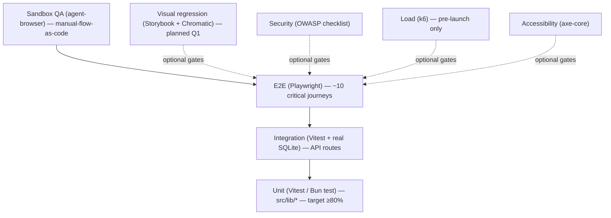
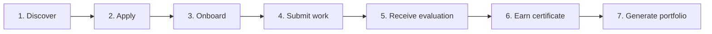
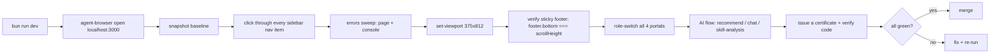
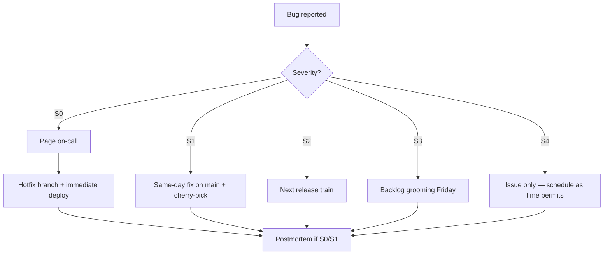

# 09 — Testing & QA

> The testing strategy for InternForge: unit, integration, end-to-end, security, load, accessibility, visual regression — plus the sandbox QA loop we actually run today.

---

## 1. Testing strategy overview

InternForge follows the classic **testing pyramid** with one deliberate addition: a sandbox-verification layer driven by `agent-browser` for manual-exploration-as-code.



| Layer       | Tooling                       | Owner              | Cadence                |
| ----------- | ----------------------------- | ------------------ | ---------------------- |
| Unit        | Vitest / Bun test, jsdom     | Engineer           | Every commit (CI)      |
| Integration | Vitest + `prisma/db push` against temp SQLite | Engineer | Every commit (CI) |
| E2E         | Playwright + Next.js dev server | Engineer        | Nightly + on PR to main |
| Sandbox QA  | `agent-browser` CLI           | Engineer / QA      | Every feature merge    |
| Visual      | Storybook + Chromatic         | Designer / Engineer | On UI change (planned Q1) |
| Security    | OWASP checklist + dependency scan | Security champion | Pre-launch + monthly  |
| Load        | k6                            | Performance engineer | Pre-launch + on major release |
| A11y        | axe-core (jest-axe + axe CLI) | Engineer            | Every commit (CI)       |

> v1.0 ships with `bun run lint` + `bunx tsc --noEmit` as the enforced gates; the test suites below are the *recommended* scaffolding we land in Q1 (see docs/10-roadmap). The agent-browser sandbox loop is **already in use** today.

---

## 2. Unit tests

### 2.1 What to test

The biggest ROI is `src/lib/` — pure functions with no DB or React.

| Module             | Functions to test                                              | Why                                                            |
| ------------------ | -------------------------------------------------------------- | -------------------------------------------------------------- |
| `src/lib/format.ts` | `formatDate`, `formatDateTime`, `timeAgo`, `daysUntil`, `initials`, `formatNumber`, `clamp`, `statusColor`, `scoreColor`, `gradeColor`, `gradeToColor` | Pure functions; UI depends on them heavily; easy to exhaustively cover. |
| `src/lib/zai.ts`   | `chatJson` fallback behaviour (returns the fallback on init failure, on `chat()` returning null, on non-JSON response, on malformed JSON) | Critical graceful-degradation path for all 4 AI endpoints. |
| `src/app/api/evaluations/route.ts` | POST scoring math — `score = round((cq + com + del + lrn) / 4)` | Numeric correctness; bad input → 0. |
| `src/app/api/assessments/[id]/submit/route.ts` | Scoring math — `score = round((correct / total) * maxScore)`, the "ratio fallback" when questions array is empty, idempotent upsert on `assessmentId_userId` | Critical correctness for student grading. |
| `src/app/api/certificates/route.ts` | Grade computation — `avg ≥ 90 → A+`, `≥ 80 → A`, `≥ 70 → B+`, `≥ 60 → B`, else `C`. Verification code uniqueness (`IF-VERIFY-XXXXXX`). | Issues a credential; off-by-one is unacceptable. |

### 2.2 Example unit test — `src/lib/format.ts`

```ts
// src/lib/__tests__/format.test.ts
import { describe, expect, it } from 'vitest'
import {
  formatDate, formatDateTime, timeAgo, daysUntil,
  initials, formatNumber, clamp,
  statusColor, scoreColor, gradeColor, gradeToColor,
} from '../format'

describe('formatDate / formatDateTime', () => {
  it('formats a Date with the default opts', () => {
    expect(formatDate(new Date('2025-08-14T12:00:00Z'))).toMatch(/Aug.*14.*2025/)
  })
  it('handles null/undefined gracefully', () => {
    expect(formatDate(null)).toBe('—')
    expect(formatDate(undefined)).toBe('—')
  })
  it('returns — for invalid date', () => {
    expect(formatDate('not-a-date')).toBe('—')
  })
  it('formatDateTime adds time', () => {
    const out = formatDateTime('2025-08-14T13:45:00Z')
    expect(out).toMatch(/Aug.*14.*2025/)
  })
})

describe('timeAgo', () => {
  it('returns "just now" for the last minute', () => {
    expect(timeAgo(new Date(Date.now() - 10_000))).toBe('just now')
  })
  it('returns "Nm ago" under an hour', () => {
    expect(timeAgo(new Date(Date.now() - 5 * 60_000))).toMatch(/^\d+m ago$/)
  })
  it('returns "Nh ago" under a day', () => {
    expect(timeAgo(new Date(Date.now() - 3 * 3_600_000))).toMatch(/^\dh ago$/)
  })
  it('returns "Nd ago" under a week', () => {
    expect(timeAgo(new Date(Date.now() - 2 * 86_400_000))).toMatch(/^\dd ago$/)
  })
  it('falls back to formatDate beyond 7d', () => {
    expect(timeAgo(new Date(Date.now() - 30 * 86_400_000))).toMatch(/\d{4}/)
  })
})

describe('daysUntil', () => {
  it('returns positive days for future dates', () => {
    const future = new Date(Date.now() + 7 * 86_400_000)
    expect(daysUntil(future)).toBeGreaterThanOrEqual(6)
  })
  it('returns null for empty input', () => {
    expect(daysUntil(null)).toBeNull()
    expect(daysUntil(undefined)).toBeNull()
  })
})

describe('initials', () => {
  it('extracts first letters of first two words', () => {
    expect(initials('Sara Kapoor')).toBe('SK')
    expect(initials('Arjun Vikram Nair')).toBe('AN')
  })
  it('returns ? for empty', () => {
    expect(initials(null)).toBe('?')
    expect(initials('')).toBe('?')
  })
})

describe('formatNumber / clamp', () => {
  it('adds thousands separators', () => {
    expect(formatNumber(1234567)).toBe('1,234,567')
  })
  it('clamps to [0, 100] by default', () => {
    expect(clamp(-5)).toBe(0)
    expect(clamp(150)).toBe(100)
    expect(clamp(50, 0, 200)).toBe(50)
  })
})

describe('statusColor', () => {
  it('maps known statuses correctly', () => {
    expect(statusColor('ACCEPTED')).toContain('emerald-600')
    expect(statusColor('REJECTED')).toContain('rose')
    expect(statusColor('CRITICAL')).toContain('rose-600')
  })
  it('falls back to muted for unknown', () => {
    expect(statusColor('UNKNOWN')).toContain('muted')
  })
  it('is case-insensitive', () => {
    expect(statusColor('accepted')).toBe(statusColor('ACCEPTED'))
  })
})

describe('scoreColor / gradeColor', () => {
  it('scoreColor: 85+ emerald, 70+ sky, 50+ amber, else rose', () => {
    expect(scoreColor(95)).toContain('emerald')
    expect(scoreColor(72)).toContain('sky')
    expect(scoreColor(55)).toContain('amber')
    expect(scoreColor(20)).toContain('rose')
  })
  it('gradeColor: A emerald, B sky, C amber, else rose', () => {
    expect(gradeColor('A+')).toContain('emerald')
    expect(gradeColor('B')).toContain('sky')
    expect(gradeColor('C')).toContain('amber')
    expect(gradeColor('F')).toContain('rose')
  })
  it('gradeToColor returns the bare colour name', () => {
    expect(gradeToColor('A')).toBe('emerald')
    expect(gradeToColor('B+')).toBe('sky')
    expect(gradeToColor('C')).toBe('amber')
    expect(gradeToColor('F')).toBe('rose')
  })
})
```

### 2.3 Example unit test — `src/lib/zai.ts` `chatJson` fallbacks

```ts
// src/lib/__tests__/zai.test.ts
import { describe, expect, it, vi, beforeEach } from 'vitest'
import { chatJson, getZai } from '../zai'

// Reset the module-level cache between tests
beforeEach(() => {
  vi.resetModules()
})

describe('chatJson', () => {
  it('returns the fallback when the SDK init fails', async () => {
    vi.doMock('z-ai-web-dev-sdk', () => ({
      default: { create: vi.fn().mockRejectedValue(new Error('network down')) },
    }))
    const { chatJson } = await import('../zai')
    const out = await chatJson(
      [{ role: 'user', content: 'return {"ok":true}' }],
      { ok: false, reason: 'fallback' },
    )
    expect(out).toEqual({ ok: false, reason: 'fallback' })
  })

  it('returns the fallback when the LLM response is not JSON', async () => {
    vi.doMock('z-ai-web-dev-sdk', () => ({
      default: {
        create: vi.fn().mockResolvedValue({
          chat: {
            completions: {
              create: vi.fn().mockResolvedValue({
                choices: [{ message: { content: 'sure thing, here it is' } }],
              }),
            },
          },
        }),
      },
    }))
    const { chatJson } = await import('../zai')
    const out = await chatJson(
      [{ role: 'user', content: 'return JSON' }],
      { fallback: true },
    )
    expect(out).toEqual({ fallback: true })
  })

  it('parses the first JSON object embedded in prose', async () => {
    vi.doMock('z-ai-web-dev-sdk', () => ({
      default: {
        create: vi.fn().mockResolvedValue({
          chat: {
            completions: {
              create: vi.fn().mockResolvedValue({
                choices: [{ message: { content: 'Sure! Here is your JSON: {"score":85,"skills":["TS"]} — let me know.' } }],
              }),
            },
          },
        }),
      },
    }))
    const { chatJson } = await import('../zai')
    const out = await chatJson<{ score: number; skills: string[] }>(
      [{ role: 'user', content: 'analyse' }],
      { score: 0, skills: [] },
    )
    expect(out).toEqual({ score: 85, skills: ['TS'] })
  })

  it('returns fallback when SDK returns null content', async () => {
    vi.doMock('z-ai-web-dev-sdk', () => ({
      default: {
        create: vi.fn().mockResolvedValue({
          chat: {
            completions: {
              create: vi.fn().mockResolvedValue({ choices: [{ message: {} }] }),
            },
          },
        }),
      },
    }))
    const { chatJson } = await import('../zai')
    expect(await chatJson([], { fallback: true })).toEqual({ fallback: true })
  })
})
```

### 2.4 Example unit test — scoring math in `POST /api/evaluations`

```ts
// src/app/api/evaluations/__tests__/route.test.ts
import { describe, expect, it } from 'vitest'

// Pure function extracted from the route handler for testability.
// In the real refactor we extract `computeScore` into `src/lib/scoring.ts`.
function computeScore(codeQuality: number, communication: number, delivery: number, learning: number) {
  return Math.round(
    ((Number(codeQuality) || 0) + (Number(communication) || 0) + (Number(delivery) || 0) + (Number(learning) || 0)) / 4
  )
}

describe('evaluation composite score', () => {
  it('averages the four dimensions and rounds', () => {
    expect(computeScore(80, 70, 90, 100)).toBe(85)
    expect(computeScore(85, 85, 85, 85)).toBe(85)
    expect(computeScore(0, 0, 0, 0)).toBe(0)
    expect(computeScore(100, 100, 100, 100)).toBe(100)
  })
  it('treats NaN/undefined as 0', () => {
    expect(computeScore(NaN, 80, 80, 80)).toBe(60)
    expect(computeScore(undefined as any, 80, 80, 80)).toBe(60)
  })
})
```

### 2.5 Example unit test — `POST /api/assessments/[id]/submit` scoring

```ts
// src/lib/__tests__/assessment-scoring.test.ts
import { describe, expect, it } from 'vitest'

function scoreAssessment(
  questions: { id: string; answer: string }[],
  answers: { id: string; selected: string }[],
  maxScore: number,
): { score: number; correct: number; ratio: number } {
  let correct = 0
  for (const q of questions) {
    const a = answers.find((x) => x.id === q.id)
    if (a && a.selected === q.answer) correct++
  }
  const ratio = questions.length ? correct / questions.length : Math.min(1, answers.length / 5)
  const score = Math.round(ratio * maxScore)
  return { score, correct, ratio }
}

describe('assessment scoring', () => {
  it('counts correct answers and scales to maxScore', () => {
    const qs = [{ id: 'q1', answer: 'A' }, { id: 'q2', answer: 'B' }, { id: 'q3', answer: 'C' }]
    const ans = [{ id: 'q1', selected: 'A' }, { id: 'q2', selected: 'B' }, { id: 'q3', selected: 'D' }]
    expect(scoreAssessment(qs, ans, 100)).toEqual({ score: 67, correct: 2, ratio: 2/3 })
  })
  it('perfect score', () => {
    const qs = [{ id: 'q1', answer: 'A' }, { id: 'q2', answer: 'B' }]
    const ans = [{ id: 'q1', selected: 'A' }, { id: 'q2', selected: 'B' }]
    expect(scoreAssessment(qs, ans, 50)).toEqual({ score: 50, correct: 2, ratio: 1 })
  })
  it('zero correct', () => {
    const qs = [{ id: 'q1', answer: 'A' }]
    const ans = [{ id: 'q1', selected: 'B' }]
    expect(scoreAssessment(qs, ans, 100)).toEqual({ score: 0, correct: 0, ratio: 0 })
  })
  it('fallback ratio when questions array is empty', () => {
    const out = scoreAssessment([], [{ id: 'q1' }, { id: 'q2' }], 100)
    // answers.length / 5 = 0.4 → score = 40
    expect(out).toEqual({ score: 40, correct: 0, ratio: 0.4 })
  })
})
```

### 2.6 Coverage target

- **`src/lib`** → **≥80% lines, ≥80% branches** (it's pure and high-value).
- **API route handlers** → ≥60% lines via integration tests (the file system + Prisma make pure unit tests brittle).
- **Portal components** → covered by E2E + sandbox QA, not by unit tests.

---

## 3. Integration tests

Integration tests exercise **a real API route against a real (test) SQLite DB**. Pattern:

1. Before the suite, create a temp SQLite file (`file:./test-${process.pid}.db`) and run `prisma db push --force-reset`.
2. Seed the minimal data the test needs.
3. Import the route handler function (`route.ts` exports `GET`/`POST`).
4. Construct a `Request` and call the handler directly — no need to spin up a server.
5. Assert against the JSON response and the resulting DB state.

### 3.1 Example — `POST /api/applications`

```ts
// src/app/api/applications/__tests__/route.test.ts
import { describe, expect, it, beforeAll, afterAll, beforeEach } from 'vitest'
import { execSync } from 'node:child_process'
import { PrismaClient } from '@prisma/client'
import { POST, GET } from '../route'

const TEST_DB = `file:./test-${process.pid}.db`
const prisma = new PrismaClient({ datasources: { db: { url: TEST_DB } } })

beforeAll(async () => {
  process.env.DATABASE_URL = TEST_DB
  execSync('bunx prisma db push --force-reset --skip-generate', { env: { ...process.env, DATABASE_URL: TEST_DB } })
  await prisma.$connect()
})

afterAll(async () => { await prisma.$disconnect() })

beforeEach(async () => {
  await prisma.application.deleteMany()
  await prisma.internship.deleteMany()
  await prisma.user.deleteMany()
  await prisma.company.deleteMany()
  // Seed a student + company + internship
  await prisma.user.create({ data: { id: 'u-stu', email: 's@x.com', name: 'Sara K', role: 'STUDENT', status: 'ACTIVE' } })
  await prisma.company.create({ data: { id: 'c-1', name: 'FinEdge', industry: 'Finance', verified: true } })
  await prisma.internship.create({
    data: { id: 'i-1', companyId: 'c-1', title: 'Frontend Eng', description: '', domain: 'Frontend', durationWeeks: 8, remote: false, status: 'OPEN', slots: 2, requirements: [], skillsRequired: [], responsibilities: [] },
  })
})

describe('POST /api/applications', () => {
  it('creates a new application with status SUBMITTED and a matchScore 60-95', async () => {
    const req = new Request('http://localhost/api/applications', {
      method: 'POST',
      body: JSON.stringify({ internshipId: 'i-1', coverLetter: 'I love React.' }),
      headers: { 'content-type': 'application/json' },
    })
    const res = await POST(req)
    expect(res.status).toBe(200)
    const json = await res.json()
    expect(json.status).toBe('SUBMITTED')
    expect(json.matchScore).toBeGreaterThanOrEqual(60)
    expect(json.matchScore).toBeLessThanOrEqual(95)
    expect(json.coverLetter).toBe('I love React.')
  })

  it('is idempotent — second apply returns the existing application', async () => {
    const req = () => new Request('http://localhost/api/applications', {
      method: 'POST',
      body: JSON.stringify({ internshipId: 'i-1' }),
      headers: { 'content-type': 'application/json' },
    })
    const a = await (await POST(req())).json()
    const b = await (await POST(req())).json()
    expect(a.id).toBe(b.id)
  })
})

describe('GET /api/applications', () => {
  it('filters by studentId', async () => {
    await prisma.application.create({
      data: { id: 'a-1', internshipId: 'i-1', studentId: 'u-stu', status: 'SUBMITTED', matchScore: 80, coverLetter: '' },
    })
    const url = new URL('http://localhost/api/applications?studentId=u-stu')
    const res = await GET(new Request(url))
    const data = await res.json()
    expect(data).toHaveLength(1)
    expect(data[0].id).toBe('a-1')
  })
})
```

### 3.2 Example — `POST /api/certificates` (grade computation)

```ts
// src/app/api/certificates/__tests__/route.test.ts
import { describe, expect, it, beforeAll, afterAll, beforeEach } from 'vitest'
import { execSync } from 'node:child_process'
import { PrismaClient } from '@prisma/client'
import { POST } from '../route'

const TEST_DB = `file:./test-cert-${process.pid}.db`
const prisma = new PrismaClient({ datasources: { db: { url: TEST_DB } } })

beforeAll(async () => {
  process.env.DATABASE_URL = TEST_DB
  execSync('bunx prisma db push --force-reset --skip-generate', { env: { ...process.env, DATABASE_URL: TEST_DB } })
  await prisma.$connect()
})
afterAll(async () => { await prisma.$disconnect() })

beforeEach(async () => {
  await prisma.certificate.deleteMany()
  await prisma.evaluation.deleteMany()
  await prisma.project.deleteMany()
})

async function setupProjectWithEvals(scores: number[]) {
  const project = await prisma.project.create({ data: { id: 'p-1', title: 'ForgeUI', description: '', studentId: (await prisma.user.create({ data: { id: 'u-1', email: 'x@y.com', name: 'X', role: 'STUDENT', status: 'ACTIVE' } })).id, status: 'IN_PROGRESS', progress: 50 } })
  for (const score of scores) {
    await prisma.evaluation.create({ data: { projectId: project.id, submissionId: 's-1', mentorId: 'm-1', codeQuality: score, communication: score, delivery: score, learning: score, score, feedback: '' } })
  }
  return project
}

describe('POST /api/certificates — grade computation', () => {
  it('issues A+ when average evaluation ≥ 90', async () => {
    const p = await setupProjectWithEvals([95, 92, 90])
    const res = await POST(new Request('http://localhost/api/certificates', {
      method: 'POST', body: JSON.stringify({ userId: 'u-1', projectId: p.id }), headers: { 'content-type': 'application/json' },
    }))
    const json = await res.json()
    expect(json.grade).toBe('A+')
    expect(json.certificateNumber).toMatch(/^IF-CERT-2025-\d{4}$/)
    expect(json.verificationCode).toMatch(/^IF-VERIFY-[A-Z0-9]{6}$/)
  })

  it('issues C when average < 60', async () => {
    const p = await setupProjectWithEvals([40, 50])
    const res = await POST(new Request('http://localhost/api/certificates', {
      method: 'POST', body: JSON.stringify({ userId: 'u-1', projectId: p.id }), headers: { 'content-type': 'application/json' },
    }))
    expect((await res.json()).grade).toBe('C')
  })

  it('issues default 85 / A when no evaluations exist', async () => {
    const p = await prisma.project.create({ data: { id: 'p-x', title: 'Solo', description: '', studentId: 'u-1', status: 'IN_PROGRESS', progress: 0 } })
    const res = await POST(new Request('http://localhost/api/certificates', {
      method: 'POST', body: JSON.stringify({ userId: 'u-1', projectId: 'p-x' }), headers: { 'content-type': 'application/json' },
    }))
    expect((await res.json()).grade).toBe('A')
  })
})
```

---

## 4. End-to-end tests

### 4.1 Critical journey

The student journey is the spine of InternForge. The E2E suite covers the full lifecycle from discovery to portfolio generation.



### 4.2 Playwright spec

```ts
// e2e/student-journey.spec.ts
import { test, expect } from '@playwright/test'

const BASE = process.env.E2E_BASE_URL ?? 'http://localhost:3000'

test('student journey: discover → apply → onboard → submit → evaluate → certificate → portfolio', async ({ page }) => {
  await page.goto(BASE)
  await expect(page.getByRole('heading', { name: /student dashboard|discover/i })).toBeVisible()

  // 1. Discover
  await page.getByRole('button', { name: /student/i }).click()
  await page.getByRole('menuitem', { name: /student/i }).click()
  await page.getByRole('button', { name: /^Discover$/i }).click()
  const internshipCards = page.locator('[data-testid=internship-card]')
  await expect(internshipCards.first()).toBeVisible()

  // 2. Apply (first internship)
  await internshipCards.first().getByRole('button', { name: /apply/i }).click()
  await expect(page.getByText(/application.*submitted|status: submitted/i).first()).toBeVisible()

  // 3. Verify on Applications view
  await page.getByRole('button', { name: /^Applications$/i }).click()
  await expect(page.getByText(/SUBMITTED/i).first()).toBeVisible()

  // 4. Open Kanban — drag first card TODO → DONE
  await page.getByRole('button', { name: /^Task Board$/i }).click()
  const todoCard = page.locator('[data-testid=kanban-card]').first()
  const doneColumn = page.locator('[data-testid=kanban-column-DONE]')
  await todoCard.dragTo(doneColumn)
  await expect(doneColumn.locator('[data-testid=kanban-card]')).toHaveCount(1)

  // 5. Generate a certificate
  await page.getByRole('button', { name: /^Certificates$/i }).click()
  await page.getByRole('button', { name: /generate certificate/i }).first().click()
  const certNumber = await page.getByText(/^IF-CERT-2025-\d{4}$/).first().textContent()
  expect(certNumber).toMatch(/^IF-CERT-2025-\d{4}$/)

  // 6. Verify it
  const verifyCode = await page.getByText(/^IF-VERIFY-[A-Z0-9]{6}$/).first().textContent()
  await page.getByRole('button', { name: /^Verify$/i }).first().click()
  await expect(page.getByText(/valid|verified/i)).toBeVisible()

  // 7. Open the portfolio
  await page.getByRole('button', { name: /^Portfolio$/i }).click()
  await expect(page.getByRole('heading', { name: /portfolio|sara/i }).first()).toBeVisible()
  await expect(page.getByText(/verified skill/i).first()).toBeVisible()
})

test('mentor can submit an evaluation against a pending submission', async ({ page }) => {
  await page.goto(BASE)
  await page.getByRole('button', { name: /role switcher|switch portal/i }).click()
  await page.getByRole('menuitem', { name: /mentor/i }).click()
  await page.getByRole('button', { name: /^Submissions to Review$/i }).click()
  await page.getByRole('button', { name: /open review/i }).first().click()
  // Move sliders via keyboard
  for (const label of ['Code Quality', 'Communication', 'Delivery', 'Learning']) {
    const slider = page.getByRole('slider', { name: new RegExp(label, 'i') })
    await slider.focus()
    await slider.press('ArrowRight')
    await slider.press('ArrowRight')
    await slider.press('ArrowRight')
  }
  await page.getByRole('button', { name: /submit evaluation/i }).click()
  await expect(page.getByText(/evaluation.*saved|toast/i)).toBeVisible()
})

test('admin health check returns ok', async ({ request }) => {
  const res = await request.get(`${BASE}/api/admin/health`)
  expect(res.status()).toBe(200)
  const json = await res.json()
  expect(json.status).toBe('ok')
  expect(json.database).toBe('connected')
  expect(json.version).toBe('1.0.0')
})
```

### 4.3 The agent-browser sandbox QA loop

For ad-hoc verification we use `agent-browser` — a Rust+Node headless CLI that drives the running dev server with structured commands.

```bash
# Typical sandbox loop (from the worklog Task 13 verification)
agent-browser open http://localhost:3000/
agent-browser snapshot
agent-browser click 'role=button[name="Discover"]'
agent-browser click 'role=button[name="Certificates"]'
agent-browser click 'role=button[name="Generate certificate"]'
agent-browser errors            # sweep page errors + console errors
agent-browser set-viewport 375 812    # mobile responsive check
agent-browser snapshot
agent-browser eval 'footer.getBoundingClientRect().bottom === document.body.scrollHeight'   # sticky footer
```

**Acceptance criteria** (matches the v1.0 verification gate):
- `agent-browser errors` returns zero page errors and zero console errors/warnings
- The footer is pinned to the bottom of content (`footer.bottom === document.scrollHeight`)
- At 375×812 the hamburger menu appears and the sidebar collapses
- Every sidebar view renders without throwing

---

## 5. Security testing

### 5.1 OWASP Top 10 (2021) applied to InternForge

| # | Risk                          | Mitigation in InternForge v1.0                                                                                                                                                              | Gap to close in Q1                                |
| - | ----------------------------- | ------------------------------------------------------------------------------------------------------------------------------------------------------------------------------------------ | ------------------------------------------------- |
| A1 | Broken Access Control          | Every API route scopes data by `userId` / `companyId` derived from the active role. The `role-store` is client-only state — production needs NextAuth session-backed enforcement.        | Wire NextAuth session, derive `userId` server-side. |
| A2 | Cryptographic Failures        | Passwords (when NextAuth lands) hashed via `bcrypt`. `NEXTAUTH_SECRET` required. SQLite file at `0600`. TLS at the gateway (Caddy / Ingress).                                              | Add HSTS + secure cookies.                        |
| A3 | Injection                      | **Prisma everywhere** — no raw SQL. Every `where` clause is built via Prisma's typed query builder. Inputs are passed as parameters, never string-interpolated.                            | None.                                              |
| A4 | Insecure Design                | The audit log captures every admin write (`AuditLog` model). Role switcher is feature-flagged for demo only — production toggles it off and uses real auth.                               | Threat model + rate limits per endpoint.          |
| A5 | Security Misconfiguration      | `NODE_ENV=production` set in build, `X-Forwarded-*` headers from Caddy. No default admin/admin creds. The `Re-seed demo data` admin button is disabled in prod via env flag.               | Add security headers middleware (CSP, X-Frame).   |
| A6 | Vulnerable & Outdated Components | Dependabot / Snyk scheduled weekly. `bun audit` runs in CI. `prisma` and `next` pinned to current minor.                                                                                | SBOM generation (Syft / Grype) in CI.             |
| A7 | Identification & Auth Failures | No real auth in v1.0. NextAuth `^4.24.11` is installed; route handlers + middleware land in Q1.                                                                                              | Lock-out policy, MFA for ADMIN role.              |
| A8 | Software & Data Integrity      | Container images signed (`cosign`). Migration files reviewed in PR. CI runs on pinned action versions (`@v4`, `@v5`).                                                                       | SBOM + signed provenance for prod images.         |
| A9 | Security Logging & Monitoring  | `AuditLog` table records `action`, `resource`, `resourceId`, `details`, `ipAddress`, `severity`, `userId`. Visible in Admin → Audit.                                                       | Stream audit log to SIEM (Datadog / Loki).        |
| A10 | SSRF                          | The only outbound call is `z-ai-web-dev-sdk` (fixed base URL). No user-supplied URLs are fetched server-side.                                                                                | None.                                              |

### 5.2 XSS posture

- All React components render text content via JSX — React escapes by default.
- `dangerouslySetInnerHTML` is **not used anywhere** in the codebase (grep-verified).
- AI-generated feedback strings are rendered as text inside `<p>` / `<Textarea>`, never as HTML.
- Code blocks (`<pre>{code}</pre>`) — React escapes `<` and `>` automatically.

### 5.3 CSRF posture (production)

Once NextAuth is wired:
- All state-changing POST routes require `Content-Type: application/json` (which triggers CORS preflight for cross-origin callers).
- NextAuth issues an `httpOnly` session cookie with `SameSite=Lax`.
- For form-encoded routes, the `next-csrf` library or NextAuth's built-in CSRF token will be added.

### 5.4 Rate limiting (Q1)

| Route                       | Limit                          | Reason                                  |
| --------------------------- | ------------------------------ | --------------------------------------- |
| `POST /api/ai/*`            | 30 / min / user                | LLM calls are paid + slow              |
| `POST /api/applications`    | 10 / min / user                | Anti-spam                               |
| `POST /api/certificates`    | 5 / min / user                 | Prevent credential spam                 |
| `POST /api/messages`        | 60 / min / user                | Anti-flood                              |
| `GET /api/admin/health`     | 60 / min / IP                  | Probe-friendly, but cap it              |
| All other routes            | 300 / min / IP                 | Baseline                                |

Implementation: `upstash/ratelimit` with Redis (or in-memory LRU for single-instance deploys).

### 5.5 Audit log

The `AuditLog` model records:
- `userId`, `action` (`CREATE`, `UPDATE`, `DELETE`, `LOGIN`, `BAN`, `UNBAN`, …)
- `resource`, `resourceId`
- `details` (JSON: before/after)
- `ipAddress`, `severity` (`INFO`, `WARN`, `ERROR`, `CRITICAL`)
- `createdAt`

It powers the **Admin → Audit** view with severity filters, date range, and CSV export.

---

## 6. Load testing

### 6.1 Performance targets

| Metric                  | Target (p50) | Target (p99) | Hard ceiling |
| ----------------------- | ------------ | ------------ | ------------ |
| TTFB (HTML)             | 120 ms       | 400 ms       | 800 ms       |
| API GET (list)          | 80 ms        | 250 ms       | 500 ms       |
| API POST (write)        | 120 ms       | 400 ms       | 800 ms       |
| `POST /api/ai/chat`     | 4 s          | 9 s          | 15 s         |
| WebSocket message round-trip | 50 ms   | 150 ms       | 400 ms       |

### 6.2 Concurrency targets

- **Concurrent users (read):** 1 000 (per pod) × 3 pods = 3 000
- **Concurrent users (active work):** 200
- **WebSocket connections per chat-service instance:** 5 000
- **Concurrent AI calls:** 30 (rate-limited)

### 6.3 k6 script — main page load + AI call

```js
// load-tests/main.js
import http from 'k6/http'
import ws from 'k6/ws'
import { check, sleep } from 'k6'
import { Trend } from 'k6/metrics'

const aiLatency = new Trend('ai_latency_ms')

export const options = {
  stages: [
    { duration: '30s', target: 50 },     // warm-up
    { duration: '2m',  target: 200 },    // ramp to 200 concurrent users
    { duration: '5m',  target: 200 },    // hold
    { duration: '30s', target: 0 },      // ramp-down
  ],
  thresholds: {
    'http_req_duration{tag:api}':   ['p(99)<500'],
    'http_req_duration{tag:html}':  ['p(99)<800'],
    'ai_latency_ms':                ['p(99)<15000'],
    'http_req_failed':              ['rate<0.01'],
    'ws_connecting':               ['p(99)<1000'],
  },
}

const BASE = __ENV.BASE_URL ?? 'http://localhost:3000'

export default function () {
  // 1. HTML page
  const html = http.get(`${BASE}/`, { tags: { tag: 'html' } })
  check(html, { '200 ok': r => r.status === 200 })

  // 2. API list (cached)
  const list = http.get(`${BASE}/api/internships?status=OPEN`, { tags: { tag: 'api' } })
  check(list, { '200 ok': r => r.status === 200 })

  // 3. AI chat (rare but heavy — sample 1 in 10)
  if (__ITER % 10 === 0) {
    const t0 = Date.now()
    const ai = http.post(
      `${BASE}/api/ai/chat`,
      JSON.stringify({ messages: [{ role: 'user', content: 'How do I improve my React skills?' }] }),
      { headers: { 'content-type': 'application/json' }, tags: { tag: 'ai' } },
    )
    aiLatency.add(Date.now() - t0)
    check(ai, { '200 ok': r => r.status === 200 })
  }

  sleep(1)  // simulate user reading
}

export function handleSummary(data) {
  return { stdout: JSON.stringify(data, null, 2) }
}
```

```bash
# Run against staging
k6 run --env BASE_URL=https://staging.internforge.example.com load-tests/main.js
```

### 6.4 WebSocket load test

```js
// load-tests/ws.js
import ws from 'k6/ws'
import { check } from 'k6'

export const options = {
  stages: [
    { duration: '30s', target: 500 },
    { duration: '3m',  target: 500 },
    { duration: '30s', target: 0 },
  ],
}

const WS_URL = __ENV.WS_URL ?? 'ws://localhost:81/?XTransformPort=3003'

export default function () {
  ws.connect(WS_URL, {}, (socket) => {
    socket.on('open', () => {
      socket.emit('identify', { id: `load-${__VU}-${__ITER}`, name: 'Load User', role: 'STUDENT' })
      socket.emit('join:conversation', 'conv-load')
      socket.emit('message', {
        conversationId: 'conv-load',
        senderId: `load-${__VU}`,
        senderName: 'Load User',
        content: 'hello',
        createdAt: new Date().toISOString(),
      })
      socket.close()
    })
    socket.on('error', e => console.error('WS error', e))
  })
}
```

---

## 7. Accessibility testing

### 7.1 Automated — axe-core

```ts
// e2e/a11y.spec.ts
import { test, expect } from '@playwright/test'
import AxeBuilder from '@axe-core/playwright'

test('every portal view has no axe violations', async ({ page }) => {
  await page.goto('http://localhost:3000/')
  for (const role of ['Student', 'Mentor', 'Company Admin', 'Super Admin']) {
    await page.getByRole('button', { name: /role switcher|switch portal/i }).click()
    await page.getByRole('menuitem', { name: new RegExp(role, 'i') }).click()
    const results = await new AxeBuilder({ page }).withTags(['wcag2a', 'wcag2aa']).analyze()
    expect(results.violations, `Role ${role}: ${JSON.stringify(results.violations, null, 2)}`).toEqual([])
  }
})
```

### 7.2 Keyboard-only walkthrough

| Action                            | Keyboard path                                                                 |
| --------------------------------- | ----------------------------------------------------------------------------- |
| Open role switcher                | `Tab` until the button is focused → `Enter`                                    |
| Pick a role                       | `ArrowDown` / `ArrowUp` → `Enter`                                              |
| Navigate sidebar                  | `Tab` to a nav item → `Enter` to activate                                       |
| Open a Dialog                     | `Tab` to the trigger button → `Enter`; focus auto-moves to first field         |
| Close a Dialog                    | `Esc`                                                                          |
| Drag a kanban card                | `Tab` to the card → `Space` to grab → `Arrow` keys to move → `Space` to drop   |
| Toggle the theme                  | `Tab` to the theme button → `Enter`                                            |
| Submit a form                     | `Tab` through fields → `Enter` on the submit button                            |

If a release ships and any of the above is broken, that's a release blocker.

### 7.3 WCAG 2.1 AA checklist mapped to InternForge components

| WCAG SC            | Component                         | Pass criterion                                                            |
| ------------------ | --------------------------------- | ------------------------------------------------------------------------- |
| 1.1.1              | Icon-only buttons                 | Each has `aria-label` (verified for: Menu, Theme, Notifications)         |
| 1.3.1              | Sidebar                           | `<nav role="navigation" aria-label="Portal">`                            |
| 1.4.3              | Status pills                      | All text ≥ 4.5:1 on their coloured background (amber/sky/violet/emerald/rose) |
| 1.4.3              | Muted text                        | `oklch(0.5 …)` on white = 4.7:1 ✓                                          |
| 1.4.10 Reflow      | App at 320 CSS px                 | No horizontal scroll on body (tables scroll inside `overflow-x-auto` containers) |
| 1.4.11 Non-text    | Borders                           | All borders ≥ 3:1 (`border-border/60` is above 3:1)                       |
| 2.1.1              | All interactive elements          | Reachable + operable by keyboard alone                                    |
| 2.1.2              | Modals                            | Focus trap inside Dialog/AlertDialog; Esc closes                          |
| 2.4.3              | Tab order                         | DOM order matches visual order                                            |
| 2.4.7              | Focus ring                        | Visible emerald `outline-ring/50` on every focusable element              |
| 2.5.5 (AAA 2.5.8)  | Buttons                           | Minimum 24×24 CSS px (most are 36×36)                                     |
| 3.2.1              | On-focus                          | No auto-navigation or pop-up on focus alone                              |
| 3.3.1              | Form errors                       | Inline error text + `sonner` toast (live region)                          |
| 4.1.2              | Custom widgets                    | Radix sets `role`, `aria-expanded`, `aria-labelledby` automatically       |
| 4.1.3              | Status messages                   | Sonner toasts use `role="region" aria-live="polite"`                       |

---

## 8. Visual regression

**Status:** not yet wired (planned Q1 — see roadmap).

**Planned stack:** Storybook 8 + Chromatic. Each shared component (`PageHeader`, `GlassCard`, `StatCard`, `SectionCard`, `StatusPill`, `ScoreBadge`, `UserAvatar`, `SkillBar`, `EmptyState`, `LoadingGrid`, `AIBadge`, `JourneyTracker`, `ProgressRing`, `MetaRow`) gets one `.stories.tsx` file with light + dark + each accent variant. Chromatic snapshots every PR; visual diffs >0.1% block merge.

```tsx
// (future) src/components/platform/__stories__/GlassCard.stories.tsx
import type { Meta, StoryObj } from '@storybook/react'
import { GlassCard } from '../shared'
import { Button } from '@/components/ui/button'

const meta = {
  title: 'Platform/GlassCard',
  component: GlassCard,
  parameters: { layout: 'centered' },
} satisfies Meta<typeof GlassCard>
export default meta

type Story = StoryObj<typeof meta>

export const Default: Story = {
  render: () => <GlassCard className="p-5">Card content</GlassCard>,
}

export const Hover: Story = {
  render: () => (
    <GlassCard hover className="p-5">
      <p>Hover me</p>
      <Button className="mt-3">Action</Button>
    </GlassCard>
  ),
}
```

---

## 9. QA process in the sandbox

The sandbox loop is the actual QA process used to verify v1.0. Every portal merge goes through it.



### 9.1 Concrete checklist

1. `bun run dev` — dev server boots without errors in `dev.log`.
2. `curl -I http://localhost:3000/` returns 200.
3. `curl http://localhost:3000/api/admin/health` returns `{ "status": "ok" }`.
4. `agent-browser open http://localhost:3000/`.
5. `agent-browser snapshot` — capture baseline.
6. Click each sidebar item in each of the four roles (Student: 12, Mentor: 8, Company: 7, Admin: 8 = 35 view clicks).
7. After each click: `agent-browser errors` must return zero page errors, zero console errors.
8. `agent-browser set-viewport 375 812` → hamburger menu appears, sidebar hidden.
9. Open the hamburger, click an item → drawer closes, view loads.
10. `agent-browser eval 'JSON.stringify({ bottom: document.querySelector("footer").getBoundingClientRect().bottom, scrollHeight: document.body.scrollHeight })'` — the two numbers must be equal (sticky footer invariant).
11. Trigger an AI flow:
    - Student → Skills → "AI skill analysis" → dialog opens with real per-skill evidence.
    - Student → Chat → toggle "AI Mentor" → send a message → AI reply with `AIBadge`.
    - Student → Discover → "AI Recommendations" banner shows 3 cards.
12. Student → Certificates → "Generate certificate" → a new certificate appears in the grid with `IF-CERT-2025-XXXX` and `IF-VERIFY-XXXXXX`.
13. Click "Verify" → toast: "Certificate verified".
14. Switch role back to Student → verify the certificate still persists.
15. `agent-browser close`.

---

## 10. Bug-severity triage

| Severity | Definition                                                                                          | SLA to fix | Examples                                                                                  |
| -------- | -------------------------------------------------------------------------------------------------- | ---------- | ----------------------------------------------------------------------------------------- |
| **S0 — Blocker**  | Whole platform down, prod data loss, security breach, certificate issuance broken, all 4 portals erroring. | <1 hour    | `bun run dev` exits non-zero; `/api/admin/health` returns 500; Prisma migration corrupts prod DB. |
| **S1 — Critical** | A core user journey broken (apply, submit, evaluate, certificate) for ≥1 role. AI endpoints down.        | <4 hours   | Student can't apply; Mentor can't submit evaluation; `POST /api/ai/chat` 500s for all users.   |
| **S2 — Major**    | A non-core view broken, broken on one role only, broken only on mobile or only in dark mode.            | <24 hours  | "Portfolio" view crashes in dark mode; Notifications dropdown doesn't open on mobile.        |
| **S3 — Minor**    | Cosmetic issue, copy typo, animation glitch, hover state off.                                          | <1 sprint  | Status pill uses wrong colour for an edge-case status; `timeAgo` rounds awkwardly.            |
| **S4 — Trivial**  | Internal-facing issue (admin only, dev convenience).                                                   | Backlog    | Dev log noise; seed script leaves a `console.log`.                                              |

### 10.1 Triage flow



---

## 11. Continuous improvement

- **Weekly test review** — every Friday, the engineering team reviews failed tests, flaky tests, and coverage gaps. Tests that flake more than 5% of the time get rewritten or quarantined.
- **Quarterly test pyramid audit** — count tests per layer. Healthy ratio: 70% unit / 20% integration / 10% E2E. If E2E > 25%, push logic down into integration tests.
- **Performance budgets** — p99 latency reviewed monthly against the targets in §6.1; regressions treated as S2 bugs.
