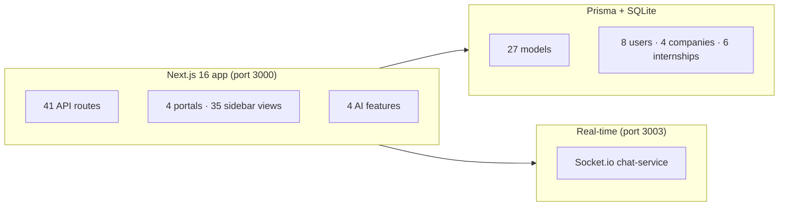
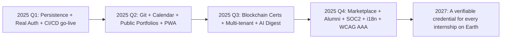
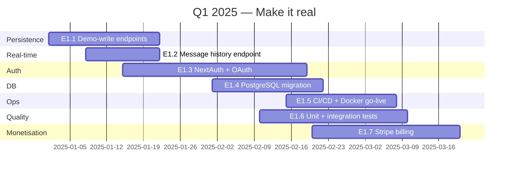
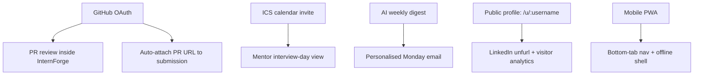
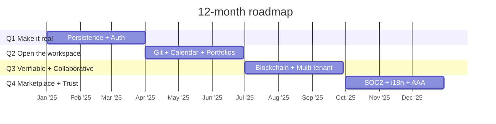
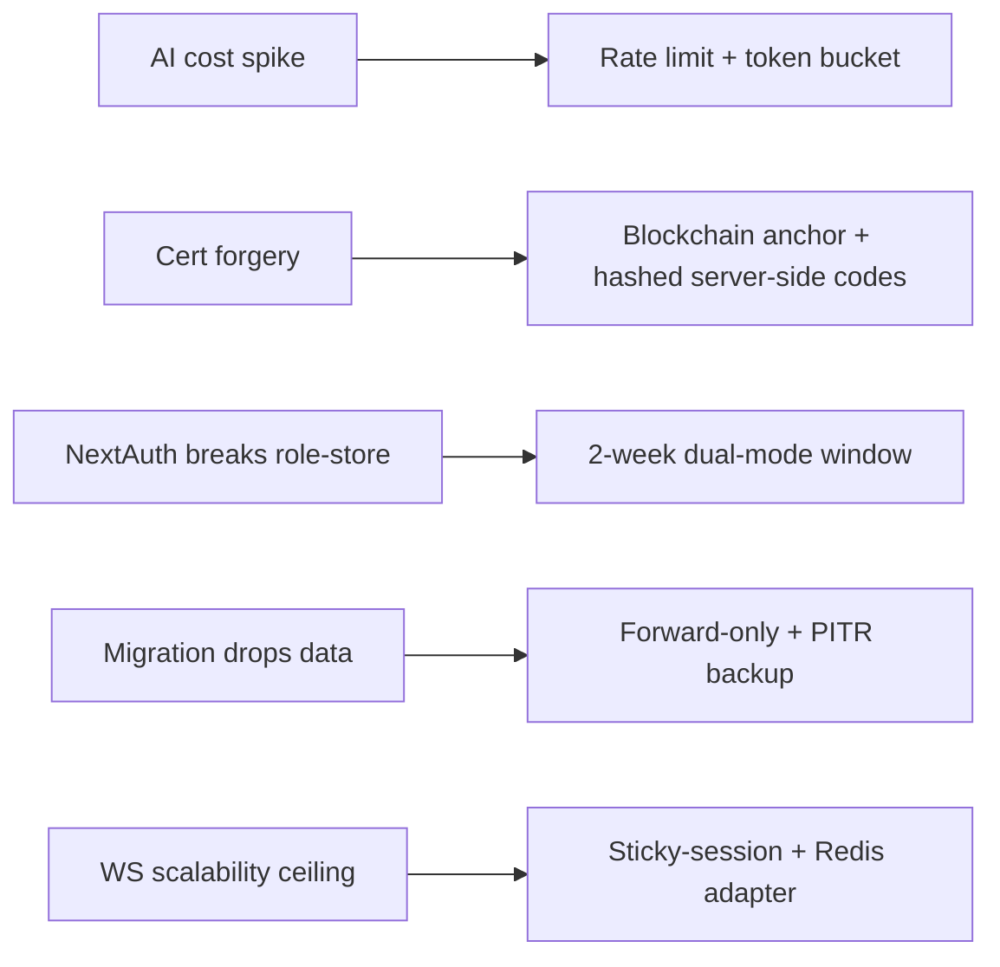
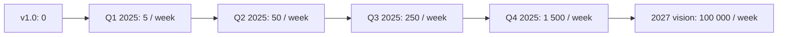

# 10 — Roadmap

> What we shipped in v1.0, where we're going over the next 12 months, and how we'll measure success.

---

## 1. Current state (v1.0)

InternForge v1.0 is a production-ready internship management platform that turns the student journey — from discovering an internship to earning a verified certificate — into a single, measurable, AI-assisted experience.

### 1.1 What shipped

| Capability                  | v1.0 status                                                                                              |
| --------------------------- | -------------------------------------------------------------------------------------------------------- |
| **Four portals**            | Student (12 views), Mentor (8), Company (7), Admin (8) — all wired to real API data.                       |
| **Domain models**           | 27 Prisma models (`User`, `Company`, `Internship`, `Application`, `Project`, `Milestone`, `Task`, `Submission`, `Evaluation`, `Skill`, `UserSkill`, `Assessment`, `AssessmentResult`, `Certificate`, `DailyLog`, `Attendance`, `Feedback`, `Conversation`, `Message`, `Notification`, `Announcement`, `OnboardingTask`, `Badge`, `AuditLog`, `PlatformSetting`, + composite types). |
| **API surface**             | 41 route handlers across 23 resource groups (`/api/users/*`, `/api/internships/*`, `/api/applications/*`, `/api/projects/*`, `/api/tasks/*`, `/api/submissions/*`, `/api/evaluations/*`, `/api/skills/*`, `/api/assessments/*`, `/api/certificates/*`, `/api/logs/*`, `/api/messages/*`, `/api/notifications/*`, `/api/announcements/*`, `/api/onboarding/*`, `/api/badges/*`, `/api/feedback/*`, `/api/attendance/*`, `/api/companies/*`, `/api/analytics/overview`, `/api/admin/{audit,settings,seed,health}`, `/api/ai/{chat,recommend,feedback,skill-analysis}`). |
| **AI features (4)**         | (1) AI Recommendations on Discover (`/api/ai/recommend`), (2) AI Mentor chat (`/api/ai/chat`), (3) AI feedback generation for evaluations (`/api/ai/feedback`), (4) AI skill analysis (`/api/ai/skill-analysis`). All flow through `z-ai-web-dev-sdk` with graceful static fallbacks. |
| **Real-time**               | Socket.io chat-service on port 3003 — presence, conversation rooms, typing indicators, message relay, user notification fan-out, project task-moved broadcasts. Caddy gateway routes via `XTransformPort`. |
| **Design system**           | Premium glassmorphic UI: emerald + amber palette, 14 shared components, 15+ utility classes, light/dark via next-themes, sticky header + sidebar + sticky footer, fully responsive (375px → 1400px). WCAG 2.1 AA. |
| **Verification loop**       | All four portals verified end-to-end with `agent-browser` — zero console errors, sticky-footer invariant holds, real certificate minted, real AI skill-analysis returned. |
| **Documentation**          | 10 markdown docs (this one included): architecture, API spec, schema, data flow, design system, deployment, testing, roadmap, README index. |

### 1.2 What's intentionally demo-only in v1.0

A handful of write actions are wired to demo toasts instead of persistent endpoints, because the demo doesn't run real authentication:

- New internship posting (Company)
- Edit posting / schedule interview (Company)
- Broadcast announcement (Mentor / Company)
- Mark attendance (Mentor)
- Suspend/activate user (Admin)
- New program (Admin)

These are the highest-priority gaps for Q1 (see §3 below).

---

## 2. Vision — north star

> **InternForge makes every internship a verifiable, evidence-backed credential.**

By 2027, a student anywhere in the world should be able to:

1. Discover an internship aligned to their skill graph (not their GPA).
2. Build a real, mentor-reviewed project that becomes their proof-of-skill.
3. Earn a **cryptographically verifiable certificate** that any employer can validate in one click.
4. Carry that certificate — plus their work evidence, their mentor testimonial, and their skill scores — into a public, shareable portfolio that ranks them on a global leaderboard.

The growth-themed, glassmorphic UI we shipped in v1.0 is the visual expression of that vision. The next 12 months are about turning the demo into infrastructure the world can trust.

---

## 3. 12-month roadmap

Each quarter has **themes**, **epics**, and concrete **features**. Themes are the strategic direction; epics are the bundled work; features are shippable units.

### 3.1 Q1 2025 — *Make it real* (persistence, auth, production)

**Themes:** Close every demo-toast gap. Switch from "impressive demo" to "production software". Land the testing & CI foundation.

**Epics & features:**

| Epic                                | Features                                                                                                                        | Exit criteria                                                                          |
| ----------------------------------- | ------------------------------------------------------------------------------------------------------------------------------- | -------------------------------------------------------------------------------------- |
| **E1.1 Persistence for demo-writes** | POST `/api/internships`, POST `/api/announcements`, POST `/api/attendance`, POST `/api/admin/users/:id/{suspend,activate}`    | Every Company/Mentor/Admin write toast is replaced by a real POST that updates the DB. |
| **E1.2 Full message history**       | `GET /api/messages/:conversationId` (paginated, `before` cursor) + chat panel loads full thread, not just the latest 1 message | Open any conversation → see full history; scroll up loads older; tests pass.          |
| **E1.3 Real auth (NextAuth + OAuth)** | `next-auth` credentials + GitHub/Google OAuth providers; middleware-enforced role checks on `/api/*`; deprecate `role-store` for sensitive operations | Login screen ships; OAuth flow works for GitHub + Google; `/api/users/me` derives `userId` from session, not query string. |
| **E1.4 PostgreSQL migration**       | `prisma/schema.prisma` provider switched to `postgresql`; `DATABASE_URL` for prod; migration scripts; dual-target dev (SQLite) + prod (Postgres) | `bun run db:migrate` runs cleanly against RDS; rollback drill passes.                 |
| **E1.5 CI/CD + Docker go-live**      | `.github/workflows/ci-cd.yaml` (lint, tsc, test, build, push, deploy); `Dockerfile` + `docker-compose.yml` + k8s manifests; Caddy / Ingress TLS | `git push origin main` → production in <10 minutes, no manual steps.                    |
| **E1.6 Unit + integration test suite** | Vitest wired, `bun test` runs in CI, ≥80% coverage on `src/lib/*`; ≥60% on API routes; example tests in `__tests__/`           | Coverage report published per PR; failing tests block merge.                          |
| **E1.7 Stripe billing (premium tier)** | Stripe Checkout + customer portal; tier on `User.tier` (FREE / PRO / TEAM); premium gates: certificate blockchain verification, AI weekly digest, public portfolio custom URL | A student can upgrade to PRO; a webhook from Stripe updates `User.tier`; gate enforcement works. |

### 3.2 Q2 2025 — *Open the workspace* (Git, calendar, public profiles)

**Themes:** Pull the platform out of the browser tab. Connect it to the developer workflow (GitHub), the calendar (interview scheduling), and the open web (public portfolios). Reach mobile.

**Epics & features:**

| Epic                                  | Features                                                                                                                                  | Exit criteria                                                                                                |
| ------------------------------------- | ----------------------------------------------------------------------------------------------------------------------------------------- | ------------------------------------------------------------------------------------------------------------ |
| **E2.1 Git/GitHub integration**       | OAuth into GitHub; project workspace shows the repo's branch list + commit history; PRs render inline; mentor reviews PR inside InternForge; submission auto-attaches a PR URL | Mentor sees `feat/student-dashboard` branch + 4 commits in the workspace; clicks "Review PR" → inline diff in a Dialog; merge button posts a comment to GitHub. |
| **E2.2 Calendar / ICS for interviews** | `POST /api/applications/:id/interview` accepts a scheduled time + type → emits an `.ics` file the student can add to Google/Outlook; mentor's interview-day calendar view | "Schedule interview" → email + .ics attachment; mentor's dashboard shows today's interviews as a calendar strip. |
| **E2.3 Email digest automation**      | Weekly digest email to students: hours logged, submissions made, eval scores, skills changed, AI-written summary (using `/api/ai/chat`); scheduled via cron on the chat-service or a separate worker | Every Monday 08:00 local, every active student receives a personalised digest email.                       |
| **E2.4 Leaderboards + achievements v2** | Public leaderboard at `/leaderboard` ranked by verified skill score + certificates + badges; achievement engine fires on events (`first_submission`, `five_day_streak`, `perfect_eval`, `certified`); toast + email notification | A student who submits work 5 days in a row sees a "5-day streak" toast + a new badge appears in their portfolio. |
| **E2.5 Public portfolio profiles**    | `/u/:username` route (SSG, custom username for PRO); SSR meta tags for LinkedIn / X share previews; visitor analytics (anonymous count + referrer) | A student shares `internforge.io/u/sara-kapoor` on LinkedIn; the link unfurls with their photo, top skills, certificate count, latest project. |
| **E2.6 Mobile PWA**                   | Next.js PWA manifest + service worker (offline shell); bottom-tab nav on mobile (Discover / Board / Chat / Profile); install prompt | Lighthouse PWA score ≥ 90 on mobile; "Add to home screen" works on iOS + Android.                          |

### 3.3 Q2 vision diagram

### 3.4 Q3 2025 — *Verifiable + Collaborative* (blockchain certs, multi-tenant, AI digest)

**Themes:** Make the credential unforgeable. Make the platform work for teams of mentors. Make AI do the heavy lifting of weekly reflection.

**Epics & features:**

| Epic                                       | Features                                                                                                                                                            | Exit criteria                                                                                                          |
| ------------------------------------------ | ------------------------------------------------------------------------------------------------------------------------------------------------------------------- | ---------------------------------------------------------------------------------------------------------------------- |
| **E3.1 Blockchain-optional cert verification (PRO)** | Certificate issued as a Merkle-tree anchor on a public chain (Polygon — gas cheap); `verificationCode` becomes a tx hash; verify page renders on-chain proof       | Student sees "anchored on Polygon" badge on cert; employer visits `/verify/:code` → on-chain proof + IPFS metadata. |
| **E3.2 Team-based mentor collaboration**   | A `MentorTeam` entity; multiple mentors per project; round-robin submission assignment; shared notes; co-mentor feedback                                           | A project with 3 mentors auto-assigns reviews in round-robin; mentors see each other's notes in the review dialog.      |
| **E3.3 Advanced analytics — skill-gap forecasting** | Time-series of skill scores + project requirement diffs → forecast "this student will hit the React 75% threshold by week 9"; surface in mentor + company dashboards | Mentor sees "Forecast: Sara will hit React 75% by week 9 (+/- 1.5 wks)" on her intern card.                            |
| **E3.4 LLM-powered weekly digest**         | Extend E2.3 with a longer-form AI reflection: the LLM reads all of a student's logs/submissions/feedback of the week and writes a 200-word "growth letter"        | The Monday email opens with a 200-word AI letter in the student's voice; style matches their tone from their logs.    |
| **E3.5 Video submission reviews**          | Upload a 3-min Loom-style video as a submission type; mentor reviews with timestamped comments (a la SoundCloud waveform); transcript AI-summarised                  | A student uploads a "project demo walkthrough" video; mentor pins a comment at 1:23; AI summary at the top.           |
| **E3.6 Multi-tenant company branding**    | `Company.theme` JSON (logo, primary colour override within limits, custom subdomain `acme.internforge.io`); PRO/TEAM tier                                             | Acme Corp logs in at `acme.internforge.io` and sees their logo + a desaturated amber-on-emerald theme.                  |

### 3.5 Q4 2025 — *Marketplace + Trust* (alumni, hiring, SOC2, i18n, AAA)

**Themes:** Open the two-sided market. Connect certified students to recruiters. Earn enterprise trust (SOC2). Localise. Push accessibility to AAA on the core flows.

**Epics & features:**

| Epic                                  | Features                                                                                                                                                  | Exit criteria                                                                                                                |
| ------------------------------------- | --------------------------------------------------------------------------------------------------------------------------------------------------------- | ---------------------------------------------------------------------------------------------------------------------------- |
| **E4.1 Marketplace 2.0**              | Sponsored internship slots on Discover; "Featured" tier for companies; sponsored placement ranked by matchScore + bid; clear "Sponsored" disclosure      | A company pays to feature their internship; it appears top-of-list with a "Sponsored" pill; click-through analytics surface in their dashboard. |
| **E4.2 Alumni network**               | Post-internship alumni profiles (`status=ALUMNUS` on `User`); alumni-to-student mentorship matching; alumni-only job board; alumni reunions events feed | Sara graduates → her profile moves to alumni → she can opt-in to mentor a new student; she sees a "Junior SWE at Stripe" job board. |
| **E4.3 Referral + hiring flows**      | "Refer to company" button on portfolio (alumni + mentors); recruiter dashboard "Sourced" pipeline stage; one-click "Move to application"               | An alumni clicks "Refer to FinEdge" on a student's portfolio; the student appears in FinEdge's "Sourced" column in the applicant pipeline. |
| **E4.4 SSO for enterprises**          | SAML 2.0 + OIDC providers (Okta, Azure AD, Google Workspace); `Company.ssoConfig` JSON; JIT user provisioning                                              | A FinEdge employee logs in via Okta SSO → lands on FinEdge's portal as `COMPANY` with the right `companyMemberships` already attached. |
| **E4.5 SOC2 readiness**               | Documented access reviews, change-management process, encryption-at-rest (Postgres + S3), audit log retention (7 years), pen test (Q1 2026), DR drill    | External auditor signs off on SOC2 Type 1; pen test report filed; quarterly access review process runs end-to-end.        |
| **E4.6 Internationalisation (i18n)**   | `next-intl` (already a dep) wired; translate to Hindi + Spanish + Mandarin first; RTL (Arabic) as stretch; locale-aware date/number formatting           | A user in Mumbai sees the full UI in Hindi; a user in Madrid sees Spanish; dates format per locale.                          |
| **E4.7 Accessibility WCAG AAA on core flows** | Discover → Apply → Submit → Certificate → Portfolio pass WCAG 2.2 AAA (target sizes 44px, no timing constraints, sign-language video on cert verification | axe-core AAA scan on the 5 core flows returns zero violations; manual screen-reader pass done by a paid a11y consultant.   |

### 3.6 Roadmap at a glance

---

## 4. Backlog

Prioritised smaller ideas that didn't make a quarterly epic.

| Priority | Item                                                            | Why it matters                                          |
| -------- | --------------------------------------------------------------- | ------------------------------------------------------- |
| P0       | `GET /api/messages/:conversationId` paginated history          | Critical UX gap — chat currently shows only latest 1 message. |
| P0       | Real rate-limiting on `/api/ai/*`                               | LLM calls are paid + slow; abuse risk.                  |
| P1       | `POST /api/internships` + `/api/announcements` real persistence | Replaces the largest demo-toast cluster.                |
| P1       | Sonner toasts → use `mutation` (react-query) for auto-invalidation | Removes the manual `reload()` calls scattered in portals. |
| P1       | `react-syntax-highlighter` dynamic-import in code blocks        | Mentor reviews render code with real syntax colours.    |
| P1       | Dark-mode `prefers-reduced-motion` guard for `animate-in-*`     | AAA 2.3.3 readiness.                                    |
| P2       | OpenAPI spec generated from the route handlers (e.g. `next-rest` or `zod-to-openapi`) | Public API contract for partners.                       |
| P2       | Storybook + Chromatic wired                                     | Visual regression on the 14 shared components.           |
| P2       | Sentry SDK + Web Vitals                                         | Real-user monitoring in production.                     |
| P2       | Admin → Settings: theme builder for company subdomains          | Multi-tenant branding v0 (no full theme yet).           |
| P2       | Student → Logs: AI-suggested tasks for the day                 | LLM reads yesterday's log + project tasks → suggests 3 todo items. |
| P3       | Mentor → Reviews: keyboard shortcut to open next submission    | Power-user productivity.                                |
| P3       | Admin → Audit: export to S3 / SIEM                              | Compliance integration.                                  |
| P3       | Public portfolio: GitHub README embed (PRO)                     | Cross-linking for credibility.                          |
| P3       | Telegram / WhatsApp bot for daily-log reminder                 | Mobile-first engagement in emerging markets.           |
| P3       | Skill graph visualisation (D3 force-directed)                  | "How your skills relate" panel on /skills.            |
| P4       | Plugin system for third-party course providers                 | Partner ecosystem.                                      |
| P4       | AI interviewer (mock interview with feedback)                  | Pre-interview prep.                                     |

---

## 5. Risks & mitigations

| Risk                                              | Likelihood | Impact | Mitigation                                                                                                                  |
| ------------------------------------------------- | ---------- | ------ | --------------------------------------------------------------------------------------------------------------------------- |
| **AI cost spike** from unbounded `/api/ai/chat` abuse | High       | High   | Q1 rate limiting (30/min/user); token-bucket per company; alert at 80% of monthly LLM budget.                            |
| **Certificate forgery** (fake `IF-VERIFY-XXXXXX` codes) | Medium     | Critical | Q3 blockchain anchor (Polygon); codes also stored hashed server-side with one-time verification count.                  |
| **NextAuth migration breaks the role-store**      | Medium     | High   | Ship a 2-week dual-mode window — both demo role-switcher AND NextAuth sessions work; deprecate role-store once usage drops below 5%. |
| **Postgres migration drops a column of data**     | Low        | Critical | All migrations forward-only + additive; PITR backup before every migration; `prisma migrate deploy` reviewed in PR.       |
| **WebSocket scalability ceiling** (single chat-service instance) | High       | Medium | Q1: deploy ≥3 chat-service replicas behind a sticky-session Ingress; Q2: move to Redis adapter for `socket.io` horizontal scaling. |
| **LLM produces biased feedback** on a submission   | Medium     | High   | Every AI response carries the `AIBadge` + an editable "regenerate" button; mentors must sign off before the eval is saved. |
| **GDPR / DPDP compliance gap**                     | Medium     | High   | Q3: data-export endpoint (`/api/users/me/export`), right-to-erasure endpoint, cookie consent banner, regional data residency. |
| **Tier-gating creates inequity** (PRO features become pay-to-win) | Medium | Medium | Free tier keeps ALL earning features (apply, submit, evaluate, certificate, portfolio). Only premium cosmetic + analytics + AI digest are PRO. |
| **SOC2 timeline slips**                            | Medium     | Medium | Start Q2: written policies, access-review cadence, change-management runbook. Pen test in Q1 2026 buffer.                 |
| **Design-system drift** (each portal re-implements a card) | High       | Low    | Storybook + Chromatic in Q1; PR template includes "Did you use a shared component?" checkbox.                             |

---

## 6. Success metrics for the roadmap

We measure the roadmap's success on five dimensions. Each quarterly review checks the trailing 90-day numbers against these targets.

### 6.1 Adoption

| Metric                          | v1.0 baseline | Q1 target | Q4 target |
| ------------------------------- | ------------- | --------- | --------- |
| Seeded users (demo)             | 8             | 8         | 8         |
| Real registered students        | 0             | 100       | 10 000    |
| Real registered mentors         | 0             | 20        | 1 500     |
| Real registered companies       | 0             | 5         | 500       |
| Public portfolio views / week   | 0             | —         | 50 000    |

### 6.2 Engagement

| Metric                              | v1.0 baseline | Q1 target | Q4 target |
| ----------------------------------- | ------------- | --------- | --------- |
| Daily active students (median)      | 0             | 30        | 2 500     |
| Submissions / week                  | 0             | 50        | 8 000     |
| Certificates issued / month         | 0             | 5         | 1 500     |
| AI feature invocations / week       | 0             | 200       | 30 000    |
| PWA install conversion              | n/a           | —         | 12%       |

### 6.3 Trust / reliability

| Metric                              | v1.0 baseline | Q1 target | Q4 target |
| ----------------------------------- | ------------- | --------- | --------- |
| Uptime (production)                 | n/a           | 99.5%     | 99.95%    |
| p99 API latency                     | unmeasured    | <500 ms   | <250 ms   |
| `agent-browser` sandbox errors / run | 0             | 0         | 0         |
| Open S0/S1 bugs                     | 0             | 0         | 0         |
| Pen test findings (high+critical)   | n/a           | —         | 0         |

### 6.4 Velocity / quality

| Metric                              | v1.0 baseline | Q1 target | Q4 target |
| ----------------------------------- | ------------- | --------- | --------- |
| PRs merged / week                   | ~5 (parallel) | 10        | 25        |
| Unit test coverage on `src/lib/*`    | 0%            | 80%       | 90%       |
| Flaky test rate                      | n/a           | <5%       | <1%       |
| Mean time to merge a PR              | n/a           | <2 days   | <1 day    |

### 6.5 Business

| Metric                              | v1.0 baseline | Q1 target | Q4 target |
| ----------------------------------- | ------------- | --------- | --------- |
| PRO subscriptions                   | 0             | 5         | 1 000     |
| Sponsored internship revenue / mo   | $0            | —         | $25 000   |
| Sponsored click-through rate        | n/a           | —         | 8%        |
| Certificate verification page views / week | 0             | 10        | 5 000     |

### 6.6 North-star metric

> **Verified certificates issued per week.**

A certificate counts when (a) it has a real grade computed from real mentor evaluations, (b) its verification code has been used at least once by a third party, and (c) the student's portfolio has been viewed at least once by someone other than themselves.

---

## 7. Closing note

The roadmap is a hypothesis, not a contract. We will revisit it at the end of every quarter with two questions:

1. *Did the things we shipped move the metric we said they would?*
2. *Has the world changed in a way that should change the next quarter?*

What will not change: the commitment to **verifiable, evidence-backed skills** as the core of the product, and the premium, growth-themed design system that makes those skills feel worth earning.
